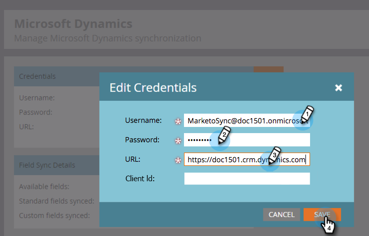

# Instalación de Marketing para Dynamics 2015 On-Prem y 2016 365 On-Prem Paso 3 de 3 {#install-marketo-for-dynamics-on-prem-and-on-prem-step-of}

>[!NOTE]
>
>**Requisitos previos**
>
>* [Instalación de Marketing para Dynamics 2015 On-Prem y 2016 365 On-Prem Paso 1 de 3](step-1-of-3-install.md)
>* [Instalación de Marketing para Dynamics 2015 On-Prem y 2016 365 On-Prem Paso 2 de 3](step-2-of-3-set-up.md)

>

>[!NOTE]
>
>**Se requieren permisos de administración**

## Especifique la información del usuario de Dynamics Sync {#enter-dynamics-sync-user-information}

1. Inicie sesión en Marketing y haga clic en **Administración**.

   

1. Haga clic en **CRM**.

   

1. Seleccione **Microsoft**.

   

1. Haga clic en **Editar** en el **paso 1: Introduzca las credenciales**.

   

   >[!CAUTION]
   >
   >Asegúrese de que sus credenciales son correctas, ya que no podemos revertir los cambios de esquema posteriores después del envío. Si se guardan credenciales incorrectas, tendrá que obtener una nueva suscripción de marketing.

1. Introduzca el **nombre de usuario**, la **contraseña** , una **dirección URL** de Microsoft Dynamics y un identificador **de** cliente opcional. Haga clic en **Guardar** cuando termine.

   

   >[!NOTE]
   >
   >El nombre de usuario de Marketing debe coincidir con el nombre de usuario del usuario de sincronización en CRM. El formato puede ser [`[email protected]`](http://docs.marketo.com/cdn-cgi/l/email-protection#8cf9ffe9fecce8e3e1ede5e2a2efe3e1) o DOMINIO\usuario.

   >[!TIP]
   >
   >¿No conoce la dirección URL? Aquí le mostraremos cómo encontrar la URL [del servicio de organización de](../../../../../product-docs/crm-sync/microsoft-dynamics-sync/sync-setup/view-the-organization-service-url.md) Dynamics.

## Seleccionar campos para sincronizar {#select-fields-to-sync}

1. Haga clic en **Editar** en el **paso 2: Seleccione Campos para sincronizar**.

   

1. Seleccione los campos que desea sincronizar con el objeto de que estén preseleccionados. Haga clic en **Guardar**.

   

## Sincronizar campos para un filtro personalizado {#sync-fields-for-a-custom-filter}

Si ha creado un filtro personalizado, asegúrese de entrar y seleccionar los nuevos campos que se sincronizarán con Marketing.

1. Vaya a Administración y seleccione **Microsoft Dynamics**.

   

1. Haga clic en **Editar** en detalles de sincronización de campo.

   

1. Desplácese hacia abajo hasta el campo y compruébelo. El nombre real debe ser new_synctomkto, pero el nombre para mostrar puede ser cualquier cosa. Haga clic en **Guardar**.

   

## Habilitar sincronización {#enable-sync}

1. Haga clic en **Editar** en el **paso 3: Habilitar sincronización**.

   

   >[!CAUTION]
   >
   >Marketo no desduplicará automáticamente una sincronización con Microsoft Dynamics o cuando introduzca personas manualmente.

1. Lea todo lo que aparece en la ventana emergente, escriba su correo electrónico y haga clic en Sincronización de **Inicio**.

   

1. La primera sincronización puede tardar unas horas. Una vez que haya terminado, recibirá una notificación por correo electrónico.

   

¡Excelente trabajo!
