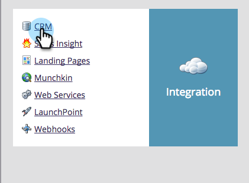
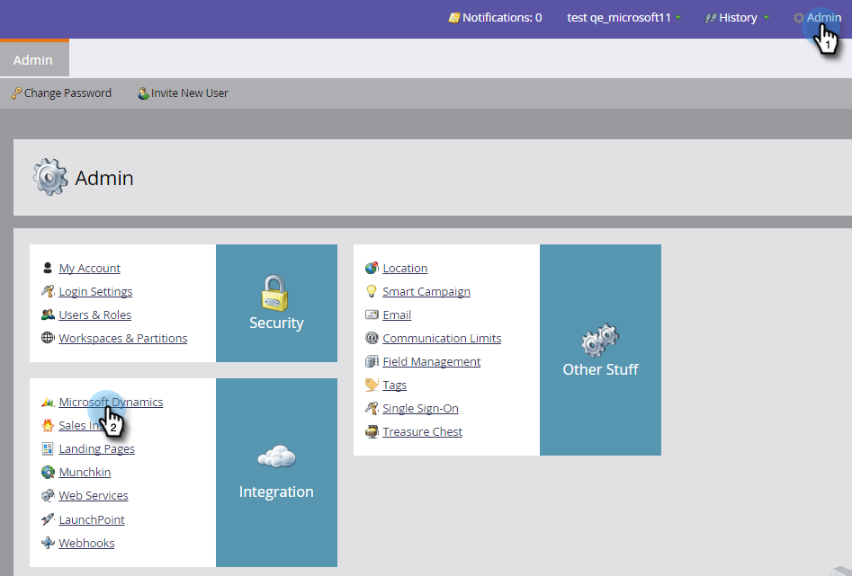
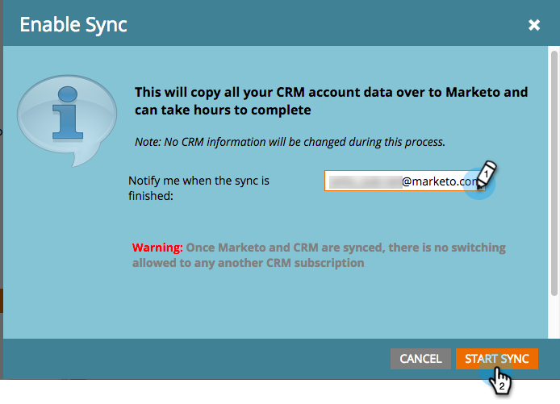
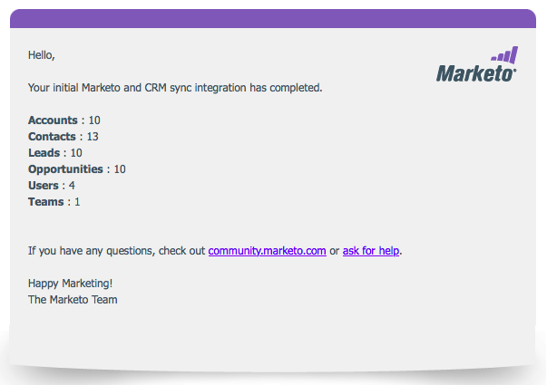

# Paso 3 de 3: Conectar Marketo [!DNL Dynamics] (2016 On Prem/[!DNL Dynamics] 365 On-Premies) {#step-of-connect-marketo-dynamics-on-premises-2016}

>[!PREREQUISITES]
>
>* [Instalar Marketo para [!DNL Microsoft Dynamics] 2016/[!DNL Dynamics] 365 local, paso 1 de 3](/help/marketo/product-docs/crm-sync/microsoft-dynamics-sync/sync-setup/microsoft-dynamics-2016-dynamics-365-on-premises/step-1-of-3-install.md)
>* [Instalar Marketo para [!DNL Microsoft Dynamics] 2016/[!DNL Dynamics] 365 local, paso 2 de 3](/help/marketo/product-docs/crm-sync/microsoft-dynamics-sync/sync-setup/microsoft-dynamics-2016-dynamics-365-on-premises/step-2-of-3-set-up.md)

>[!NOTE]
>
>**Se requieren permisos de administrador**

## Introducir información de usuario de sincronización de [!DNL Dynamics] {#enter-dynamics-sync-user-information}

1. Inicie sesión en Marketo y haga clic en **[!UICONTROL Administrador]**.

   

1. Haga clic en **[!UICONTROL CRM]**.

   

1. Seleccione **[!DNL Microsoft]**.

   

1. Haga clic en **[!UICONTROL Editar]** en **Paso 1: Escriba las credenciales**.

   

   >[!CAUTION]
   >
   >Compruebe que sus credenciales son correctas. Los cambios de esquema posteriores no se pueden revertir después del envío. Si se guardan credenciales incorrectas, se requerirá una nueva suscripción de Marketo.

1. Escriba **Nombre de usuario**, **Contraseña**, [!DNL Microsoft Dynamics] **URL** y **Secreto/Id. de cliente**. Haga clic en **Guardar** cuando termine.

   

   >[!NOTE]
   >
   >* Si el Marketo se aprovisionó antes de octubre de 2020, el ID de cliente y el secreto son campos opcionales. De lo contrario, son obligatorios. La obtención de esta información dependerá de la versión de MSD que utilice.
   >* El Nombre de usuario en Marketo debe coincidir con el Nombre de usuario para el usuario de sincronización en CRM. El formato puede ser `user@domain.com` o DOMAIN\user.
   >* Si no conoce la dirección URL, [aprenda a encontrarla aquí](/help/marketo/product-docs/crm-sync/microsoft-dynamics-sync/sync-setup/view-the-organization-service-url.md){target="_blank"}.

   >[!TIP]
   >
   >¿No conoce la dirección URL? Le mostraremos cómo encontrar la [[!DNL Dynamics] URL del servicio de organización](/help/marketo/product-docs/crm-sync/microsoft-dynamics-sync/sync-setup/view-the-organization-service-url.md) aquí.

## Seleccionar campos para sincronización {#select-fields-to-sync}

1. Haga clic en **[!UICONTROL Editar]** en **[!UICONTROL Paso 2: Seleccionar campos para sincronizar]**.

   

1. Seleccione los campos que desea sincronizar con Marketo para que se preseleccionen. Haga clic en **[!UICONTROL Guardar]**.

   

>[!NOTE]
>
>Marketo almacena una referencia a los campos que se van a sincronizar. Si elimina un campo de [!DNL Dynamics], se recomienda hacerlo con la [sincronización deshabilitada](/help/marketo/product-docs/crm-sync/salesforce-sync/enable-disable-the-salesforce-sync.md). A continuación, actualice el esquema en Marketo editando y guardando [Seleccionar campos para sincronizar](/help/marketo/product-docs/crm-sync/microsoft-dynamics-sync/microsoft-dynamics-sync-details/microsoft-dynamics-sync-field-sync/editing-fields-to-sync-before-deleting-them-in-dynamics.md).

## Sincronizar campos para un filtro personalizado {#sync-fields-for-a-custom-filter}

Si ha creado un filtro personalizado, vaya y seleccione los nuevos campos que desea sincronizar con Marketo.

1. Vaya a Administración y seleccione **[!DNL Microsoft Dynamics]**.

   

1. Haz clic en **[!UICONTROL Editar]** en Detalles de sincronización de campos.

   

1. Desplácese hacia abajo hasta el campo y compruébelo. El nombre real debe ser new_synctomkto, pero el Nombre para mostrar puede ser cualquier cosa. Haga clic en **[!UICONTROL Guardar]**.

   

## Habilitar sincronización {#enable-sync}

1. Haga clic en **[!UICONTROL Editar]** en **[!UICONTROL Paso 3: Habilitar sincronización]**.

   

   >[!CAUTION]
   >
   >Marketo no desduplicará automáticamente una sincronización de [!DNL Microsoft Dynamics] ni cuando se escriban personas manualmente.

1. Lee todo en la ventana emergente, escribe tu correo electrónico y haz clic en **[!UICONTROL Iniciar sincronización]**.

   

1. Según el número de registros, la sincronización inicial puede tardar entre unas horas y unos días. Recibirá una notificación por correo electrónico una vez completada.

   
