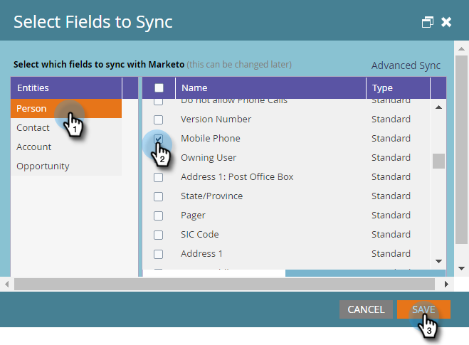

# Paso 3 de 3: Conexión de Marketo Dynamics (2016 en Prem/Dynamics 365 local) {#step-of-connect-marketo-dynamics-on-premises-2016}

>[!PREREQUISITES]
>
>* [Instalar Marketo para Microsoft Dynamics 2016/Dynamics 365 local, paso 1 de 3](/help/marketo/product-docs/crm-sync/microsoft-dynamics-sync/sync-setup/microsoft-dynamics-2016-dynamics-365-on-premises/step-1-of-3-install.md){target="_blank"}
>* [Instalar Marketo para Microsoft Dynamics 2016/Dynamics 365 local, paso 2 de 3](/help/marketo/product-docs/crm-sync/microsoft-dynamics-sync/sync-setup/microsoft-dynamics-2016-dynamics-365-on-premises/step-2-of-3-set-up.md){target="_blank"}

>[!NOTE]
>
>**Se requieren permisos de administración**

## Introducir información de usuario de sincronización de Dynamics {#enter-dynamics-sync-user-information}

1. Inicie sesión en Marketo y haga clic en **[!UICONTROL Administrador]**.

   

1. Haga clic en **[!UICONTROL CRM]**.

   

1. Seleccione **[!DNL Microsoft]**.

   

1. Haga clic en **[!UICONTROL Editar]** en **[!UICONTROL Introducir credenciales]**.

   

   >[!CAUTION]
   >
   >Asegúrese de que sus credenciales sean correctas, ya que no podemos revertir los cambios de esquema posteriores después del envío. Si se guardan credenciales incorrectas, tendrá que obtener una nueva suscripción de Marketo.

1. Escriba **[!UICONTROL Nombre de usuario]**, **[!UICONTROL Contraseña]**, una **[!UICONTROL URL]** de Microsoft Dynamics y un **Secreto/Id de cliente**. Haga clic en **[!UICONTROL Guardar]** cuando termine.

   

   >[!NOTE]
   >
   >* Si el Marketo se aprovisionó antes de octubre de 2020, el ID de cliente y el secreto son campos opcionales. De lo contrario, son obligatorios. La obtención de esta información dependerá de la versión de MSD que esté utilizando.
   >* El Nombre de usuario en Marketo debe coincidir con el Nombre de usuario para el usuario de sincronización en CRM. El formato puede ser `user@domain.com` o DOMAIN\user.
   >* Si no conoce la dirección URL, [aprenda a encontrarla aquí](/help/marketo/product-docs/crm-sync/microsoft-dynamics-sync/sync-setup/view-the-organization-service-url.md){target="_blank"}.

   >[!TIP]
   >
   >¿No conoce la dirección URL? Le mostraremos cómo encontrar la URL del servicio de organización de [Dynamics](/help/marketo/product-docs/crm-sync/microsoft-dynamics-sync/sync-setup/view-the-organization-service-url.md) aquí.

## Seleccionar campos para sincronización {#select-fields-to-sync}

1. Haga clic en **[!UICONTROL Editar]** en **[!UICONTROL Seleccionar campos para sincronizar]**.

   

1. Seleccione los campos que desea sincronizar con Marketo para que se preseleccionen. Haga clic en **[!UICONTROL Guardar]**.

   

>[!NOTE]
>
>Marketo almacena una referencia a los campos que se van a sincronizar. Si elimina un campo en Dynamics, se recomienda hacerlo con la [sincronización deshabilitada](/help/marketo/product-docs/crm-sync/salesforce-sync/enable-disable-the-salesforce-sync.md){target="_blank"}. A continuación, actualice el esquema en Marketo editando y guardando [Seleccionar campos para sincronizar](/help/marketo/product-docs/crm-sync/microsoft-dynamics-sync/microsoft-dynamics-sync-details/microsoft-dynamics-sync-field-sync/editing-fields-to-sync-before-deleting-them-in-dynamics.md){target="_blank"}.

## Sincronizar campos para un filtro personalizado {#sync-fields-for-a-custom-filter}

Si ha creado un filtro personalizado, asegúrese de entrar y seleccionar los nuevos campos que desea sincronizar con Marketo.

1. Vaya a Administración y seleccione **[!DNL Microsoft Dynamics]**.

   

1. Haz clic en **[!UICONTROL Editar]** en Detalles de sincronización de campos.

   

1. Desplácese hacia abajo hasta el campo y compruébelo. El nombre real debe ser new_synctomkto, pero el Nombre para mostrar puede ser cualquier cosa. Haga clic en **[!UICONTROL Guardar]**.

   

## Habilitar sincronización {#enable-sync}

1. Haz clic en **[!UICONTROL Editar]** en **[!UICONTROL Habilitar sincronización]**.

   

   >[!CAUTION]
   >
   >Marketo no desduplicará automáticamente una sincronización de Microsoft Dynamics ni cuando introduzca personas manualmente.

1. Lee todo en la ventana emergente, escribe tu correo electrónico y haz clic en **[!UICONTROL Iniciar sincronización]**.

   

1. La primera sincronización puede tardar unas horas. Una vez hecho esto, recibirá una notificación por correo electrónico.

   

¡Excelente trabajo!
