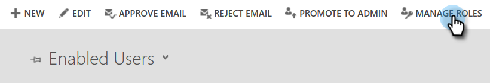

# Paso 2 de 3: Configurar la solución de Marketo con la conexión de control de contraseña del propietario del recurso {#step-2-of-3-set-up-the-marketo-solution-ropc}

Empecemos creando una cuenta de usuario.

>[!PREREQUISITES]
>
>[Paso 1 de 4: Instalación de la solución de Marketo con la conexión de control de contraseña del propietario de recursos](/help/marketo/product-docs/crm-sync/microsoft-dynamics-sync/sync-setup/microsoft-dynamics-365-with-ropc-connection/step-1-of-4-install.md)

## Crear un nuevo usuario {#create-a-new-user}

1. Inicie sesión en Dynamics. Haga clic en el icono Configuración y seleccione **Configuración avanzada**.

   

1. Haga clic en **Configuración** y seleccione **Seguridad**.

   

1. Haga clic en **Usuarios**.

   

1. Haga clic en **Nuevo.**

   

1. Haga clic en **Agregar y conceder licencias a usuarios** en la nueva ventana.

   

1. Se abre una nueva pestaña. Haga clic en **Administrador** en la parte superior de la página.

   

1. Se abre otra pestaña nueva. Haga clic en **Agregar un usuario**.

   

1. Escriba toda la información. Cuando haya terminado, haga clic en **Agregar**.

   

   >[!NOTE]
   >
   >Este nombre debe ser un usuario de sincronización dedicado y no una cuenta de usuario de CRM existente. No necesita ser una dirección de correo electrónico real.

1. Introduzca el correo electrónico para recibir las nuevas credenciales de usuario y haga clic en **Enviar correo electrónico y cerrar**.

   

## Asignar función de usuario de sincronización {#assign-sync-user-role}

Asigne la función de usuario de sincronización de Marketo únicamente al usuario de sincronización de Marketo. No es necesario asignarlo a ningún otro usuario.

>[!NOTE]
>
>Esto se aplica a Marketo versión 4.0.0.14 y posteriores. En versiones anteriores, todos los usuarios deben tener la función de sincronización de usuarios. Para actualizar Marketo, consulte [Actualización de la solución Marketo para Microsoft Dynamics](/help/marketo/product-docs/crm-sync/microsoft-dynamics-sync/sync-setup/update-the-marketo-solution-for-microsoft-dynamics.md).

>[!IMPORTANT]
>
>La configuración de idioma del usuario de sincronización [debe establecerse en inglés](https://portal.dynamics365support.com/knowledgebase/article/KA-01201/en-us).

1. Vuelva a la pestaña Usuarios habilitados y actualice la lista de usuarios.

   

1. Pase el ratón junto al usuario de Marketo Sync recién creado y aparecerá una casilla de verificación. Haga clic en para seleccionarlo.

   

1. Haga clic en **Administrar funciones**.

   

1. Marque **Usuario de sincronización de Marketo** y haga clic en **OK**.

   

   >[!NOTE]
   >
   >Cualquier actualización realizada en su CRM por el usuario de sincronización **not** se sincronizan de nuevo con Marketo.

## Configurar la solución Marketo {#configure-marketo-solution}

¡Casi ahí! Todo lo que nos queda es informar a Marketo Solution sobre el nuevo usuario creado.

1. Vuelva a la sección Configuración avanzada y haga clic en el botón  junto a Configuración y seleccione **Configuración de Marketo**.

   

   >[!NOTE]
   >
   >Si no ve **Configuración de Marketo** en el menú Configuración , actualice la página. Si eso no funciona, intente [publicar la solución de Marketo](/help/marketo/product-docs/crm-sync/microsoft-dynamics-sync/sync-setup/microsoft-dynamics-365-with-ropc-connection/step-1-of-4-install.md) o cierre la sesión y vuelva a iniciarla.

1. Haga clic en **Predeterminado**.

   

1. Haga clic en el botón de búsqueda de la **Usuario de Marketo** y seleccione el usuario de sincronización que ha creado.

   

1. Haga clic en el  en la esquina inferior derecha para guardar los cambios.

   

1. Haga clic en el **X** en la parte superior derecha para cerrar la pantalla.

   

1. Haga clic en el  junto a Configuración y seleccione **Soluciones**.

   

1. Haga clic en el **Publicar todas las personalizaciones** botón.

   

## Antes de continuar con el paso 3 {#before-proceeding-to-step}

    * Si desea restringir el número de registros que sincroniza, [configure un filtro de sincronización personalizado](/help/marketo/product-docs/crm-sync/microsoft-dynamics-sync/create-a-custom-dynamics-sync-filter.md) ahora.
    * Ejecute el proceso [Validar sincronización de Microsoft Dynamics](/help/marketo/product-docs/crm-sync/microsoft-dynamics-sync/sync-setup/validate-microsoft-dynamics-sync.md). Comprueba que la configuración inicial se haya realizado correctamente.
    * Inicie sesión en el usuario de sincronización de Marketo en Microsoft Dynamics CRM.

>[!MORELIKETHIS]
>
>[Paso 3 de 4: Conexión de la solución de Marketo con la conexión de control de contraseña del propietario del recurso](/help/marketo/product-docs/crm-sync/microsoft-dynamics-sync/sync-setup/microsoft-dynamics-365-with-ropc-connection/step-3-of-4-connect.md)
