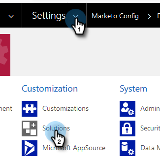

# Paso 2 de 4: Configurar la solución de Marketo con la conexión de control de contraseña del propietario de los recursos {#step-2-of-4-set-up-the-marketo-solution-ropc}

Empecemos por crear una cuenta de usuario.

>[!PREREQUISITES]
>
>[Paso 1 de 4: instale la solución Marketo con la conexión de control de contraseña de propietario de recursos](/help/marketo/product-docs/crm-sync/microsoft-dynamics-sync/sync-setup/microsoft-dynamics-365-with-ropc-connection/step-1-of-4-install.md){target="_blank"}

## Crear un nuevo usuario {#create-a-new-user}

1. Iniciar sesión en [!DNL Dynamics]. Haga clic en el icono [!UICONTROL Configuración] y seleccione **[!UICONTROL Configuración avanzada]**.

   

1. Haga clic en **[!UICONTROL Configuración]** y seleccione **[!UICONTROL Seguridad]**.

   

1. Haga clic en **[!UICONTROL Usuarios]**.

   

1. Haga clic en **[!UICONTROL Nuevo]**.

   

1. Haga clic en **[!UICONTROL Agregar y autorizar usuarios]** en la nueva ventana.

   

1. Se abre una nueva pestaña. Haga clic en **[!UICONTROL Administrador]** en la parte superior de la página.

   

1. Se abre otra pestaña nueva. Haga clic en **[!UICONTROL Agregar un usuario]**.

   

   >[!IMPORTANT]
   >
   >El usuario de sincronización debe tener permiso de lectura para la configuración de Marketo.

1. Escriba toda la información. Cuando hayas terminado, haz clic en **[!UICONTROL Agregar]**.

   

   >[!NOTE]
   >
   >Este nombre debe ser un usuario de sincronización dedicado y no una cuenta de usuario de CRM existente. No necesita ser una dirección de correo electrónico real.

1. Escriba el correo electrónico para recibir las nuevas credenciales de usuario y haga clic en **[!UICONTROL Enviar correo electrónico y cerrar]**.

   

## Asignar función de usuario de sincronización {#assign-sync-user-role}

Asigne la función Usuario de sincronización de Marketo únicamente al usuario de sincronización de Marketo. No es necesario asignarlo a ningún otro usuario.

>[!NOTE]
>
>Esto se aplica a la versión de Marketo 4.0.0.14 y posterior. Para las versiones anteriores, todos los usuarios deben tener la función de usuario de sincronización. Para actualizar Marketo, consulte [Actualizar la solución Marketo para [!DNL Microsoft Dynamics]](/help/marketo/product-docs/crm-sync/microsoft-dynamics-sync/sync-setup/update-the-marketo-solution-for-microsoft-dynamics.md).

>[!IMPORTANT]
>
>La configuración de idioma del usuario de sincronización [ debe establecerse en inglés](https://learn.microsoft.com/en-us/power-platform/admin/enable-languages){target="_blank"}.

1. Vuelva a la ficha [!UICONTROL Usuarios habilitados] y actualice la lista de usuarios.

   

1. Pase el ratón sobre el usuario de sincronización de Marketo que acaba de crear y aparecerá una casilla de verificación. Haga clic en para seleccionarlo.

   

1. Haga clic en **[!UICONTROL Administrar roles]**.

   

1. Comprueba **[!UICONTROL el usuario de sincronización de Marketo]** y haz clic en **[!UICONTROL Aceptar]**.

   

   >[!NOTE]
   >
   >Cualquier actualización hecha en su CRM por el usuario de sincronización _no_ se sincronizará de nuevo con Marketo.

## Configuración de la solución Marketo {#configure-marketo-solution}

¡Ya casi está! Todo lo que nos queda es informar a Marketo Solution sobre el nuevo usuario creado.

1. Vuelva a la sección [!UICONTROL Configuración avanzada], haga clic en el icono  junto a [!UICONTROL Configuración] y seleccione **[!UICONTROL Configuración de Marketo]**.

   

   >[!NOTE]
   >
   >Si no ve **[!UICONTROL Configuración de Marketo]** en el menú [!UICONTROL Configuración], actualice la página. Si eso no funciona, intente [publicar la solución de Marketo](/help/marketo/product-docs/crm-sync/microsoft-dynamics-sync/sync-setup/microsoft-dynamics-365-with-ropc-connection/step-1-of-4-install.md) de nuevo o cierre la sesión y vuelva a iniciarla.

1. Haga clic en **[!UICONTROL Predeterminado]**.

   

1. Haga clic en el botón de búsqueda en el campo **[!UICONTROL Usuario de Marketo]** y seleccione el usuario de sincronización que ha creado.

   

1. Haga clic en el icono  en la esquina inferior derecha para guardar los cambios.

   

1. Haga clic en **X** en la esquina superior derecha para cerrar la pantalla.

   

1. Haga clic en el icono  junto a [!UICONTROL Configuración] y seleccione **[!UICONTROL Soluciones]**.

   

1. Haga clic en el botón **[!UICONTROL Publicar todas las personalizaciones]**.

   

>[!MORELIKETHIS]
>
>[Paso 3 de 4: conectar la solución Marketo con la conexión de control de contraseña de propietario de recursos](/help/marketo/product-docs/crm-sync/microsoft-dynamics-sync/sync-setup/microsoft-dynamics-365-with-ropc-connection/step-3-of-4-set-up.md){target="_blank"}
