# Paso 1 de 3: Instalar la solución de Marketo con conexión de servidor a servidor {#step-1-of-3-install-the-marketo-solution-s2s}

Para poder sincronizar [!DNL Microsoft Dynamics 365] y Marketo, primero debe instalar la solución de Marketo en [!DNL Dynamics]. **[!DNL Dynamics]Se requieren permisos de administrador.**

>[!CAUTION]
>
>No habilite la sincronización de entidades personalizada antes de completar la sincronización inicial. Se le notificará por correo electrónico una vez que se haya completado la sincronización inicial.

>[!NOTE]
>
>Después de sincronizar Marketo con un CRM, no se puede realizar una nueva sincronización sin reemplazar la instancia.

>[!PREREQUISITES]
>
>[Descargar la solución Marketo Lead Management](/help/marketo/product-docs/crm-sync/microsoft-dynamics-sync/sync-setup/download-the-marketo-lead-management-solution.md){target="_blank"}

1. Iniciar sesión en **[[!DNL Microsoft Office 365]](https://login.microsoftonline.com/)**.

   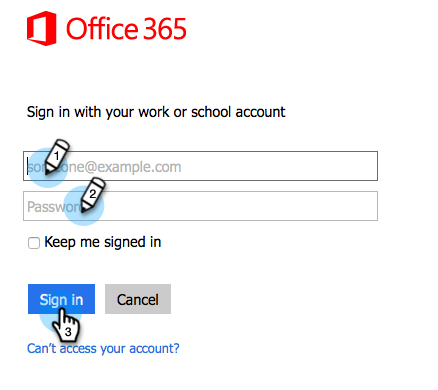

1. Haga clic en el menú  y seleccione **[!UICONTROL CRM]**.

   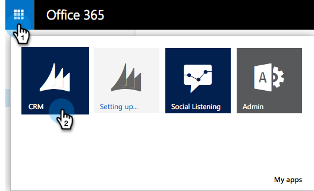

1. Haga clic en el menú . En el menú desplegable, seleccione **[!UICONTROL Configuración]** y, a continuación, seleccione **[!UICONTROL Soluciones]**.

   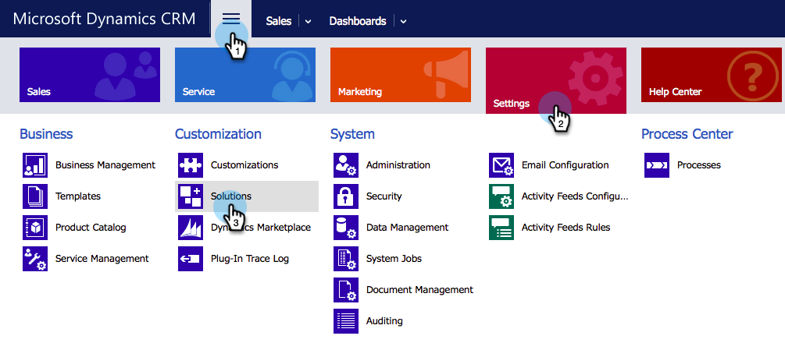

1. Haga clic en **[!UICONTROL Importar]**.

   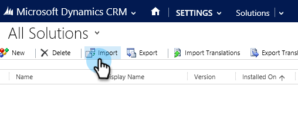

1. Haga clic en **[!UICONTROL Elegir archivo]**. Seleccione la solución Marketo Lead Management [descargada](/help/marketo/product-docs/crm-sync/microsoft-dynamics-sync/sync-setup/download-the-marketo-lead-management-solution.md). Haga clic en **[!UICONTROL Next]**.

   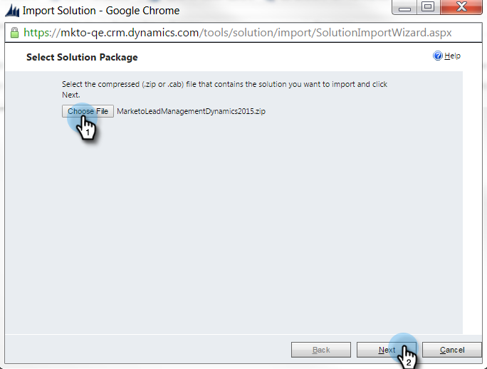

1. Vea la información de la solución y haga clic en **[!UICONTROL Ver detalles del paquete de la solución]**.

   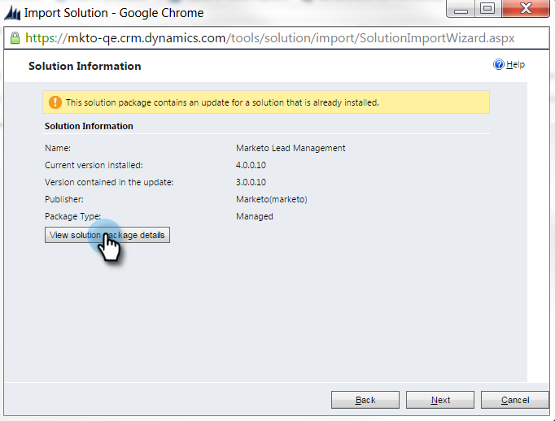

1. Cuando termine de comprobar todos los detalles, haga clic en **[!UICONTROL Cerrar]**.

   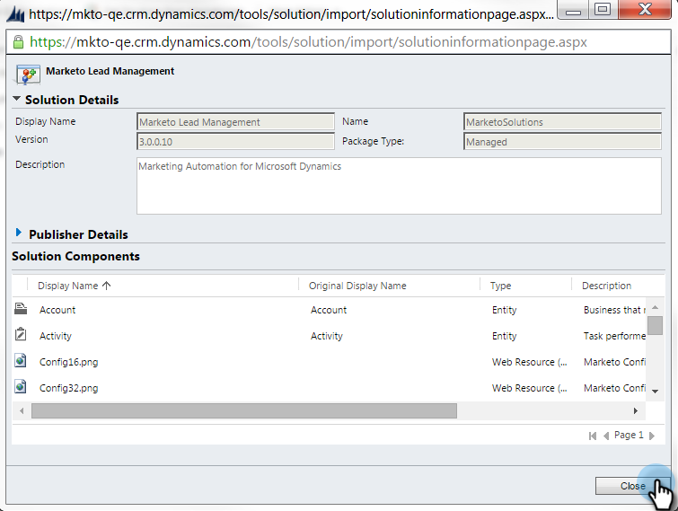

1. Ahora, en la página [!UICONTROL Información de la solución], haga clic en **[!UICONTROL Siguiente]**.

   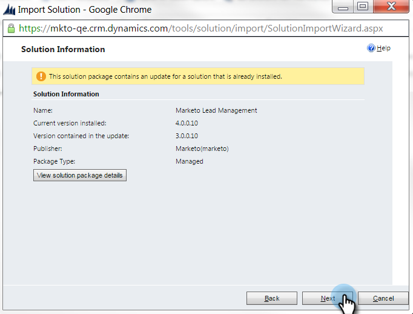

1. Asegúrese de que la casilla de verificación de la opción SDK esté seleccionada. Haga clic en **[!UICONTROL Importar]**.

   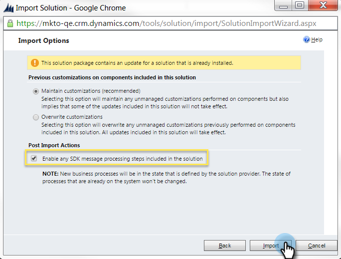

   >[!TIP]
   >
   >Deberá habilitar las ventanas emergentes en el explorador para completar el proceso de instalación.

1. Ahora espere a que finalice la importación.

   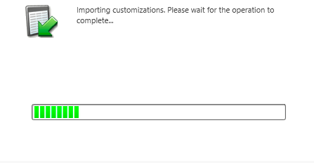

1. Haga clic en **[!UICONTROL Cerrar]**.

   >[!NOTE]
   >
   >Puede ver un mensaje que dice &quot;Marketo Lead Management completado con advertencia&quot;. Esto es totalmente esperado.

   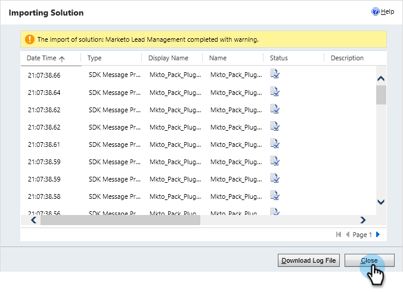

1. [!UICONTROL Marketo Lead Management] aparecerá en la lista de soluciones.

   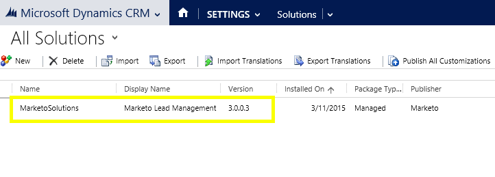

1. Seleccione **[!UICONTROL Marketo Lead Management]** y haga clic en **[!UICONTROL Publicar todas las personalizaciones]**.

   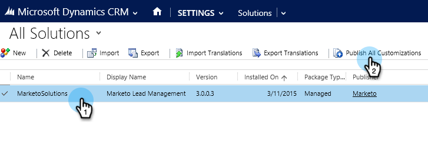

   La instalación ha finalizado.

   >[!MORELIKETHIS]
   >
   >[Paso 2 de 3: Configurar la solución de Marketo con conexión S2S](/help/marketo/product-docs/crm-sync/microsoft-dynamics-sync/sync-setup/microsoft-dynamics-365-with-s2s-connection/step-2-of-3-set-up.md){target="_blank"}
