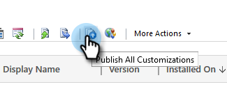

# Paso 2 de 3: Configurar la solución de Marketo con conexión de servidor a servidor {#step-2-of-3-set-up-marketo-sync-user-in-dynamics-s2s}

>[!PREREQUISITES]
>
>[Paso 1 de 3: Instalación de la solución de Marketo con conexión de servidor a servidor](/help/marketo/product-docs/crm-sync/microsoft-dynamics-sync/sync-setup/microsoft-dynamics-365-with-s2s-connection/step-1-of-3-install.md)

## Crear aplicación de cliente en Azure AD {#create-client-application-in-azure-ad}

1. Vaya a [este artículo de Microsoft](https://docs.microsoft.com/en-us/powerapps/developer/common-data-service/walkthrough-register-app-azure-active-directory#create-an-application-registration).

1. Siga todos los pasos. En el paso 3, introduzca un nombre de aplicación relevante (por ejemplo, &quot;Integración de Marketo&quot;). En Tipos de cuenta compatibles, seleccione **Cuenta en este directorio organizativo solamente**.

1. Escriba el ID de aplicación (ClientId) y el ID de inquilino. Tendrá que introducirlo más adelante en Marketo.

1. Conceda el consentimiento del administrador siguiendo los pasos [en este artículo](/help/marketo/product-docs/crm-sync/microsoft-dynamics-sync/sync-setup/grant-consent-for-client-id-and-app-registration.md).

1. Genere un secreto de cliente en el Centro de administración haciendo clic en **Certificados y secretos**.

   

1. Haga clic en el **Nuevo secreto de cliente** botón.

   

1. Introduzca una descripción de secreto de cliente y haga clic en **Agregar**.

   

>[!CAUTION]
>
>Asegúrese de anotar el valor Secreto del cliente (que se ve en la captura de pantalla siguiente), ya que lo necesitará más adelante. Solo se muestra una vez y no podrá recuperarlo de nuevo.

## Crear usuario de aplicación en Microsoft {#create-application-user-in-microsoft}

1. Siga los pasos del siguiente vínculo a [configuración de un usuario de aplicación en Microsoft](https://docs.microsoft.com/en-us/powerapps/developer/common-data-service/use-single-tenant-server-server-authentication#application-user-creation).

   >[!IMPORTANT]
   >
   >* Al conceder permisos al usuario de la aplicación, asegúrese de asignarlo a &quot;Función de usuario de sincronización de Marketo&quot;.
   >* Tenga en cuenta la dirección de correo electrónico del usuario de la aplicación desde la [opción ver detalles](https://docs.microsoft.com/en-us/power-platform/admin/manage-application-users#view-or-edit-the-details-of-an-application-user) en Power Platform. Esta dirección de correo electrónico se utilizará como nombre de usuario al configurar la conexión a MS Dynamics en Marketo.

## Azure AD Federated con AD FS On-Premim {#azure-ad-federated-with-ad-fs-on-prem}

Federated Azure AD to ADFS Onprem necesita la creación de una directiva de Home Domain Discovery para la aplicación específica. Con esta directiva, Azure AD redireccionará la solicitud de autenticación al servicio de federación. Para ello, la sincronización hash de contraseña debe habilitarse en AD Connect. Para obtener más información, consulte [OAuth con ROPC](https://docs.microsoft.com/en-us/azure/active-directory/develop/v2-oauth-ropc) y [Establecer una directiva secundaria para una aplicación](https://docs.microsoft.com/en-us/azure/active-directory/manage-apps/configure-authentication-for-federated-users-portal#example-set-an-hrd-policy-for-an-application).

Referencias adicionales [se puede encontrar aquí](https://docs.microsoft.com/en-us/azure/active-directory/reports-monitoring/concept-all-sign-ins#:~:text=Interactive%20user%20sign%2Dins%20are,as%20the%20Microsoft%20Authenticator%20app.&amp;text=This%20report%20also%20include%20federated,are%20federated%20to%20Azure%20AD.).

## Configurar la solución Marketo {#configure-marketo-solution}

¡Casi ahí! Todo lo que nos queda es informar a Marketo Solution sobre el nuevo usuario creado.

>[!IMPORTANT]
>
>Si está actualizando de la autenticación básica a OAuth, deberá ponerse en contacto con [Asistencia de Marketo](https://nation.marketo.com/t5/support/ct-p/Support) para obtener ayuda con la actualización de los parámetros adicionales. Al realizar un cambio de configuración en el usuario de sincronización predeterminado, se detendrá temporalmente la sincronización hasta que se introduzcan nuevas credenciales y se vuelva a habilitar la sincronización. A petición suya, la asistencia de Marketo puede deshabilitar la función (hasta abril de 2022) si desea volver al antiguo método de autenticación.

1. Vuelva a la sección Configuración avanzada y haga clic en el botón  junto a Configuración y seleccione **Configuración de Marketo**.

   

   >[!NOTE]
   >
   >Si no ve **Configuración de Marketo** en el menú Configuración , actualice la página. Si eso no funciona, intente [publicar la solución de Marketo](/help/marketo/product-docs/crm-sync/microsoft-dynamics-sync/sync-setup/microsoft-dynamics-365-with-s2s-connection/step-1-of-3-install.md) o cierre la sesión y vuelva a iniciarla.

1. Haga clic en **Predeterminado**.

   

1. Haga clic en el botón de búsqueda de la **Usuario de Marketo** y seleccione el usuario de sincronización que ha creado.

   

1. Haga clic en el  en la esquina inferior derecha para guardar los cambios.

   

1. Haga clic en el **X** en la parte superior derecha para cerrar la pantalla.

   

1. Haga clic en el  junto a Configuración y seleccione **Soluciones**.

   

1. Haga clic en el **Publicar todas las personalizaciones** botón.

   

## Antes de continuar con el paso 3 {#before-proceeding-to-step}

* Si desea restringir el número de registros que sincroniza, [configurar un filtro de sincronización personalizado](/help/marketo/product-docs/crm-sync/microsoft-dynamics-sync/create-a-custom-dynamics-sync-filter.md) ahora.
* Ejecute el [Validar Microsoft Dynamics Sync](/help/marketo/product-docs/crm-sync/microsoft-dynamics-sync/sync-setup/validate-microsoft-dynamics-sync.md) proceso. Comprueba que la configuración inicial se haya realizado correctamente.
* Inicie sesión en el usuario de sincronización de Marketo en Microsoft Dynamics CRM.

>[!MORELIKETHIS]
>
>* [Paso 3 de 3: Conexión de la solución de Marketo con la conexión servidor a servidor](/help/marketo/product-docs/crm-sync/microsoft-dynamics-sync/sync-setup/microsoft-dynamics-365-with-s2s-connection/step-3-of-3-connect.md)
>* [Reconfiguración del método de autenticación de Dynamics](/help/marketo/product-docs/crm-sync/microsoft-dynamics-sync/sync-setup/reconfigure-dynamics-authentication-method.md)

