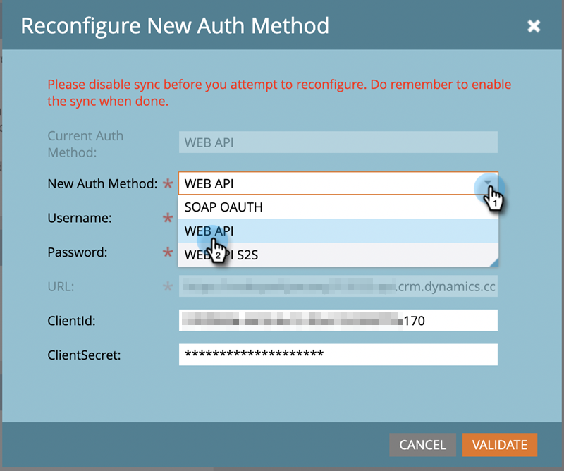

# Reconfiguración del método de autenticación de Dynamics {#reconfigure-dynamics-authentication-method}

Siga los pasos a continuación para actualizar su método de autenticación de Dynamics.

>[!PREREQUISITES]
>
>Configure la aplicación en Microsoft Dynamics y el directorio activo (Azure AD/ADFS) utilizando el método de autenticación deseado desde cualquiera de los siguientes artículos:
>* [Paso 2 de 3: Configurar la solución de Marketo con conexión de servidor a servidor](/help/marketo/product-docs/crm-sync/microsoft-dynamics-sync/sync-setup/microsoft-dynamics-365-with-s2s-connection/step-2-of-3-set-up.md)
>* [Paso 2 de 4: Configurar la solución de Marketo con la conexión de control de contraseña del propietario del recurso](/help/marketo/product-docs/crm-sync/microsoft-dynamics-sync/sync-setup/microsoft-dynamics-365-with-ropc-connection/step-2-of-4-set-up.md)

1. En Marketo, haga clic en **Administrador**.

   

1. Haga clic en **Microsoft Dynamics**, luego **Desactivar sincronización**.

   

   >[!NOTE]
   >
   >Debe desactivar la sincronización global temporalmente para actualizar el método de autenticación.

1. Haga clic en el **Reconfigurar nuevo método de autenticación** pestaña .

   

1. Seleccione el nuevo método de autenticación deseado (en este ejemplo elegimos la API web).

   

1. Introduzca las credenciales necesarias para el nuevo método de autenticación y haga clic en **Validar**.

   

   >[!NOTE]
   >
   >* Los campos específicos variarán según el método de autenticación elegido y el formulario se actualizará automáticamente según el método de autenticación anterior.
   >* Si ha sincronizado antes, es posible que los datos del formulario anterior se rellenen previamente. Vuelva a introducir todas las credenciales para asegurarse de que los valores son correctos.

1. Si todo está bien, Validar sincronización generará todas las marcas de verificación verdes . Revise el mensaje y haga clic en **Conmutador** para actualizar el método de autenticación.

   

   >[!NOTE]
   >
   >Si ve una , ese paso tiene un problema. Consulte [Corregir problemas de sincronización de validación de Dynamics](/help/marketo/product-docs/crm-sync/microsoft-dynamics-sync/sync-setup/validate-microsoft-dynamics-sync/fix-dynamics-validation-sync-issues.md) para identificar y solucionar los problemas. A continuación, vuelva a ejecutar los pasos de validación de sincronización hasta que el resultado se asemeje a la imagen anterior.

1. Haga clic en **Confirmar** para continuar.

   

1. Haga clic en **Confirmar** de nuevo.

   

1. Haga clic en **OK**.

   >[!IMPORTANT]
   >
   >El sistema tarda 15 minutos en aceptar el nuevo modo de autenticación. Espere 15 minutos desde la hora del conmutador antes de volver a activar la sincronización.
