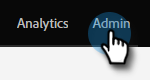
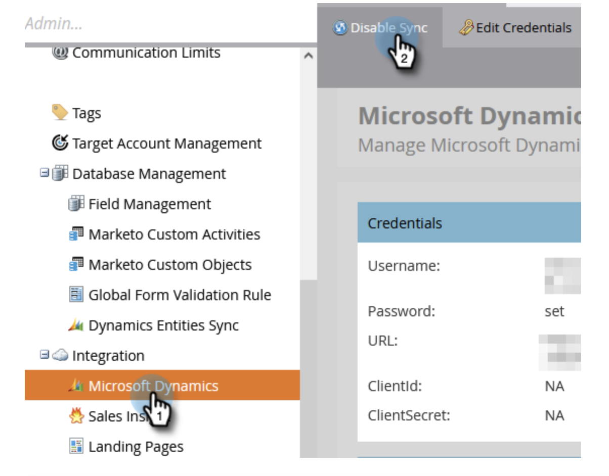
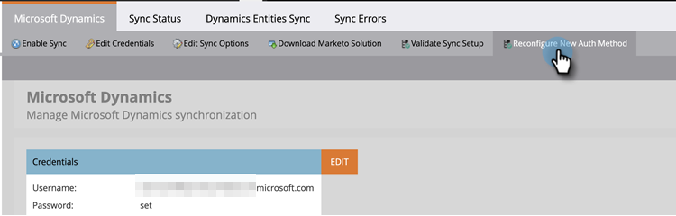
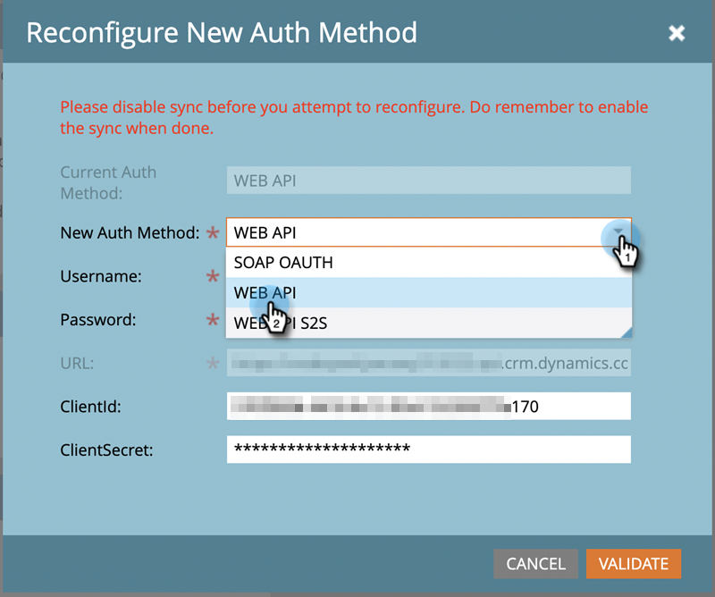
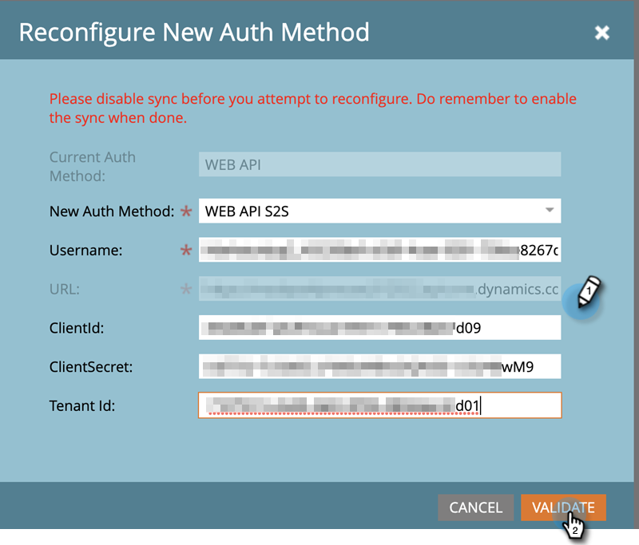
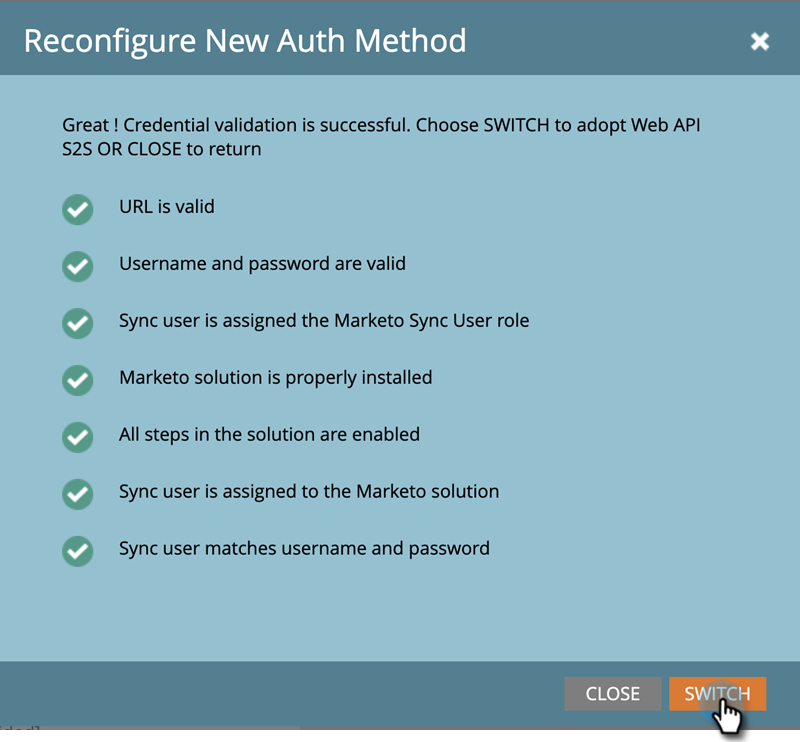
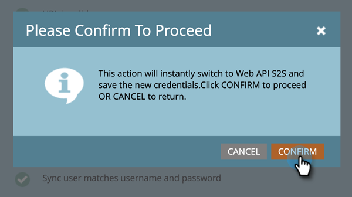
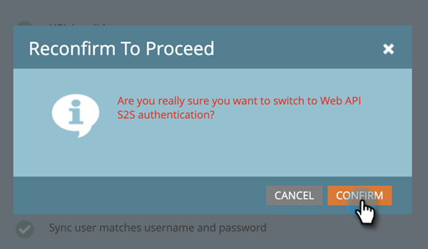

# Volver a configurar el método de autenticación de Dynamics {#reconfigure-dynamics-authentication-method}

Siga los pasos a continuación para actualizar su método de autenticación [!DNL Dynamics].

>[!PREREQUISITES]
>
>Configure la aplicación en [!DNL Microsoft Dynamics] y Active Directory (Azure AD/ADFS) utilizando el método de autenticación deseado en cualquiera de los siguientes artículos:
>
>* [Paso 2 de 3: Configurar la solución de Marketo con conexión de servidor a servidor](/help/marketo/product-docs/crm-sync/microsoft-dynamics-sync/sync-setup/microsoft-dynamics-365-with-s2s-connection/step-2-of-3-set-up.md){target="_blank"}
>* [Paso 2 de 4: Configurar la solución Marketo con conexión de control de contraseña de propietario de recursos](/help/marketo/product-docs/crm-sync/microsoft-dynamics-sync/sync-setup/microsoft-dynamics-365-with-ropc-connection/step-2-of-4-set-up.md){target="_blank"}

1. En Marketo, haga clic en **[!UICONTROL Admin]**.

   

1. Haga clic en **Microsoft Dynamics** y luego en **[!UICONTROL Deshabilitar sincronización]**.

   

   >[!NOTE]
   >
   >Debe deshabilitar la sincronización global temporalmente para actualizar el Método de autenticación.

1. Haga clic en la ficha **[!UICONTROL Volver a configurar nuevo método de autenticación]**.

   

1. Seleccione el nuevo Método de autenticación que desee (en este ejemplo, se selecciona API web).

   

1. Escriba las credenciales necesarias para el nuevo método de autenticación y haga clic en **[!UICONTROL Validar]**.

   

   >[!NOTE]
   >
   >* Los campos específicos variarán según el método de autenticación elegido y el formulario se actualizará automáticamente en función del método de autenticación anterior.
   >* Si ha realizado la sincronización anteriormente, es posible que los datos del formulario anterior se rellenen previamente. Vuelva a introducir todas las credenciales para asegurarse de que los valores son correctos.

1. Si todo está bien, Validar sincronización generará todas las marcas de verificación verdes . Revise el mensaje y haga clic en **[!UICONTROL Cambiar]** para actualizar el método de autenticación.

   

   >[!NOTE]
   >
   >Si ve un(a) , ese paso presenta un problema. Vea [Corregir [!DNL Dynamics] problemas de sincronización de validación](/help/marketo/product-docs/crm-sync/microsoft-dynamics-sync/sync-setup/validate-microsoft-dynamics-sync/fix-dynamics-validation-sync-issues.md) para identificar y corregir los problemas. A continuación, vuelva a ejecutar los pasos de validación de sincronización hasta que el resultado se parezca a la imagen anterior.

1. Haga clic en **[!UICONTROL Confirmar]** para continuar.

   

1. Vuelva a hacer clic en **[!UICONTROL Confirmar]**.

   

1. Haga clic en **[!UICONTROL Aceptar]**.

   >[!IMPORTANT]
   >
   >El sistema tarda 15 minutos en aceptar el nuevo modo de autenticación. Espere 15 minutos desde el momento del cambio antes de volver a activar la sincronización.
