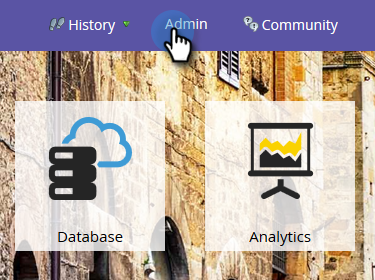
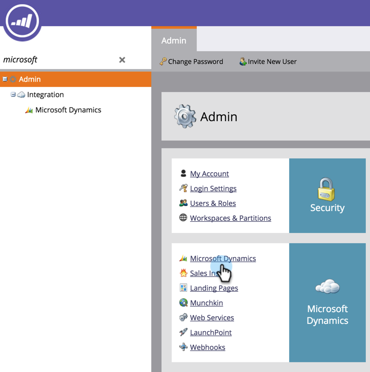
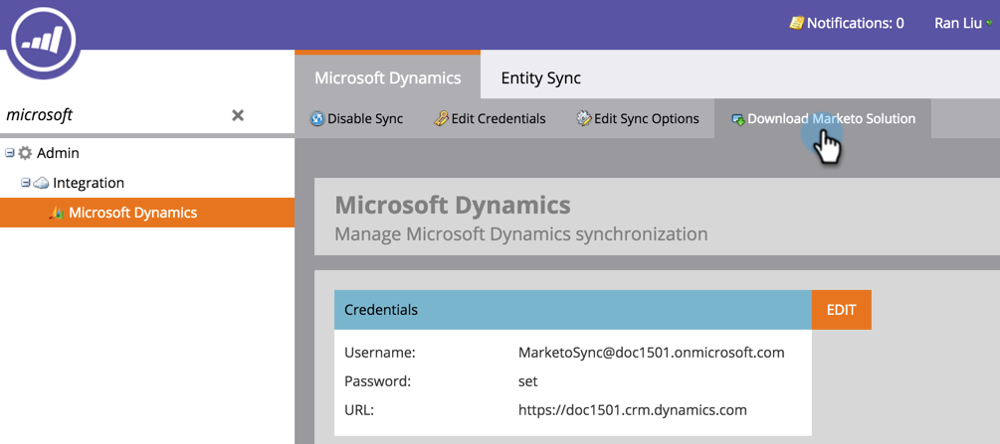
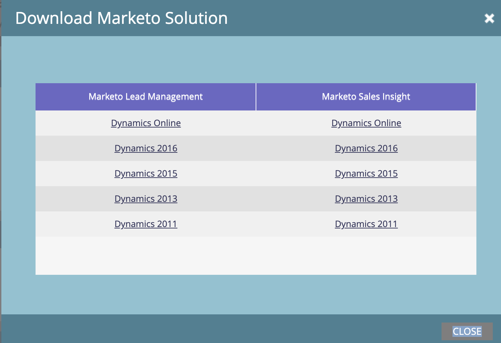
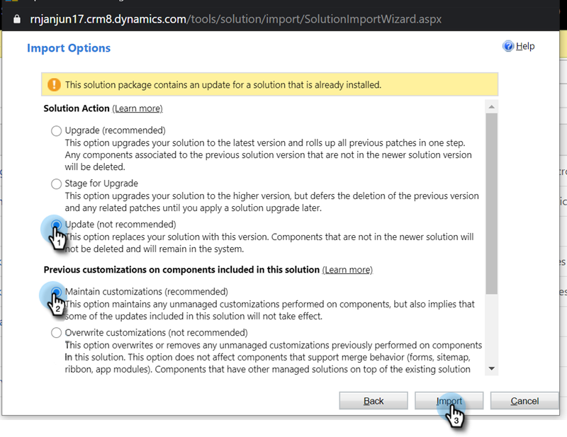

# Actualizar la solución Marketo para [!DNL Microsoft Dynamics] {#update-the-marketo-solution-for-microsoft-dynamics}

Cuando se publique una nueva solución [!DNL Microsoft Dynamics], podrá descargar la actualización desde el área de administración de su cuenta.

>[!NOTE]
>
>**Se requieren permisos de administrador**

>[!CAUTION]
>
>es imperativo que descargue la última solución de Marketo _antes de_ realizar cualquier actualización.

1. Vaya al área de **[!UICONTROL Admin]**.

   

1. Haga clic en **[!DNL Microsoft Dynamics]**.

   

1. Seleccione **[!UICONTROL Descargar solución de Marketo]**.

   

1. Seleccione la solución adecuada para su versión de [!DNL Microsoft Dynamics].

   

   Ahora se descargará un archivo zip de la solución en el dispositivo. Si no está familiarizado con los pasos de instalación, póngase en contacto con su administrador de [!UICONTROL Dynamics].

## Realización de la actualización {#performing-the-update}

1. Importe la última versión de la solución a través de la versión existente de su [!DNL Dynamics] CRM (p. ej.: si su [!DNL Dynamics] CRM tiene la versión 1.4 y la última versión es 1.5, importaría _más de_ la versión 1.4).

1. Verá la siguiente ventana emergente. Seleccione **[!UICONTROL Actualizar]** y **[!UICONTROL Mantener personalizaciones]**, y luego haga clic en **[!UICONTROL Importar]**.

   

>[!CAUTION]
>
>Si selecciona Actualizar en lugar de Actualizar, podrían dañarse los datos del entorno [!DNL Dynamics]. **Elija Actualización** en [!UICONTROL Opciones de importación].
