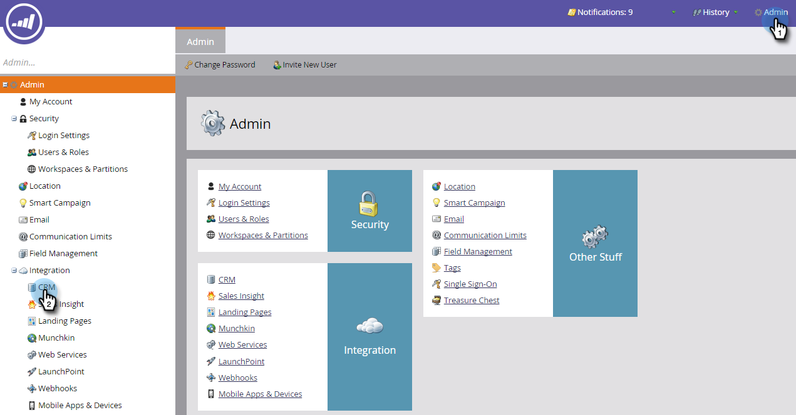
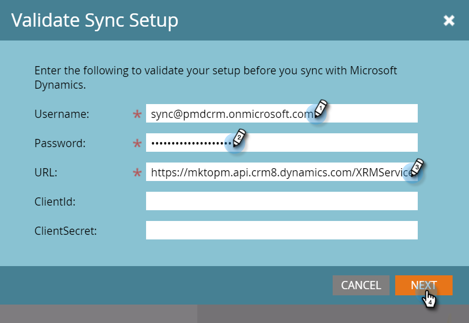

# Validar Microsoft Dynamics Sync {#validate-microsoft-dynamics-sync}

>[!CAUTION]
>
>Si tiene Multi-Factor Authentication (MFA) habilitado para Dynamics Sync, debe deshabilitarlo para que Dynamics se sincronice correctamente con Marketo. Para obtener más información, póngase en contacto con el [Soporte de Marketo](https://nation.marketo.com/t5/Support/ct-p/Support).

## Ejecutar Validar sincronización en Marketo {#run-validate-sync-in-marketo}

Es muy importante ejecutar la herramienta Validar sincronización para asegurarse de que la sincronización de Microsoft Dynamics con Marketo esté correctamente configurada antes de establecer la conexión final entre ellas. El proceso genera una lista de comprobación de siete pasos de configuración que señalan dónde existen problemas. Verificar que se hayan realizado correctamente puede ahorrar mucho tiempo después.

1. Haga clic en la pestaña **Admin** y, a continuación, en el enlace **Microsoft Dynamics** en el área de integración.

   

1. Seleccione **Microsoft**.

   

1. Haga clic en la pestaña **Validar configuración de sincronización**.

   

1. Introduzca su nombre de usuario, contraseña y dirección URL (el ID de cliente y el Secreto de cliente son opcionales). Haga clic en **Siguiente** cuando termine.

   

   >[!NOTE]
   >
   >Si ha sincronizado antes, **CRM** en el árbol de la izquierda leerá **Microsoft Dynamics** y es posible que los datos del formulario anterior se rellenen previamente.

1. Si todo está bien, Validar sincronización genera una lista de comprobación llena de marcas de verificación verdes .

   

1. Si ve un , entonces ese paso tiene un problema. Consulte [Solucionar problemas de sincronización de validación de Dynamics](/help/marketo/product-docs/crm-sync/microsoft-dynamics-sync/sync-setup/validate-microsoft-dynamics-sync/fix-dynamics-validation-sync-issues.md) para identificar y solucionar el problema. A continuación, vuelva a ejecutar los pasos de validación de sincronización hasta que el resultado se asemeje a la imagen anterior.

   >[!CAUTION]
   >
   >Actualmente no se admite la actualización de entornos limitados para Marketo Dynamics Sync. Si necesita actualizar el simulador para pruebas de Dynamics CRM, se necesitará un nuevo simulador para pruebas de Marketo. Póngase en contacto con el administrador de éxito de los clientes para obtener más información.

>[!MORELIKETHIS]
>
>[Corregir problemas de sincronización de validación de Dynamics](/help/marketo/product-docs/crm-sync/microsoft-dynamics-sync/sync-setup/validate-microsoft-dynamics-sync/fix-dynamics-validation-sync-issues.md)
