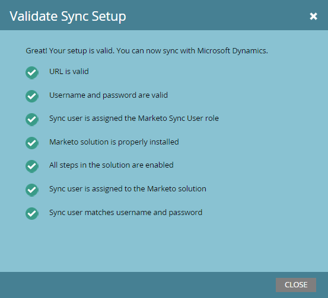

# Solucionar problemas de sincronización de validación de Dynamics {#fix-dynamics-validation-sync-issues}

## Validar resultados de la herramienta de sincronización {#validate-sync-tool-results}

Cuando ejecuta Dynamics Validate Sync, genera este informe. Si hay un  junto a un paso, consulte a continuación para identificar y solucionar el problema. A continuación, vuelva a ejecutar los pasos de validación de sincronización hasta que el resultado muestre únicamente marcas de verificación.

## La dirección URL es válida {#url-is-valid}

Si tiene una  aquí, compruebe que la dirección URL sea válida. Lo encontrará aquí en Recursos para desarrolladores y consulte el servicio de organización. La dirección URL puede no ser válida por varios motivos.

1. Inicie sesión en Dynamics. Haga clic en el icono Configuración y seleccione **Configuración avanzada**.

   

1. Haga clic en Configuración y seleccione **Personalizaciones**.

   

1. Haga clic en **Developer Resources**.

   

1. La URL del servicio de organización se encuentra en Puntos de conexión de servicio.

   

## El nombre de usuario y la contraseña son válidos {#username-and-password-are-valid}

Si tiene un  aquí, compruebe que su nombre de usuario y contraseña de Microsoft Dynamics son válidos.

## El usuario de sincronización está asignado a la función de usuario de sincronización de Marketo {#sync-user-is-assigned-to-the-marketo-sync-user-role}

Si tiene un  aquí, debe comprobar que la función de usuario de sincronización de Marketo está marcada en Microsoft Dynamics. Consulte el paso 2 de la documentación de instalación de Microsoft Dynamics.

1. En Dynamics, haga clic en el icono Configuración y seleccione **Configuración avanzada**.

   

1. Haga clic en **Settings** y seleccione **Security**.

   

1. Haga clic en **Usuarios.**

   

1. Haga clic en el vínculo del usuario de sincronización.

   

1. Haga clic en **Administrar funciones**.

   

1. Compruebe que la función de usuario de sincronización de Marketo esté marcada. Si no es así, compruébelo y haga clic en **OK.**

   

## La solución Marketo está instalada correctamente {#marketo-solution-is-properly-installed}

Si tiene un  aquí, vaya a Microsoft Dynamics para comprobar que la instalación de Marketo está allí. Consulte el paso 1 de la documentación de configuración de Microsoft Dynamics.

1. En Dynamics, haga clic en el icono Configuración y seleccione **Configuración avanzada**.

   

1. Haga clic en **Configuración** y seleccione **Soluciones.**

   

1. Compruebe que la solución esté incluida en la lista.

   

## Todos los pasos de la solución están habilitados {#all-steps-in-the-solution-are-enabled}

Si tiene un  aquí, compruebe que no se haya desactivado ninguno de los pasos predeterminados. Todos los pasos se activan automáticamente en la instalación, pero se pueden desactivar durante una personalización.

## El usuario de sincronización está asignado a la solución de Marketo {#sync-user-is-assigned-to-the-marketo-solution}

Si tiene un  aquí, asegúrese de que el usuario de sincronización esté asignado en la página predeterminada de Marketo en Microsoft Dynamics.

1. En Dynamics, haga clic en el icono Configuración y seleccione **Configuración avanzada**.

   

1. Haga clic en **Settings** y seleccione **Marketo Config**.

   

1. Compruebe que el usuario de sincronización está asignado como predeterminado.

   

## El usuario de sincronización coincide con el nombre de usuario y la contraseña {#sync-user-matches-username-and-password}

Si tiene un  aquí, asegúrese de asignar el usuario de sincronización adecuado en el campo Usuario de Marketo en el paso Configuración predeterminada de Marketo en Microsoft Dynamics.

>[!MORELIKETHIS]
>
>[Validar Microsoft Dynamics Sync](/help/marketo/product-docs/crm-sync/microsoft-dynamics-sync/sync-setup/validate-microsoft-dynamics-sync.md)
