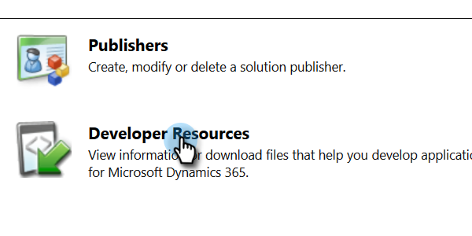

# Ver la URL del servicio de organización {#view-the-organization-service-url}

Marketo necesita la URL del servicio de organización para sincronizar con instancias de Dynamics. Así es como encontrarlo en Dynamics.

1. Inicie sesión en Dynamics. Haga clic en el icono Configuración y seleccione **Configuración avanzada**.

   

1. Haga clic en **Settings** y seleccione **Customogies**.

   

1. Haga clic en **Developer Resources**.

   

1. La URL del servicio de organización se encuentra en **Service Endpoints**.

   

1. Copie y pegue esa dirección URL en Marketo y disfrute del resto de la sincronización.
