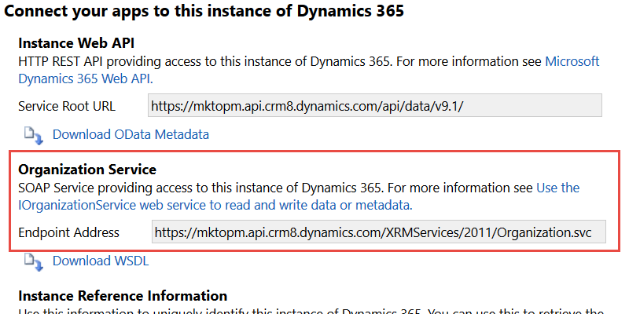

# Ver la URL del servicio de organización {#view-the-organization-service-url}

Marketo Engage necesita la URL del servicio de organización para sincronizarse con las instancias de MD. A continuación se indica cómo encontrarlo en Dynamics.

1. Inicie sesión en [!DNL Dynamics]. Haga clic en el icono Configuración y seleccione **[!UICONTROL Configuración avanzada]**.

   

1. Haga clic en **[!UICONTROL Configuración]** y seleccione **[!UICONTROL Personalizaciones]**.

   

1. Haga clic en **[!UICONTROL Recursos para desarrolladores]**.

   

1. La URL del servicio de organización se encuentra en **[!UICONTROL Extremos de servicio]**.

   

1. Copie y pegue esa dirección URL en Marketo y disfrute del resto de la sincronización.
