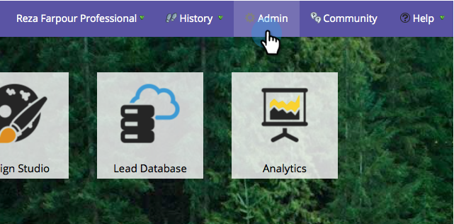

# Habilitar/deshabilitar la sincronización de Salesforce {#enable-disable-the-salesforce-sync}

Cuando realice cambios importantes en la sincronización o en la configuración de los campos, debe desactivar la sincronización al configurarla. Así es como:

1. Vaya a la **Administrador** para obtener más información.

   

1. En **Salesforce**, haga clic en **Desactivar sincronización**.

   

1. La sincronización de dos vías ahora está desactivada e inactiva hasta que la vuelva a habilitar. Las acciones de flujo de Salesforce seguirán funcionando.

   

1. Realice los cambios y vuelva a habilitar la sincronización. Es el mismo botón.
