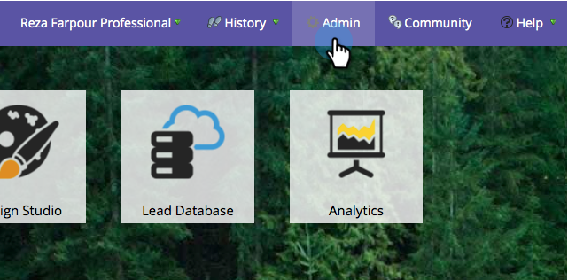
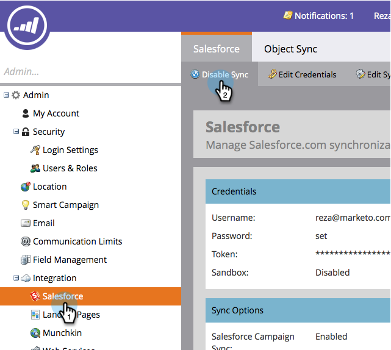

# Habilitar/deshabilitar la sincronización de [!DNL Salesforce] {#enable-disable-the-salesforce-sync}

Cuando realice cambios importantes en la configuración de la sincronización o del campo, debe deshabilitar la sincronización mientras configura. A continuación se muestra cómo:

1. Vaya a la sección **[!UICONTROL Admin]**.

   

1. En **[!UICONTROL Salesforce]**, haga clic en **[!UICONTROL Deshabilitar sincronización]**.

   

1. La sincronización bidireccional ahora está desactivada e inactiva hasta que la vuelva a habilitar. [!DNL Salesforce] acciones de flujo seguirán funcionando.

   

1. Realice los cambios y vuelva a habilitar la sincronización. Es el mismo botón.
