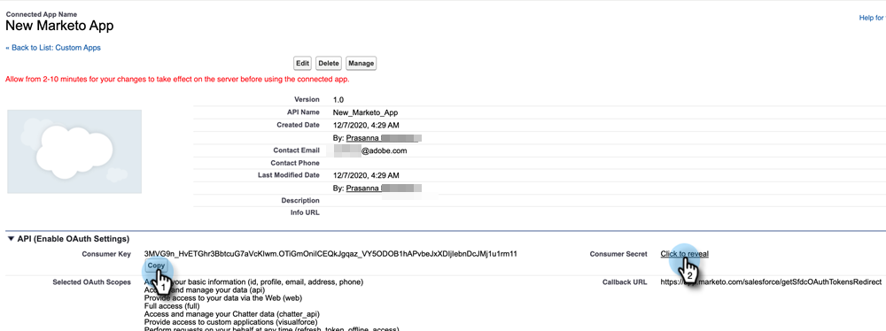
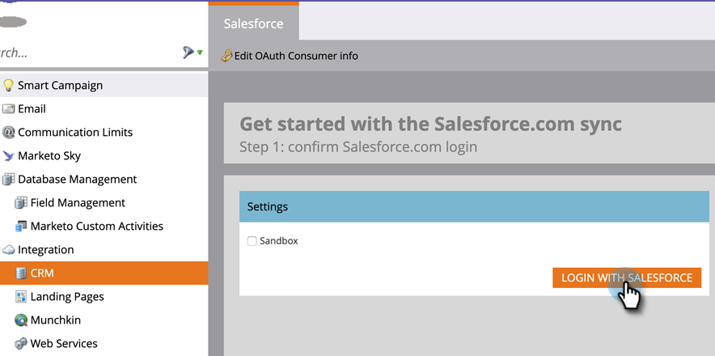
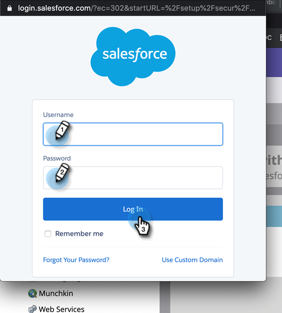
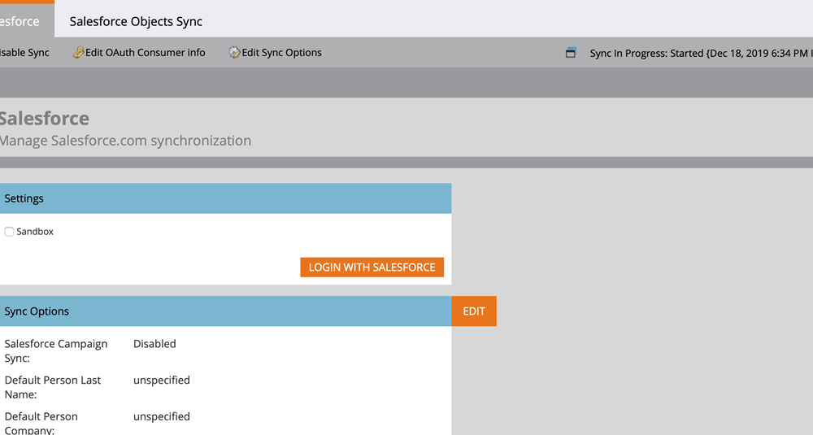

# Iniciar sesión utilizando OAuth 2.0 {#log-in-using-oauth-2-0}

Salesforce utiliza el protocolo OAuth para permitir que los usuarios de aplicaciones accedan de forma segura a los datos (autentique la aplicación utilizando OAuth 2.0) sin tener que revelar las credenciales de inicio de sesión. A continuación se indican los pasos que se deben realizar para conectar y sincronizar Marketo con Salesforce de forma segura.

>[!IMPORTANT]
>
>Para conectar Marketo y Salesforce mediante OAuth, inicie sesión en Marketo a través de un navegador privado (incógnito) para evitar conectarse a Salesforce con el nombre de usuario incorrecto.

## Configurar aplicación conectada {#set-up-connected-app}

1. En Salesforce, en Configuración, dentro de Herramientas de plataforma, vaya a Aplicaciones, Administrador de aplicaciones y haga clic en **Nueva aplicación conectada**.

   

1. Complete los detalles y haga clic en **Guardar**.

   

1. Haga clic en el **Habilitar la configuración de OAuth** casilla de verificación. En URL de devolución de llamada, introduzca `https://app.marketo.com/salesforce/getSfdcOAuthTokensRedirect`. Seleccione todos los ámbitos de OAuth disponibles y haga clic en **Agregar**.

   

1. Haga clic en **Guardar**.

   

1. Haga clic en **Continuar**.

   

1. Copie la clave de consumidor y el secreto del consumidor.

   

>[!NOTE]
>
>Guarde la clave del consumidor y la información del secreto del consumidor para usarlos más adelante en Marketo.

## Configuración de Marketo {#set-up-marketo}

>[!PREREQUISITES]
>
>* El acceso a la API debe estar habilitado para el usuario de sincronización de Salesforce (si es usuario de Salesforce Professional Edition, ese acceso no está disponible de forma predeterminada; póngase en contacto con su ejecutivo de cuentas de Salesforce).
>* El usuario de Marketo Sync debe crearse en Salesforce.
>* Para los clientes existentes, la función &quot;Habilitar OAuth para la sincronización SFDC&quot; está habilitada en la suscripción del cliente.
>* Los bloqueadores de ventanas emergentes están desactivados.
>* La aplicación conectada se crea y tenemos la clave del consumidor y el secreto del consumidor disponibles para su uso.

>[!CAUTION]
>
>Asegúrese de ocultar todos los campos que no necesite en Marketo del usuario de sincronización antes de hacer clic en **Campos de sincronización**. Una vez que haga clic en Campos de sincronización, todos los campos que el usuario pueda ver en SFDC se crearán en Marketo de forma permanente y no se podrán eliminar.

1. En la sección Administración de Marketo , haga clic en **CRM**, luego **Sincronizar con Salesforce**.

   

1. Añada la información de la clave de consumidor y del secreto de consumidor que haya registrado anteriormente y haga clic en y **Guardar**.

   

1. En la página de sincronización de Marketo Salesforce, haga clic en el botón **Iniciar sesión con Salesforce** botón.

   

   >[!CAUTION]
   >
   >Si ve los campos Nombre de usuario/Contraseña/Token y no el botón &quot;Iniciar sesión con Salesforce&quot;, su suscripción a Marketo está habilitada para la autenticación básica. Consulte [Configuración de Marketo con autenticación básica](/help/marketo/product-docs/crm-sync/salesforce-sync/setup/enterprise-unlimited-edition/step-3-of-3-connect-marketo-and-salesforce-enterprise-unlimited.md). Una vez que la sincronización comienza a utilizar un conjunto de credenciales, no se cambia la credenciales o la suscripción de Salesforce. Si desea utilizar Oauth 2.0, póngase en contacto con el administrador de éxito de los clientes.

1. Aparecerá una ventana emergente con la página de inicio de sesión de salesforce. Clave en sus credenciales de &quot;usuario de sincronización de Marketo&quot; e inicie sesión.

   

1. Introduzca el código de verificación recibido por correo electrónico (enviado por Salesforce) y haga clic en **Verificar**.

   

1. Cuando la verificación se realice correctamente, la página de acceso mostrará la solicitud de acceso. Haga clic en **Permitir**.

   

1. En unos minutos, aparecerá una ventana emergente en Marketo. Haga clic en **Confirmar credenciales**.

   

1. Al finalizar la sincronización de campos, haga clic en **Iniciar sincronización de Salesforce**.

   

1. Haga clic en **Iniciar sincronización**.

   

La sincronización entre Marketo y Salesforce está en curso.

>[!MORELIKETHIS]
>
>* [Paso 1 de 3: Agregar campos de Marketo a Salesforce (Enterprise/Unlimited)](/help/marketo/product-docs/crm-sync/salesforce-sync/setup/enterprise-unlimited-edition/step-1-of-3-add-marketo-fields-to-salesforce-enterprise-unlimited.md)
>* [Paso 2 de 3: Crear un usuario de Salesforce para Marketo (Enterprise/Unlimited)](/help/marketo/product-docs/crm-sync/salesforce-sync/setup/enterprise-unlimited-edition/step-2-of-3-create-a-salesforce-user-for-marketo-enterprise-unlimited.md)
>* [Instalación del paquete de perspectivas de ventas de Marketo en la AppExchange de Salesforce](/help/marketo/product-docs/marketo-sales-insight/msi-for-salesforce/installation/install-marketo-sales-insight-package-in-salesforce-appexchange.md)
>* [Configurar la perspectiva de ventas de Marketo en Salesforce Enterprise/Unlimited](/help/marketo/product-docs/marketo-sales-insight/msi-for-salesforce/configuration/configure-marketo-sales-insight-in-salesforce-enterprise-unlimited.md)

