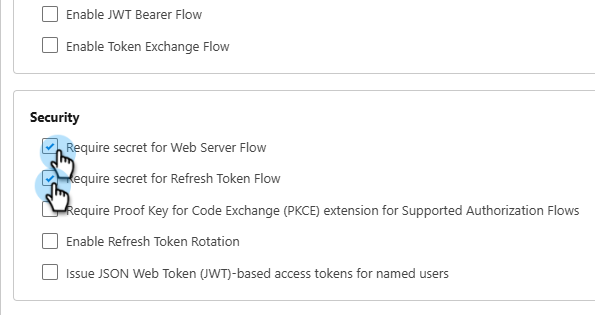
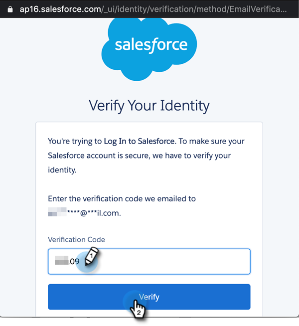

# Iniciar sesión con OAuth 2.0 {#log-in-using-oauth-2-0}

Salesforce utiliza el protocolo OAuth para permitir a los usuarios de aplicaciones acceder a los datos de forma segura (autenticar la aplicación mediante OAuth 2.0) sin tener que revelar las credenciales de inicio de sesión. A continuación se indican los pasos que se deben seguir para conectar y sincronizar Marketo Engage de forma segura con Salesforce.

>[!IMPORTANT]
>
>Para conectar Marketo y [!DNL Salesforce] mediante OAuth, inicie sesión en Marketo a través del explorador privado (incógnito) para evitar conectarse a [!DNL Salesforce] con el nombre de usuario incorrecto.

## Configuración de la aplicación cliente externa {#set-up-external-client-app}

>[!NOTE]
>
>En septiembre de 2025, Salesforce empezó a restringir el uso de [aplicaciones conectadas](https://help.salesforce.com/s/articleView?id=005132365&type=1){target="_blank"}. Para los usuarios existentes que han configurado una aplicación conectada en función de nuestra documentación, puede añadir el permiso &quot;Aprobar aplicaciones conectadas no instaladas&quot; al perfil del usuario de sincronización de Marketo o crear una nueva aplicación de cliente externo siguiendo las instrucciones a continuación.

1. En Salesforce, haga clic en el icono del engranaje y seleccione **Configuración**.

   

1. En el cuadro Búsqueda rápida, escriba `App Manager` y después seleccione **Administrador de aplicaciones**.

   

1. Haga clic en **Nueva aplicación cliente externa**.

   

1. Rellene los detalles en _Información básica_. Establecer _estado de distribución_ en **Local**.

   

1. Expanda la sección **API (Habilitar configuración de OAuth)** y seleccione la casilla de verificación **[!UICONTROL Habilitar OAuth]**. Para _URL de devolución de llamada_, ingrese `https://app.marketo.com/salesforce/getSfdcOAuthTokensRedirect`. Seleccione todos los ámbitos de OAuth disponibles y haga clic en la flecha derecha para añadirlos.

   

1. En _Habilitación de flujo_, asegúrese de que no haya casillas seleccionadas.

   

1. En _Seguridad_, asegúrese de que solo están seleccionados **Requerir secreto para flujo de servidor web** y **Requerir secreto para flujo de token de actualización**.

   

1. Omita las últimas cuatro secciones y haga clic en **Crear**.

   

1. Una vez creada la nueva aplicación cliente externa, haga clic en la ficha **Configuración** y expanda la sección **Configuración de OAuth**.

   

1. Haga clic en el botón **Clave de consumidor y Secreto del consumidor**, para que se abra una nueva pestaña. Copie y guarde ambos números (los necesitará más adelante para usarlos en Marketo Engage).

   

## Configuración de Marketo {#set-up-marketo}

>[!PREREQUISITES]
>
>* El acceso a la API debe estar habilitado para el usuario de sincronización de Salesforce (si es usuario de Salesforce Professional Edition, ese acceso no está disponible de forma predeterminada; póngase en contacto con el administrador de cuentas de Salesforce).
>* El usuario de sincronización de Marketo debe crearse en Salesforce.
>* Para los clientes existentes, la función &quot;Habilitar OAuth para la sincronización de SFDC&quot; está habilitada en la suscripción del cliente.
>* Los bloqueadores de elementos emergentes están deshabilitados.
>* Se ha creado la aplicación conectada y tenemos [!UICONTROL Clave de consumidor] y [!UICONTROL Secreto de consumidor] disponibles para usar.

>[!CAUTION]
>
>Asegúrese de ocultar al usuario de sincronización todos los campos que no necesite en Marketo antes de hacer clic en **[!UICONTROL Campos de sincronización]**. Una vez que haga clic en Sincronizar campos, todos los campos que el usuario pueda ver en SFDC se crearán en Marketo de forma permanente y no se podrán eliminar.

1. En la sección Administración de Marketo, haz clic en **[!UICONTROL CRM]**, luego en **[!UICONTROL Sincronizar con Salesforce]**.

   

1. Agregue la clave de consumidor y la información del secreto de consumidor que registró anteriormente, haga clic en y **[!UICONTROL Guardar]**.

   

1. En la página de sincronización de Marketo Salesforce, haga clic en el botón **[!UICONTROL Iniciar sesión con Salesforce]**.

   

   >[!CAUTION]
   >
   >Si ve los campos Nombre de usuario/Contraseña/Token y no un botón &quot;Iniciar sesión con Salesforce&quot;, su suscripción a Marketo está habilitada para la autenticación básica. Consulte [Configurar Marketo con autenticación básica](/help/marketo/product-docs/crm-sync/salesforce-sync/setup/enterprise-unlimited-edition/step-3-of-3-connect-marketo-and-salesforce-enterprise-unlimited.md){target="_blank"}. Una vez que la sincronización comienza con un conjunto de credenciales, no se cambia de credenciales de Salesforce ni de suscripción. Para que Oauth 2.0 esté configurado para la autenticación de Salesforce, comuníquese con el [Soporte técnico de Marketo](https://nation.marketo.com/t5/support/ct-p/Support){target="_blank"}.

1. Se mostrará una ventana emergente con la página de inicio de sesión de Salesforce. Introduzca sus credenciales de &quot;Usuario de sincronización de Marketo&quot; e inicie sesión.

   

1. Escribe el código de verificación que recibiste por correo electrónico (enviado por Salesforce) y haz clic en **[!UICONTROL Verificar]**.

   

1. Una vez verificada correctamente, aparecerá la página de acceso que solicita el acceso. Haga clic en **[!UICONTROL Permitir]**.

   

1. En unos minutos, aparecerá una ventana emergente en Marketo. Haga clic en **[!UICONTROL Confirmar credenciales]**.

   

1. Una vez finalizada la sincronización de campos, haga clic en **[!UICONTROL Iniciar sincronización de Salesforce]**.

   

1. Haga clic en **[!UICONTROL Iniciar sincronización]**.

   

La sincronización entre Marketo y [!DNL Salesforce] está en curso.

>[!MORELIKETHIS]
>
>* [Paso 1 de 3: agregar campos de Marketo a Salesforce (empresarial/ilimitado)](/help/marketo/product-docs/crm-sync/salesforce-sync/setup/enterprise-unlimited-edition/step-1-of-3-add-marketo-fields-to-salesforce-enterprise-unlimited.md){target="_blank"}
>* [Paso 2 de 3: Crear un usuario de Salesforce para Marketo (Enterprise/Unlimited)](/help/marketo/product-docs/crm-sync/salesforce-sync/setup/enterprise-unlimited-edition/step-2-of-3-create-a-salesforce-user-for-marketo-enterprise-unlimited.md){target="_blank"}
>* [Instalar el paquete Marketo Sales Insight en Salesforce AppExchange](/help/marketo/product-docs/marketo-sales-insight/msi-for-salesforce/installation/install-marketo-sales-insight-package-in-salesforce-appexchange.md){target="_blank"}
>* [Configuración de Marketo Sales Insight en Salesforce Enterprise/Unlimited](/help/marketo/product-docs/marketo-sales-insight/msi-for-salesforce/configuration/configure-marketo-sales-insight-in-salesforce-enterprise-unlimited.md){target="_blank"}
