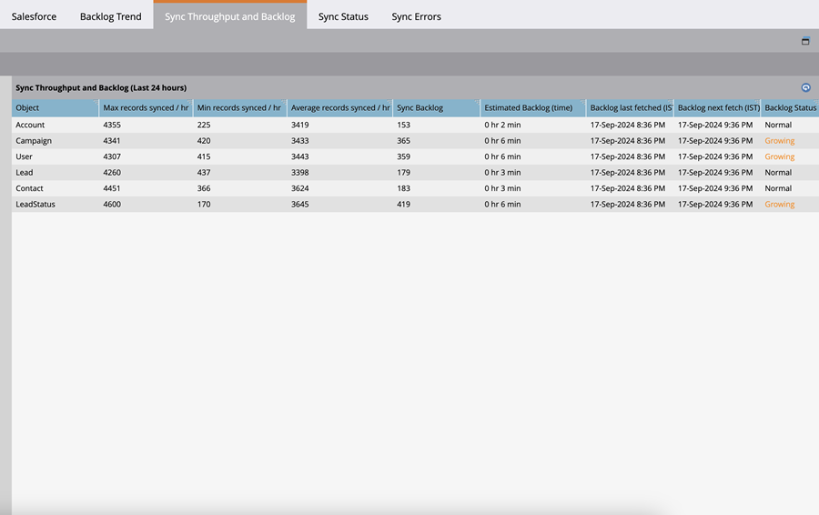

# Métricas de registro de sincronización de Salesforce  {#salesforce-sync-backlog-metrics}

El registro de pendientes de sincronización es el nombre utilizado para los registros pendientes de sincronización. Tiene en cuenta los registros pendientes de sincronización de Salesforce con Marketo Engage y viceversa. Garantizar que el registro de pendientes permanece bajo control dará lugar a sincronizaciones suaves y de tiempo. El registro de pendientes abarca los números pendientes de las actualizaciones posteriores a la sincronización en ambos lados, y no aquellos que se realizan mediante pasos de flujo de sincronización como los pasos de flujo de Sincronizar posible cliente a SFDC.

## Cómo acceder a {#how-to-access}

1. En Marketo Engage, vaya al área **Admin**.

   

1. Seleccione **Salesforce**.

   

## Tendencia de trabajo pendiente de sincronización {#sync-backlog-trend}

La tendencia del registro de pendientes refleja los cambios en los registros de asuntos pendientes registrados durante los últimos 5 días. El registro de pendientes se muestra en un intervalo de tiempo de 4 horas dividido en 5 días. Por lo tanto, el gráfico mostrará 6 intervalos por día por 5 días, lo que equivale a 30 intervalos.

El registro de pendientes se observa a un intervalo de tiempo particular de 4 horas en el eje x. Este valor es para todos los objetos sincronizados. Este es el total del registro de pendientes en Salesforce y Marketo Engage que esperan sincronizarse.

## Rendimiento de sincronización y registro de pendientes {#sync-throughput-and-backlog}

Las estadísticas reflejan el rendimiento y el estado del registro de pendientes de cada tipo de objeto sincronizado durante las últimas 24 horas. Los tipos de objeto incluyen todos los objetos sincronizados, incluidos: Posible cliente, Contacto, Cuenta, Oportunidad, Campaña, Usuario y Objetos personalizados. Las estadísticas de rendimiento se actualizan automáticamente cada 15 minutos, pero puede hacerlo manualmente con el icono de actualización. El registro de pendientes se recupera cada hora.

>[!NOTE]
>
>Las estadísticas se actualizan de forma gradual, no por día natural.

<table><thead>
  <tr>
    <th>Campo</th>
    <th>Descripción</th>
  </tr></thead>
<tbody>
  <tr>
    <td>Máximo de registros sincronizados por hora</td>
    <td>El número máximo de registros sincronizados por hora (rendimiento máximo) observado en las últimas 24 horas para el tipo de objeto. El periodo de 24 horas se desplaza con el tiempo, no con el día del calendario.</td>
  </tr>
  <tr>
    <td>Registros mínimos sincronizados por hora</td>
    <td>Número mínimo de registros sincronizados por hora (rendimiento mínimo) observados en las últimas 24 horas para el tipo de objeto. El periodo de 24 horas se desplaza con el tiempo, no con el día del calendario.</td>
  </tr>
  <tr>
    <td>Registros promedio sincronizados por hora</td>
    <td>Número promedio de registros sincronizados por hora (rendimiento mínimo) observados en las últimas 24 horas para el tipo de objeto. El periodo de 24 horas se desplaza con el tiempo, no con el día del calendario. Se calcula como el número total de registros sincronizados en las últimas 24 horas.</td>
  </tr>
  <tr>
    <td>Sincronizar registro de pendientes</td>
    <td>El registro de registros pendientes de sincronización para el tipo de objeto. Es la suma total de la sincronización pendiente de registro en ambas direcciones (de Salesforce a Marketo Engage y viceversa). El registro de pendientes de Salesforce se obtiene mediante una llamada de API a Salesforce y el registro de pendientes de Marketo Engage se calcula mediante las estadísticas obtenidas del registro de datos de cambios. Se calcula cada hora. Los dos campos siguientes de esta tabla informan de cuándo se calculó por última vez el registro de pendientes y la siguiente programación para el cálculo, respectivamente.</td>
  </tr>
  <tr>
    <td>Registro de pendientes estimado (tiempo)</td>
    <td>Estimación del tiempo necesario para sincronizar el registro de pendientes por tipo de objeto. Se calcula como "Sincronizar registros pendientes/promedio sincronizados por hora".</td>
  </tr>
  <tr>
    <td>Último registro de pendientes recuperado</td>
    <td>Hora del último cálculo del registro de pendientes.</td>
  </tr>
  <tr>
    <td>Siguiente captura de registro pendiente</td>
    <td>Hora del siguiente cálculo del registro de pendientes.</td>
  </tr>
  <tr>
    <td>Estado de trabajo pendiente</td>
    <td>Esto muestra si el registro de pendientes ha aumentado en las últimas 6 horas. Se deduce como "Creciente" si el registro de asuntos pendientes actual es mayor que el registro de asuntos pendientes hace seis horas. De lo contrario, se muestra como "Normal". El objetivo de esto es mostrar si el rendimiento de la sincronización se está poniendo al día con el registro de pendientes.</td>
  </tr>
</tbody></table>

## Qué causa los trabajos pendientes de sincronización {#what-causes-sync-backlogs}

Tanto si la actualización se realiza en el lado del Marketo Engage como en el del CRM, almacenará en déclencheur el registro que se debe resincronizar para actualizar la información en el otro extremo a través del ciclo de sincronización normal entre el Marketo Engage y el CRM. Siempre que se realiza una actualización de un registro en Salesforce, se genera una marca de tiempo de modificación del sistema (SysModStamp). Esto pone en cola un cambio para sincronizarlo.

Cuando se realiza una gran cantidad de actualizaciones (como cuando cambia un valor de campo), muchos registros se modifican, lo que provoca nuevos SysModStamps. Un gran número de actualizaciones de registros de personas debe resincronizarse entre el Marketo Engage y su CRM, a veces creando un registro de asuntos pendientes momentáneo.

## Prácticas recomendadas para administrar los trabajos pendientes de sincronización {#best-practices}

**Campos visibles para el usuario de sincronización**: Asegúrese de que los campos visibles para sincronizar sean solo los que necesitan sincronizarse y tengan valor para los esfuerzos de marketing. Cualquier actualización de un registro en Salesforce que actualice la última marca de tiempo modificada colocará un registro en la cola del registro de sincronización pendiente, y la sincronización de campos innecesarios puede ralentizar los campos más importantes que se están sincronizando. Si se ocultan los campos innecesarios al usuario de sincronización, las actualizaciones de esos campos resultarán en una omisión mucho más rápida que una actualización. Póngase en contacto con su administrador de Salesforce para revisar las prácticas recomendadas aquí y actualizar qué campos son visibles para el usuario de sincronización de Marketo.

**Ocultar o filtrar registros innecesarios**: si un registro no se puede comercializar, es posible que esté desperdiciando recursos de sincronización. Si el usuario de sincronización no puede verlo, no desperdiciará recursos al intentar sincronizarlo. [El soporte técnico del Marketo Engage](https://nation.marketo.com/t5/support/ct-p/Support#_blank){target="_blank"} puede ayudar a configurar un filtro de sincronización para inhibir la sincronización de registros en función de criterios adicionales. Encontrará más información sobre la configuración de un filtro de sincronización personalizado [aquí](https://nation.marketo.com/t5/product-blogs/instructions-for-creating-a-custom-sync-rule/ba-p/242758){target="_blank"}. Se recomienda encarecidamente utilizar campos de índice dentro de Salesforce (póngase en contacto con salesforce para obtener más información).

**Programar actualizaciones masivas durante horas no críticas**: revise los patrones de sincronización de datos para identificar períodos no críticos. Revise si se pueden programar actualizaciones masivas en estos períodos no críticos, si es posible.

**Campos actualizados con frecuencia**: Algunos campos son propensos a actualizaciones frecuentes. Por ejemplo, los campos de moneda que están sujetos a cambios de moneda. Revise si es necesario sincronizarlos o si los campos deben diseñarse de forma diferente. Si tiene otros campos que se actualizan con frecuencia y no son necesarios, ocúltelos del usuario de sincronización. Asegúrese de hablar con los administradores de SFDC sobre las integraciones que pueden estar actualizando campos.

**Objetos personalizados**: revise periódicamente [objetos personalizados](https://experienceleague.adobe.com/en/docs/marketo/using/product-docs/crm-sync/salesforce-sync/sfdc-sync-details/sfdc-sync-custom-object-sync){target="_blank"} habilitados para sincronizar y deshabilitar los que ya no necesitan sincronizarse.

**Actividades**: [Revise si alguna de las actividades](https://experienceleague.adobe.com/en/docs/marketo/using/product-docs/crm-sync/salesforce-sync/setup/optional-steps/customize-activities-sync){target="_blank"} habilitó la sincronización que se pueda quitar de la sincronización.  Estas actividades solo se sincronizan una vez al día por posible cliente.

**Revisar errores de sincronización**: La administración de excepciones puede ralentizar la sincronización. Revisar las notificaciones de los usuarios y resolver los errores puede mejorar el estado de la sincronización.

**Póngase en contacto con el soporte técnico**: Si está siguiendo todas las prácticas recomendadas anteriores y aún experimenta retrasos significativos, póngase en contacto con el [Soporte técnico del Marketo Engage](https://nation.marketo.com/t5/support/ct-p/Support#_blank){target="_blank"}.
