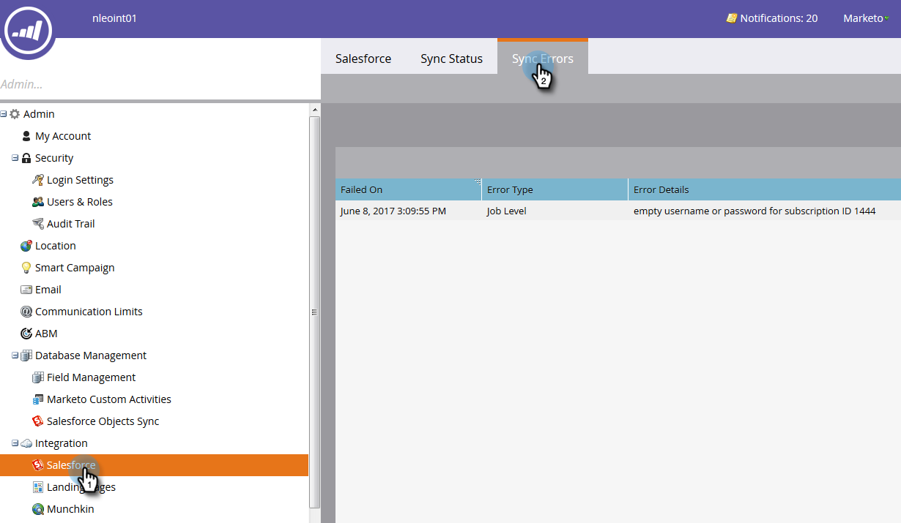

# Errores de sincronización de Salesforce {#salesforce-sync-errors}

Vea un resumen de los errores encontrados durante el proceso de sincronización. Esto incluye los errores causados por errores al sincronizar datos incompatibles.

>[!NOTE]
>
>**Se requieren permisos de administrador**

## Ver errores de sincronización {#view-sync-errors}

1. Haga clic en **Administrador**.

   

1. En Integración, haga clic en **Salesforce**, luego la variable **Errores de sincronización** pestaña .

   

>[!NOTE]
>
>Los errores enumerados van desde el tiempo actual hasta cinco días antes de la sincronización actual.

| Campo | Descripción |
|---|---|
| Error en | Nivel de registro _o_ Nivel de trabajo |
| Fecha/hora del error | Detalles del error |
| Tipo de error | Mensaje de devolución SFDC |

>[!TIP]
>
>Al hacer clic en el registro de nivel de registro, se muestran los ID de Marketo y Salesforce del objeto relacionado. En algunos casos, el mensaje del registro y los errores de nivel de trabajo proceden directamente de Salesforce. Si los busca en línea, puede proporcionar más detalles.

## Filtrar errores de sincronización {#filter-sync-errors}

1. Para filtrar los datos, haga clic en el icono de filtro situado en el extremo derecho de la página.

   

1. Seleccione el intervalo de fecha y hora y, a continuación, filtre por Tipo de error (Nivel de trabajo o Nivel de registro). Haga clic en **Aplicar** cuando haya terminado.

   

**Paso opcional**: Para exportar errores de sincronización, haga clic en **Exportar**. Los datos se exportan como CSV.

