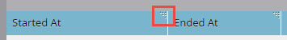

# Estado de sincronización de Salesforce {#salesforce-sync-status}

Utilice el panel de estado de sincronización para ver las estadísticas de sincronización como parte de los pasos de sincronización y su estado de éxito.

Los pasos de sincronización reflejan las operaciones de push o pull por cada tipo de objeto para el esquema de objetos y los propios datos. Las estadísticas cubren nuevos registros, actualizaciones, eliminaciones y recuentos fallidos durante la sincronización. Los usuarios pueden filtrar por fecha, tipo de operación o tipo de objeto. El panel de estado de sincronización muestra el estado de los ciclos de sincronización de los últimos cinco días.

>[!NOTE]
>
>Se requieren permisos de administrador

## Ver estado de sincronización {#view-sync-status}

1. Haga clic en **Admin**.

   

1. En Integración, haga clic en Salesforce y, a continuación, en la ficha Estado de sincronización.

   

De forma predeterminada, las estadísticas se ordenarán por orden de iniciación más reciente. Puede ordenar por Iniciado en o Terminado en (desde la más reciente hasta la más antigua) haciendo clic en el icono de ordenación.

## Estado de sincronización de filtro {#filter-sync-status}

1. Para filtrar los datos, haga clic en el icono de filtro situado en el extremo derecho de la página.

   

1. Seleccione la fecha y el intervalo de tiempo y, a continuación, haga clic en los desplegables para filtrar por Tipo de objeto, Tipo de operación y/o Tipo de estado.

   

1. Haga clic en **Aplicar**.

   

**Paso** opcional: Para exportar errores de sincronización, haga clic en  **Exportar**. Los datos se exportan como CSV.

## Campos de estado de sincronización {#sync-status-fields}

<table> 
 <colgroup> 
  <col> 
  <col> 
  <col> 
 </colgroup> 
 <tbody> 
  <tr> 
   <th>Campo</th> 
   <th>Descripción</th> 
   <th>Valores de enumeración</th> 
  </tr> 
  <tr> 
   <td colspan="1">Comenzar en</td> 
   <td colspan="1">Fecha y hora de inicio del ciclo de sincronización (zona horaria del usuario)</td> 
   <td colspan="1"></td> 
  </tr>  
  <tr> 
   <td colspan="1">Finalizado en</td> 
   <td colspan="1">Fecha y hora de finalización del ciclo de sincronización (zona horaria del usuario)</td> 
   <td colspan="1"></td> 
  </tr> 
  <tr> 
   <td colspan="1">Objeto</td> 
   <td colspan="1">Tipo de objeto</td> 
   <td colspan="1">Contacto, persona, tarea, oportunidad, posible cliente, otros como se muestra a continuación</td> 
  </tr>  
  <tr> 
   <td colspan="1">Operación</td> 
   <td colspan="1">Tipo de operación</td> 
   <td colspan="1">Tipos de operaciones como se muestra a continuación</td> 
  </tr>  
  <tr> 
   <td colspan="1">Estado</td> 
   <td colspan="1">Estado del lote</td> 
   <td colspan="1">Correcto, Fallido, Incompleto, En Proceso, Limpiado*</td> 
  </tr>
  <tr> 
   <td colspan="1">Nuevo</td> 
   <td colspan="1">Recuento de registros nuevos</td> 
   <td colspan="1"></td> 
  </tr>  
  <tr> 
   <td colspan="1">Actualizado</td> 
   <td colspan="1">Recuento de registros actualizados</td> 
   <td colspan="1"></td> 
  </tr>  
  <tr> 
   <td colspan="1">Eliminado</td> 
   <td colspan="1">Recuento de registros eliminados</td> 
   <td colspan="1"></td> 
  </tr> 
  <tr> 
   <td colspan="1">Elemento con error</td> 
   <td colspan="1">Número de registros cuya sincronización falló</td> 
   <td colspan="1"> </td> 
  </tr>  
  <tr> 
   <td colspan="1">Omitido</td> 
   <td colspan="1">Recuento de registros omitidos porque no se han realizado cambios en los campos de interés para la sincronización</td> 
   <td colspan="1"></td> 
  </tr>  
 </tbody> 
</table>

*Los datos se han revertido al estado de integridad anterior después del error de paso de sincronización.

## Tipo de objeto {#object-type}

<table> 
 <colgroup> 
  <col> 
 </colgroup> 
 <tbody> 
  <tr> 
   <td colspan="1">Cuenta</td> 
  </tr>  
  <tr> 
   <td colspan="1">Tipo de cuenta</td> 
  </tr> 
  <tr> 
   <td colspan="1">Objetos personalizados</td> 
  </tr>  
  <tr> 
   <td colspan="1">Campaign</td> 
  </tr>  
  <tr> 
   <td colspan="1">Estado del miembro de la campaña</td> 
  </tr>
  <tr> 
   <td colspan="1">Contacto</td> 
  </tr>  
  <tr> 
   <td colspan="1">Plantilla de correo electrónico</td> 
  </tr>  
  <tr> 
   <td colspan="1">Evento</td> 
  </tr> 
  <tr> 
   <td colspan="1">Persona (posible cliente)</td> 
  </tr>  
  <tr> 
   <td colspan="1">Oportunidad</td> 
  </tr>  
  <tr> 
   <td colspan="1">Función de contacto de oportunidad</td> 
  </tr>  
  <tr> 
   <td colspan="1">Tarea</td> 
  </tr>  
  <tr> 
   <td colspan="1">Usuario</td> 
  </tr>  
 </tbody> 
</table>

## Tipo de operación {#operation-type}

<table> 
 <colgroup> 
  <col> 
  <col> 
  <col>
  <col> 
 </colgroup> 
 <tbody> 
  <tr> 
   <th>Tipo de operación</th> 
   <th>Encontrado en estos objetos</th> 
   <th>Observaciones</th> 
   <th>Tipo de operación</th>
  </tr> 
  <tr> 
   <td colspan="1">Vínculo de inicio con el programa</td> 
   <td colspan="1">Campaign</td> 
   <td colspan="1">Vinculación de campañas a programas</td> 
   <td colspan="1">Actualizar</td>
  </tr>  
  <tr> 
   <td colspan="1">Extraer conversiones</td> 
   <td colspan="1">Persona (posible cliente)*</td> 
   <td colspan="1">Extraiga las acciones de conversión de SFDC a Marketo. Las unidades (números) son posibles clientes que se convierten a contactos</td> 
   <td colspan="1">Actualizar, error de elemento u omitido</td>
  </tr> 
  <tr> 
   <td colspan="1">Eliminaciones de extracción</td> 
   <td colspan="1">Contacto, Persona (Plomo), Oportunidad, Campaña, Miembros De Campaña, Contacto De Oportunidad, Objetos Personalizados, Campañas, Estado Del Miembro De La Campaña, Función De Contacto De Oportunidad</td> 
   <td colspan="1">Registros eliminados de SFDC que se sincronizan con Marketo</td> 
   <td colspan="1">Eliminado, fallido o omitido</td>
  </tr>  
  <tr> 
   <td colspan="1">Actualizaciones de extracción</td> 
   <td colspan="1">Tarea, Persona (Posible Cliente), Cola Persona (Posible Cliente), Contacto, Evento, Oportunidad, Cuenta, Tipo De Cuenta, Miembros De Campaña, Objetos Personalizados, Campañas, Estado De Miembro De Campaña, Eventos, Estado De Persona, Oportunidad, Función De Contacto De Oportunidad</td> 
   <td colspan="1">Actualizaciones o registros nuevos en SFDC sincronizados con Marketo, Extraer eventos como actividades</td> 
   <td colspan="1">Nuevo, actualizado, error de elemento u omitido</td>
  </tr>  
  <tr> 
   <td colspan="1">Insertar nuevo</td> 
   <td colspan="1">Tareas, plantillas de correo electrónico</td> 
   <td colspan="1">Tareas push (actividades)</td> 
   <td colspan="1"></td>
  </tr>
  <tr> 
   <td colspan="1">Actualizaciones push</td> 
   <td colspan="1">Tareas, Plantillas De Correo Electrónico, Persona, Contacto, Campañas</td> 
   <td colspan="1">Inserción de actualizaciones en SFDC y también eliminación</td> 
   <td colspan="1">Actualizar, error de elemento u omitido</td>
  </tr>  
  <tr> 
   <td colspan="1">esquema de sincronización</td> 
   <td colspan="1">Miembros de campaña, Objetos personalizados, Campañas, Estado de miembro de campaña, Tareas, Persona, Oportunidad, Función de contacto de oportunidad, Usuarios</td> 
   <td colspan="1">Sincroniza metadatos de diferentes objetos para decidir qué campos nuevos sincronizar en el siguiente ciclo</td> 
   <td colspan="1"></td>
  </tr>  
  <tr> 
   <td colspan="1">Sincronizar con el programa</td> 
   <td colspan="1">Campañas</td> 
   <td colspan="1">Sincroniza el programa de Marketo con campañas SFDC</td> 
   <td colspan="1">Nuevas, actualizaciones, fallidas u omitidas</td>
  </tr> 
  <tr> 
   <td colspan="1">Actualizar actividades</td> 
   <td colspan="1">Tareas</td> 
   <td colspan="1">Extraer actividades de Salesforce</td> 
   <td colspan="1"></td>
  </tr>  
  <tr> 
   <td colspan="1">Actualizar FKS</td> 
   <td colspan="1">Todo</td> 
   <td colspan="1">Actualizar la clave externa de todos los objetos</td> 
   <td colspan="1">N/D</td>
  </tr>  
 </tbody> 
</table>

*La configuración de marca en el nivel de suscripción decide la etiqueta - &quot;Posible cliente&quot; o &quot;Persona&quot; en el informe.
