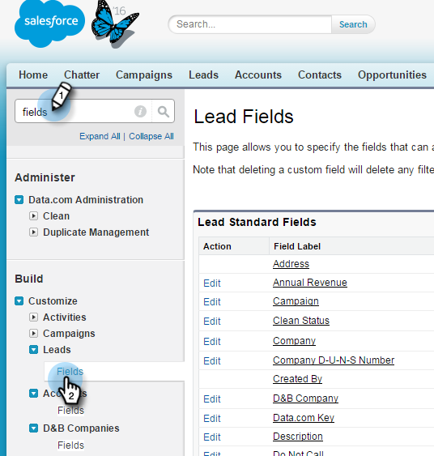

# Paso 1 de 3: Agregar campos de Marketo a Salesforce (Enterprise/Unlimited) {#step-of-add-marketo-fields-to-salesforce-enterprise-unlimited}

>[!PREREQUISITES]
>
>Debe tener acceso a las API de Salesforce para sincronizar entre Marketo y Salesforce.

Marketo utiliza un conjunto de campos para capturar determinados tipos de información relacionada con el marketing. Si desea ver estos datos en Salesforce, siga las instrucciones a continuación.

1. Cree tres campos personalizados en Salesforce en los objetos de contacto y posible cliente: Puntuación, Programa de adquisición y Fecha de adquisición.
1. Asigne estos campos personalizados entre posibles clientes y contactos para que, al realizar la conversión en Salesforce, los valores se transfieran.
1. Si es necesario, puede crear otros campos adicionales (consulte la tabla siguiente).

Todos estos campos personalizados son opcionales y no son necesarios para sincronizar Marketo y Salesforce. Como práctica recomendada, le recomendamos que cree campos para Puntuación, Programa de adquisición y Fecha de adquisición.

## Añadir campos de Marketo a Salesforce {#add-marketo-fields-to-salesforce}

Agregue tres campos personalizados a los objetos de contacto y posible cliente de Salesforce que se han indicado anteriormente. Si desea agregar más, consulte la tabla de campos disponibles al final de esta sección.

Siga estos pasos para cada uno de los tres campos personalizados para agregarlos. Comience con Puntuación.

1. Inicie sesión en Salesforce y haga clic en **Configurar**.

   

1. En el menú Generar de la izquierda, haga clic en **Personalizar** y seleccione **Posibles clientes**. Clic **Campos**.

   

1. Clic **Nuevo** en la sección Campos personalizados y relaciones en la parte inferior de la página.

   

1. Elija el tipo de campo adecuado (para Puntuación — número; Programa de adquisición — texto; Fecha/hora de adquisición).

   

1. Clic **Siguiente**.

   

1. Introduzca la Etiqueta de campo, Longitud y Nombre de campo para el campo, como se muestra en la tabla siguiente.

<table> 
 <thead> 
  <tr> 
   <th> 
    

      Etiqueta de campo 
    
</th> 
   <th> 
    

      Nombre del campo 
    
</th> 
   <th> 
    

      Tipo de datos 
    
</th> 
   <th> 
    

      Atributos de campo 
    
</th> 
  </tr> 
 </thead> 
 <tbody> 
  <tr> 
   <td>Puntuación</td> 
   <td>mkto71_Lead_Score</td> 
   <td>Número</td> 
   <td>Longitud 10 Cifras decimales 0 </td> 
  </tr> 
  <tr> 
   <td>Fecha de adquisición</td> 
   <td>mkto71_Acquisition_Date</td> 
   <td>Fecha/hora</td> 
   <td> </td> 
  </tr> 
  <tr> 
   <td>Programa de adquisición</td> 
   <td>mkto71_Acquisition_Program</td> 
   <td>Texto</td> 
   <td>Longitud 255</td> 
  </tr> 
 </tbody> 
</table>

>[!NOTE]
>
>Salesforce anexa __c a los nombres de campo cuando los utiliza para crear nombres de API.

>[!NOTE]
>
>Los campos de texto y número requieren una longitud, pero los campos de fecha y hora no. Una descripción es opcional.

1. Clic **Siguiente**.

   

1. Especifique la configuración de acceso y haga clic en **Siguiente**:

   * Definir todos los roles en **Visible** y **Solo lectura**

   * Borre la **Solo lectura** casilla de verificación para el perfil del usuario de sincronización:

      * Si tiene un usuario con el perfil de un _Administrador del sistema_ como usuario de sincronización, borre la **Solo lectura** casilla de verificación para el perfil del administrador del sistema (como se muestra a continuación)
      * Si ha creado un _perfil personalizado_ para el usuario de sincronización, borre la etiqueta **Solo lectura** casilla de verificación para ese perfil personalizado

   

1. Elija los diseños de página que deben mostrar el campo.

   

1. Clic **Guardar y nuevo** para volver y crear cada uno de los otros dos campos personalizados. Clic **Guardar** con lo que has terminado con los tres.

   

1. En el menú Generar de la izquierda, haga clic en **Personalizar** y seleccione Contactos. Haga clic en Campos.
1. Realice los pasos del 3 al 10 para los campos Puntuación, Fecha de adquisición y Programa de adquisición del objeto de contacto, tal como lo hizo para el objeto de posible cliente.
1. De forma opcional, utilice el procedimiento anterior para cualquier campo personalizado adicional de esta tabla.

<table> 
 <thead> 
  <tr> 
   <th> 
    

      Etiqueta de campo 
    
</th> 
   <th> 
    

      Nombre del campo 
    
</th> 
   <th> 
    

      Tipo de datos 
    
</th> 
   <th> 
    

      Atributos de campo 
    
</th> 
  </tr> 
 </thead> 
 <tbody> 
  <tr> 
   <td>ID del programa de adquisición</td> 
   <td>mkto71_Acquisition_Program_Id</td> 
   <td>Número</td> 
   <td>Longitud 18 Cifras decimales 0 </td> 
  </tr> 
  <tr> 
   <td>Referente original</td> 
   <td>mkto71_Original_Referrer</td> 
   <td>Texto</td> 
   <td>Longitud 255</td> 
  </tr> 
  <tr> 
   <td>Motor de búsqueda original</td> 
   <td>mkto71_Original_Search_Engine</td> 
   <td>Texto</td> 
   <td>Longitud 255</td> 
  </tr> 
  <tr> 
   <td>Frase de búsqueda original</td> 
   <td>mkto71_Original_Search_Phrase</td> 
   <td>Texto</td> 
   <td>Longitud 255</td> 
  </tr> 
  <tr> 
   <td>Información de origen original</td> 
   <td>mkto71_Original_Source_Info</td> 
   <td>Texto</td> 
   <td>Longitud 255</td> 
  </tr> 
  <tr> 
   <td>Tipo de origen original</td> 
   <td>mkto71_Original_Source_Type</td> 
   <td>Texto</td> 
   <td>Longitud 255</td> 
  </tr> 
  <tr> 
   <td>Ciudad inferida</td> 
   <td>mkto71_Inferred_City</td> 
   <td>Texto</td> 
   <td>Longitud 255</td> 
  </tr> 
  <tr> 
   <td>Compañía inferida</td> 
   <td>mkto71_Inferred_Company</td> 
   <td>Texto</td> 
   <td>Longitud 255</td> 
  </tr> 
  <tr> 
   <td>País inferido</td> 
   <td>mkto71_Inferred_Country</td> 
   <td>Texto</td> 
   <td>Longitud 255</td> 
  </tr> 
  <tr> 
   <td>Área metropolitana inferida</td> 
   <td>mkto71_Inferred_Metropolitan_Area</td> 
   <td>Texto</td> 
   <td>Longitud 255</td> 
  </tr> 
  <tr> 
   <td>Código de área telefónico inferido</td> 
   <td>mkto71_Inferred_Phone_Area_Code</td> 
   <td>Texto</td> 
   <td>Longitud 255</td> 
  </tr> 
  <tr> 
   <td>Código postal inferido</td> 
   <td>mkto71_Inferred_Postal_Code</td> 
   <td>Texto</td> 
   <td>Longitud 255</td> 
  </tr> 
  <tr> 
   <td>Región del estado inferida</td> 
   <td>mkto71_Inferred_State_Region</td> 
   <td>Texto</td> 
   <td>Longitud 255</td> 
  </tr> 
 </tbody> 
</table>

>[!NOTE]
>
>Los valores de los campos asignados automáticamente por Marketo no estarán disponibles inmediatamente en Salesforce cuando se haya creado el nuevo campo. Marketo sincronizará los datos con Salesforce la próxima vez que se actualice el registro en cualquiera de los sistemas (es decir, cuando se actualice cualquiera de los campos sincronizados entre Marketo y Salesforce).

## Asignación de campos personalizados para conversiones {#map-custom-fields-for-conversions}

Un campo personalizado en el objeto de posible cliente en Salesforce debe asignarse a un campo de contacto en el objeto de contacto para que los datos se transfieran cuando se produzca una conversión.

1. En la esquina superior derecha, haga clic en **Configurar**.

   

1. Escriba &quot;Campos&quot; en la búsqueda de navegación sin pulsar Intro. Los campos aparecen bajo diferentes objetos; haga clic en **Campos** en Posibles clientes.

   

1. Vaya a la sección Campos personalizados y relaciones de posibles clientes y haga clic en **Asignar campos de posibles clientes**.

   

1. Haga clic en la lista desplegable junto al campo que desee asignar.

   

1. Seleccione el campo personalizado de contacto correspondiente.

   

1. Repita los pasos anteriores para cualquier otro campo que haya creado.

1. Clic **Guardar** cuando hayas terminado.

   Suficientemente fácil, ¿verdad?

>[!MORELIKETHIS]
>
>[Paso 2 de 3: Crear un usuario de Salesforce para Marketo (Enterprise/Unlimited)](/help/marketo/product-docs/crm-sync/salesforce-sync/setup/enterprise-unlimited-edition/step-2-of-3-create-a-salesforce-user-for-marketo-enterprise-unlimited.md)
