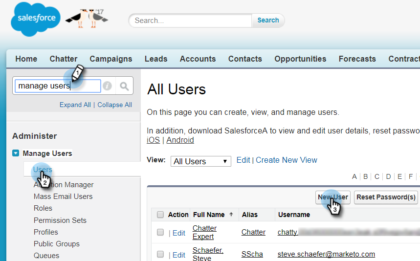

# Paso 2 de 3: Crear un usuario de Salesforce para Marketo (Enterprise/Unlimited) {#step-of-create-a-salesforce-user-for-marketo-enterprise-unlimited}

>[!NOTE]
>
>Estos pasos debe completarlos un administrador de Salesforce

>[!PREREQUISITES]
>
>[Paso 1 de 3: Agregar campos de Marketo a Salesforce (Enterprise/Unlimited)](/help/marketo/product-docs/crm-sync/salesforce-sync/setup/enterprise-unlimited-edition/step-1-of-3-add-marketo-fields-to-salesforce-enterprise-unlimited.md){target="_blank"}

En este artículo, configurará los permisos de usuario en el perfil de Salesforce y creará una cuenta de integración de Marketo-Salesforce.

## Crear un perfil {#create-a-profile}

1. Clic **[!UICONTROL Configurar]**.

   

1. Escriba &quot;perfiles&quot; en la barra de búsqueda de navegación y haga clic en **[!UICONTROL Perfiles]** vínculo.

   

1. Haga clic en **[!UICONTROL Nuevo]**.

   

1. Seleccionar **[!UICONTROL Usuario estándar]**, asigne un nombre al perfil &quot;Marketo-Salesforce Sync&quot; y haga clic en **[!UICONTROL Guardar]**.

   

## Definición de permisos de perfil {#set-profile-permissions}

1. Clic **[!UICONTROL Editar]** para establecer los permisos de seguridad.

   

1. En el **[!UICONTROL Permisos administrativos]** , asegúrese de que las siguientes casillas estén marcadas:

   * API habilitada
   * Editar plantillas de HTML
   * Administrar documentos públicos
   * Administrar plantillas públicas

   

   >[!TIP]
   >
   >Asegúrese de comprobar el **[!UICONTROL La contraseña nunca caduca]** cuadro.

1. En la sección Permisos generales de usuario, asegúrese de que las siguientes casillas estén marcadas:

   * Convertir posibles clientes
   * Editar eventos
   * Editar tareas

   

1. En la sección Permisos de objeto estándar, asegúrese de que los permisos Leer, Crear, Editar y Eliminar están marcados para:

   * Cuentas
   * Campañas
   * Contactos
   * Clientes potenciales
   * Oportunidades

   >[!NOTE]
   >
   >Conceda permisos a las campañas si planea utilizar la sincronización de campañas.

   

1. Cuando termine, haga clic en **[!UICONTROL Guardar]** en la parte inferior de la página.

   

## Definir permisos de campo {#set-field-permissions}

1. Hable con los especialistas en marketing para averiguar qué campos personalizados son necesarios para sincronizar.

   >[!NOTE]
   >
   >Este paso evitará que los campos que no necesite se muestren en Marketo, lo que reducirá el desorden y acelerará la sincronización.

1. En la página de detalles del perfil, vaya a **[!UICONTROL Seguridad de nivel de campo]** sección. Clic **[!UICONTROL Ver]** para editar la accesibilidad de los objetos:

   * Posible cliente
   * Contacto
   * Cuenta
   * Oportunidad

   >[!TIP]
   >
   >Puede configurar otros objetos según las necesidades de su organización.

   

1. Haga clic en cada objeto **[!UICONTROL Editar]**.

   

1. Busque los campos innecesarios, asegúrese de que **[!UICONTROL Acceso de lectura]** y **[!UICONTROL Editar acceso]** están desmarcadas. Clic **[!UICONTROL Guardar]** cuando termine.

   >[!NOTE]
   >
   >Editar solo la accesibilidad de los campos personalizados.

   

1. Una vez que termine de deshabilitar todos los campos innecesarios, debe comprobar **[!UICONTROL Acceso de lectura y acceso de edición]** para los siguientes campos de objeto. Clic **[!UICONTROL Guardar]** cuando termine.

<table> 
 <tbody> 
  <tr> 
   <th colspan="1" rowspan="1">
Objeto
</th> 
   <th colspan="1" rowspan="1">
Campos
</th> 
  </tr> 
  <tr> 
   <td colspan="1" rowspan="1">
Cuenta
</td> 
   <td colspan="1" rowspan="1">
Campo Tipo
</td> 
  </tr> 
  <tr> 
   <td colspan="1" rowspan="1">
Evento
</td> 
   <td colspan="1" rowspan="1">
Todos los campos
</td> 
  </tr> 
  <tr> 
   <td colspan="1" rowspan="1">
Tarea
</td> 
   <td colspan="1" rowspan="1">
Todos los campos
</td> 
  </tr> 
 </tbody> 
</table>

## Crear cuenta de sincronización de Marketo-Salesforce {#create-marketo-salesforce-sync-account}

>[!TIP]
>
>Cree una cuenta de Salesforce dedicada (por ejemplo, `marketo@yourcompany.com`) para distinguir los cambios realizados por Marketo frente a otros usuarios de Salesforce.

1. Escriba &quot;Administrar usuarios&quot; en la barra de búsqueda de navegación y haga clic en **[!UICONTROL Usuarios]**. Clic **[!UICONTROL Nuevo usuario]**.

   

1. Rellene los campos obligatorios. A continuación, seleccione la **[!UICONTROL Licencia de usuario: Salesforce]** y el perfil que ha creado anteriormente. Clic **[!UICONTROL Guardar]** cuando hayas terminado.

   

Se ha completado el paso 2 de 2.

>[!NOTE]
>
>[Paso 3 de 3: Conectar Marketo y Salesforce (Enterprise/Unlimited)](/help/marketo/product-docs/crm-sync/salesforce-sync/setup/enterprise-unlimited-edition/step-3-of-3-connect-marketo-and-salesforce-enterprise-unlimited.md){target="_blank"}
