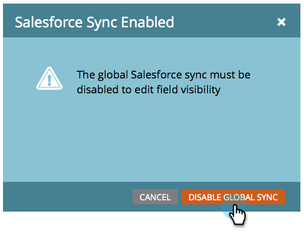

# Agregar o quitar el campo de objeto personalizado como restricción de lista/Déclencheur inteligente {#add-remove-custom-object-field-as-smart-list-trigger-constraints}

Marketo proporciona control de grano sobre la sincronización de objetos personalizados de Salesforce. Esto le permite seleccionar los campos disponibles como restricciones en filtros de objeto personalizados y utilizarlos como déclencheur en campañas inteligentes.

>[!NOTE]
>
>**Se requieren permisos de administrador**

1. Haga clic en **Administración.**

   

1. Haga clic en **Admin** y luego en **Sincronización de objetos de Salesforce**

   

1. **Las** Syncappears de objetos de Salesforce se encuentran en la columna izquierda.

   

1. Seleccione el objeto que desea modificar.

   

1. Haga clic en **Editar campos visibles**.

   >[!TIP]
   >
   >Si el botón **Editar campos visibles** aparece atenuado, el objeto se está utilizando actualmente en una lista inteligente o campaña inteligente. Elimine todas las asociaciones para continuar.

   

1. Si la sincronización global está habilitada, haga clic en **Deshabilitar sincronización global**.

   

1. Marque las casillas situadas junto a las restricciones de filtro/déclencheur necesarias y haga clic en **Guardar**.

   

   >[!NOTE]
   >
   >Todos los campos están seleccionados de forma predeterminada para que sean restricciones en los filtros.

1. Haga clic en la pestaña **Fields** para confirmar los cambios.

   

   >[!NOTE]
   >
   >No olvide volver a habilitar la sincronización global.

¡Guau! Ahora sus listas inteligentes y campañas inteligentes tienen aún más poder.

>[!MORELIKETHIS]
>
>[Habilitar/deshabilitar la sincronización de objetos personalizados](/help/marketo/product-docs/crm-sync/salesforce-sync/setup/optional-steps/enable-disable-custom-object-sync.md)
