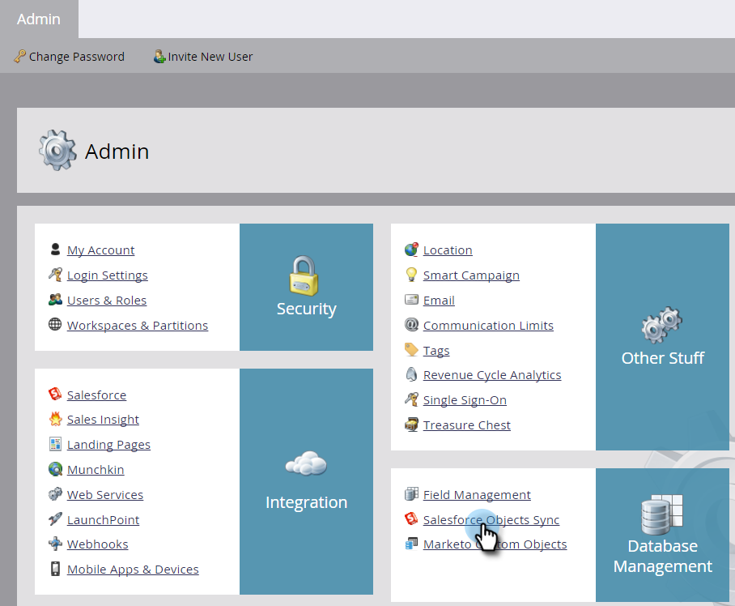

# Agregar o quitar campos de objetos personalizados como restricciones de listas inteligentes o Déclencheur {#add-remove-custom-object-field-as-smart-list-trigger-constraints}

Marketo Engage proporciona un control preciso sobre la sincronización de objetos personalizada de Salesforce. Esto le permite seleccionar los campos disponibles como restricciones en los filtros de objeto personalizados y utilizarlos como déclencheur en campañas inteligentes.

>[!NOTE]
>
>**Permisos de administración necesarios**

1. Clic **[!UICONTROL Administrador]**.

   

1. Clic **[!UICONTROL Administrador]** y luego **[!UICONTROL Sincronización de objetos de Salesforce]**.

   

1. **[!UICONTROL Sincronización de objetos de Salesforce]** aparece en la columna izquierda.

   

1. Seleccione el objeto que desea modificar.

   

1. Clic **[!UICONTROL Editar campos visibles]**.

   >[!TIP]
   >
   >Si la variable **[!UICONTROL Editar campos visibles]** está atenuado, el objeto está actualmente en uso en una lista inteligente o campaña inteligente. Elimine todas las asociaciones para continuar.

   

1. Si la sincronización global está habilitada, haga clic en **[!UICONTROL Deshabilitar sincronización global]**.

   

1. Marque las casillas junto a las restricciones de filtro/déclencheur necesarias y haga clic en **[!UICONTROL Guardar]**.

   

   >[!NOTE]
   >
   >Todos los campos están seleccionados de forma predeterminada para que sean restricciones en los filtros.

1. Haga clic en **[!UICONTROL Campos]** para confirmar los cambios.

   

   >[!NOTE]
   >
   >No olvide volver a activar la sincronización global.

Ahora sus listas inteligentes y campañas inteligentes tienen aún más poder.

>[!MORELIKETHIS]
>
>[Habilitar/Deshabilitar sincronización de objetos personalizada](/help/marketo/product-docs/crm-sync/salesforce-sync/setup/optional-steps/enable-disable-custom-object-sync.md){target="_blank"}
