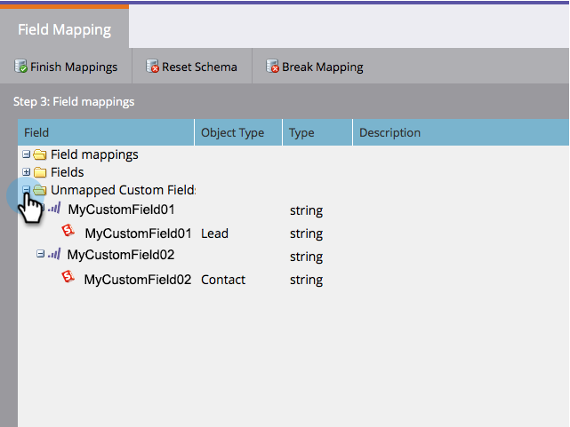
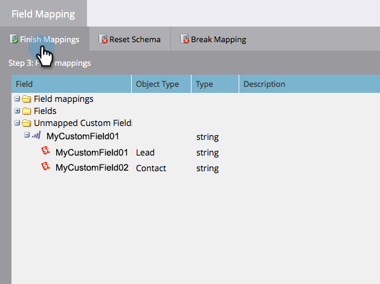
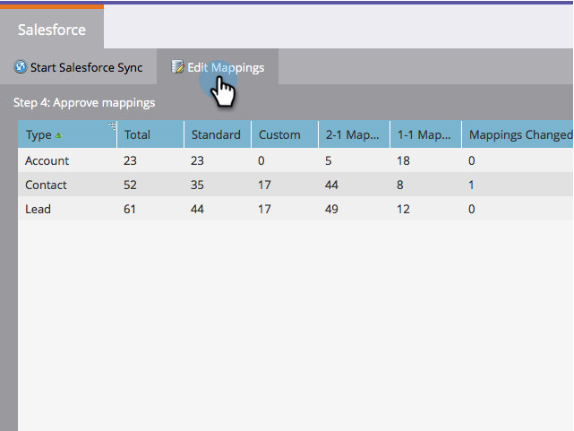
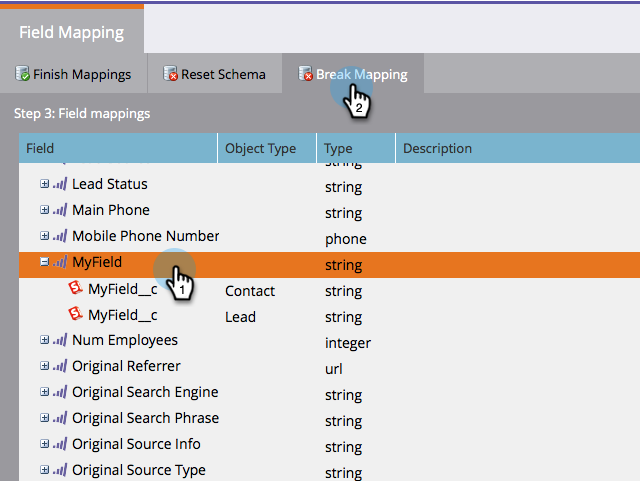
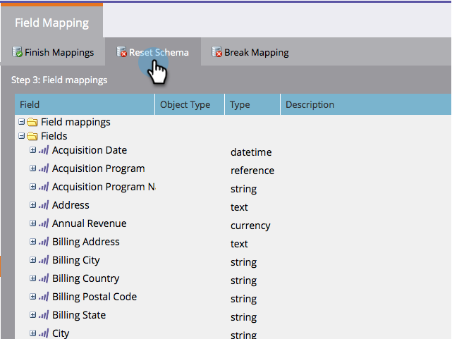

# Editar asignaciones de campo iniciales {#edit-initial-field-mappings}

>[!NOTE]
>
>Solo se puede acceder a esta función antes de la sincronización inicial con Salesforce. Una vez que pulse el botón **[!UICONTROL Sincronizar ahora]**, ya no podrá hacerlo.

Durante la sincronización inicial con Salesforce, Marketo Engage combina automáticamente campos personalizados con nombres similares en un único campo del lado de Marketo para garantizar que los datos se puedan intercambiar con los objetos de posible cliente y contacto en CRM. Este artículo explica cómo personalizar estas asignaciones.

## Asignar campos no asignados {#map-unmapped-fields}

Cuando ve un campo en la carpeta [!UICONTROL Campos no asignados], significa que no está asignado a un campo similar en el posible cliente o contacto en Salesforce. Puedes arreglar eso.

1. Haga clic en **[!UICONTROL Editar asignaciones]**.

1. Abra la carpeta **[!UICONTROL Campos personalizados sin asignar]**.

   

1. Arrastre un campo personalizado sin asignar a otro para asignarlo juntos.

   >[!NOTE]
   >
   >Solo puede editar asignaciones de campos personalizados. No se pueden modificar las asignaciones de campo estándar.

   

1. Haga clic en **[!UICONTROL Finalizar asignaciones]** cuando haya terminado.

   

## Romper asignación existente {#break-existing-mapping}

Si tiene campos con nombres similares en el posible cliente y en el objeto de contacto, Marketo los asignará automáticamente. Puede considerar que son diferentes y que contienen datos diferentes. Rompa la asignación de esta manera.

1. Haga clic en **[!UICONTROL Editar asignaciones]**.

   

1. Resalte un campo asignado y haga clic en **[!UICONTROL Romper asignación]** para separar los campos.

   

1. Haga clic en **[!UICONTROL Finalizar asignaciones]** cuando haya terminado.

   

   Ya casi ha terminado la sincronización inicial.

## Restablecer esquema {#reset-schema}

1. Si realiza algunos cambios en el esquema en Salesforce mientras trabaja en las asignaciones, puede extraer los cambios haciendo clic en **[!UICONTROL Restablecer esquema]**.

   * Se restablecerán todos los cambios de asignación.
   * Al restablecer el esquema, solo se añaden campos, no se eliminan (aunque se oculten al usuario de sincronización).

   
