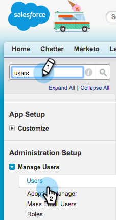

# Convertir al usuario de sincronización de Marketo en usuario de marketing {#make-marketo-sync-user-a-marketing-user}

El [usuario de sincronización de Marketo](/help/marketo/product-docs/crm-sync/salesforce-sync/setup/enterprise-unlimited-edition/step-2-of-3-create-a-salesforce-user-for-marketo-enterprise-unlimited.md){target="_blank"} debe ser un usuario de marketing para que la sincronización de campañas de Salesforce funcione correctamente. A continuación, se indica cómo convertir al usuario en un usuario de marketing en Salesforce.

>[!NOTE]
>
>**Se requieren permisos de administrador**

1. Inicie sesión en Salesforce. Busque usuarios en la barra de búsqueda izquierda y haga clic en **[!UICONTROL Usuarios]** en **[!UICONTROL Administrar usuarios]**.

   

1. Busque el usuario de sincronización y haga clic en su nombre.

   

1. Haga clic en **[!UICONTROL Editar]**.

   

1. Marque la casilla **[!UICONTROL Usuario de mercadotecnia]** y haga clic en **[!UICONTROL Guardar]**.

   

   ¡Excelente! Este usuario de sincronización de Marketo ahora es un usuario de marketing.
