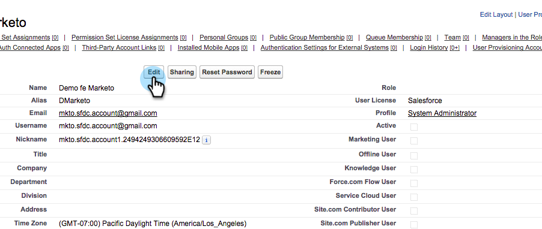

# Convertir al usuario de Marketing en usuario de mercadotecnia {#make-marketo-sync-user-a-marketing-user}

El [usuario de sincronización de Marketing para](../../../../../../product-docs/crm-sync/salesforce-sync/setup/enterprise-unlimited-edition/step-2-of-3-create-a-salesforce-user-for-marketo-enterprise-unlimited.md) debe ser un usuario de Marketing para que la sincronización de campaña de Salesforce funcione correctamente. A continuación se muestra cómo convertir al usuario en un usuario de Marketing en Salesforce.

>[!NOTE]
>
>**Se requieren permisos de administración**

1. Inicie sesión en Salesforce. Busque usuarios en la barra de búsqueda izquierda y haga clic en **Usuarios** en **Administración de usuarios**.

   

1. Busque el usuario de sincronización y haga clic en su nombre.

   

1. Haga clic en **Editar**.

   

1. Marque la casilla de verificación **Usuario de mercadotecnia** y haga clic en **Guardar**.

   

   ¡bueno! Este usuario de sincronización de Marketing para ahora es un usuario de marketing.

