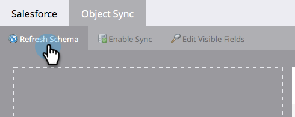

# Habilitar/deshabilitar sincronización de objetos personalizada {#enable-disable-custom-object-sync}

Los objetos personalizados creados en su instancia de Salesforce también pueden formar parte de Marketo Engage. A continuación se muestra cómo configurarlo.

## Habilitar/deshabilitar sincronización de objetos personalizada {#enable-disable-custom-object-sync-1}

>[!NOTE]
>
>**Se requieren permisos de administración**

1. Vaya al área de **[!UICONTROL Admin]**.

   

1. En el menú Administración de bases de datos, haga clic en **[!UICONTROL Sincronizar objetos de Salesforce]**.

   

1. Si este es su primer objeto personalizado, haga clic en **[!UICONTROL Sincronizar esquema]**. De lo contrario, haga clic en **[!UICONTROL Actualizar esquema]** para asegurarse de que dispone de la última versión.

   

1. Si la sincronización global se está ejecutando, tendrá que deshabilitarla haciendo clic en **[!UICONTROL Deshabilitar sincronización global]**.

   

   >[!NOTE]
   >
   >Una sincronización del esquema de objeto personalizado [!DNL Salesforce] puede tardar unos minutos.

1. Haga clic en **[!UICONTROL Actualizar esquema]**.

   

1. Seleccione el objeto que desea sincronizar y haga clic en **[!UICONTROL Habilitar sincronización]**.

   >[!TIP]
   >
   >Marketo solo puede sincronizar un objeto personalizado si tiene una relación directa con el objeto de posible cliente, contacto o cuenta en [!DNL Salesforce].

   

1. Vuelva a hacer clic en **[!UICONTROL Habilitar sincronización]**.

   

1. Vuelva a la ficha **[!DNL Salesforce]** y haga clic en **[!UICONTROL Habilitar sincronización]**.

   

## Uso de los objetos personalizados {#using-your-custom-objects}

>[!NOTE]
>
>No se pueden usar objetos personalizados en campañas inteligentes con déclencheur.

1. En tu lista inteligente, arrastra el filtro **[!UICONTROL Tiene oportunidad]** y establece en **[!UICONTROL true]**.

   

1. A continuación, utilice restricciones de filtro para reducir el enfoque.

   

   ¡Excelente! Ahora puede utilizar los datos de este objeto personalizado en campañas inteligentes y listas inteligentes.

>[!MORELIKETHIS]
>
>[Agregar o quitar campo de objeto personalizado como restricciones de lista inteligente/Déclencheur](/help/marketo/product-docs/crm-sync/salesforce-sync/setup/optional-steps/add-remove-custom-object-field-as-smart-list-trigger-constraints.md){target="_blank"}
