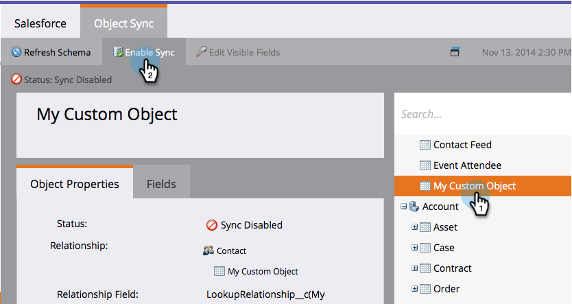

# Habilitar la sincronización de objetos personalizados sin inglés {#enable-non-english-custom-object-sync}

Si el usuario de sincronización de Marketo está configurado en un idioma distinto del inglés, puede que se produzca un error al intentar habilitar una sincronización de objetos personalizada.

## El error {#the-error}

## Cómo evitarlo {#getting-around-it}

1. Inicie sesión en Salesforce utilizando el marketing para sincronizar al usuario.

   

1. Bajo el nombre de usuario, vaya a **Configuración**.

   

1. En **Información personal**, haga clic en **Mi información personal**.

   

1. Haga clic en **Editar**.

   

1. Cambie el **Idioma** a **Inglés**.

   

1. Haga clic en **Guardar**.

   

1. Vuelva a Marketo, en **Administración > Salesforce > Objetos** click **Actualizar esquema**.

   

1. Esto extraerá la lista de objetos en inglés. A continuación, seleccione el objeto que desee y haga clic en **Habilitar sincronización**.

   

1. Observe que el objeto personalizado ahora está habilitado y sincronizándose.

   

1. Vuelva a Salesforce y siga los pasos anteriores para cambiar el usuario de sincronización a su idioma preferido.

>[!NOTE]
>
>No olvide actualizar esquema una última vez para extraer los objetos de nuevo en su idioma.
