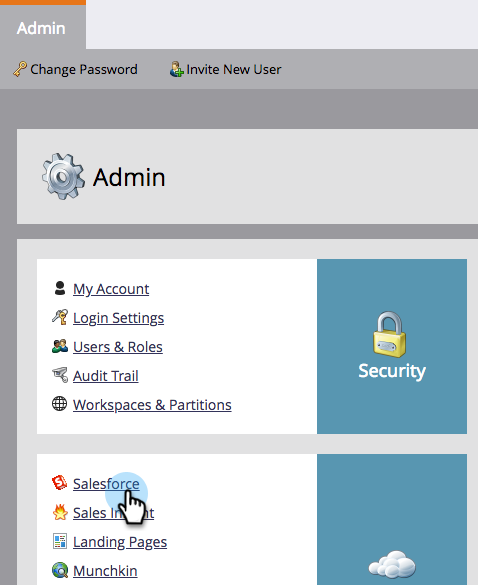

# Desactivar notificaciones por correo electrónico al propietario del posible cliente {#turn-off-email-notifications-to-lead-owner}

Puede deshabilitar las notificaciones automáticas por correo electrónico que se envían a los propietarios de posibles clientes en [!DNL Salesforce] tras la asignación del posible cliente. Así es cómo se hace.

1. Ir a **[!UICONTROL Administrador]**.

   

1. Haga clic en **[!DNL Salesforce]**.

   

1. En **[!UICONTROL Opciones de sincronización]**, haga clic en **[!UICONTROL Editar]**.

   

1. Desmarque la casilla **[!UICONTROL Enviar notificación por correo electrónico al propietario en Salesforce tras la asignación de posibles clientes]**. Haga clic en **[!UICONTROL Guardar]**.

   
