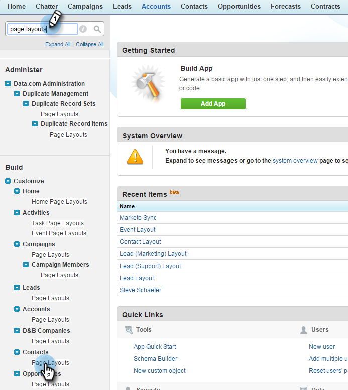

# Paso 2 de 3: Crear un usuario de Salesforce para Marketo (Professional) {#step-of-create-a-salesforce-user-for-marketo-professional}

>[!NOTE]
>
>Estos pasos debe completarlos un administrador de Salesforce

>[!PREREQUISITES]
>
>[Paso 1 de 3: Agregar campos de Marketo a Salesforce (Professional)](/help/marketo/product-docs/crm-sync/salesforce-sync/setup/professional-edition/step-1-of-3-add-marketo-fields-to-salesforce-professional.md)

En este artículo, personalizará los permisos de campo con un diseño de página de Salesforce y creará un usuario de sincronización Marketo-Salesforce.

## Definir diseños de página {#set-page-layouts}

Salesforce Professional establece la accesibilidad a nivel de campo con los diseños de página, en contraposición a los perfiles de Salesforce Enterprise/Unlimited. Estos pasos permitirán al usuario de sincronización de Marketo actualizar los campos personalizados.

1. Escriba **diseños de página** en la barra de búsqueda de navegación sin pulsar **Entrar** y haga clic en **Diseño de página** en **Posibles clientes**.

   

1. Haga clic en **Editar** junto a Diseño de posible cliente.

   

1. Haga clic y arrastre una nueva **Sección** al diseño de página.

   

1. Introduzca &quot;Marketo&quot; para **Section Name** y haga clic en **OK**.

   

1. Haga clic y arrastre el campo **Fecha de adquisición** a la sección **Marketo**.

   

1. Repita el paso anterior para los campos siguientes:

   * Programa de adquisición
   * Id Del Programa De Adquisición
   * Opción de exclusión de correo electrónico
   * Ciudad vinculada
   * Empresa vinculada
   * País afectado
   * Área metropolitana vinculada
   * Código de área de teléfono insertado
   * Código postal adjunto
   * Región Estado Inferior
   * Puntuación de posible cliente
   * Referente original
   * Motor de búsqueda original
   * Frase de búsqueda original
   * Información del origen original
   * Tipo de origen original

   >[!NOTE]
   >
   >Estos campos deben estar en el diseño de página para que Marketo pueda leerlos o escribirlos.

   >[!TIP]
   >
   >Cree dos columnas para los campos arrastrándolas hasta el lado derecho de la página. Puede mover campos de un lado a otro para equilibrar la longitud de las columnas.

1. Haga clic en **Save** cuando termine de agregar campos.

   

1. Repita todos los pasos anteriores para el **Diseño de página de contacto** de Salesforce.

   

1. Recuerde hacer clic en **Guardar** cuando haya terminado con el **Diseño de página de contacto**.

   

   >[!NOTE]
   >
   >Asegúrese de que el campo **Evento de todo el día** se ha agregado al **Diseño de página de evento**.

## Crear usuario de sincronización {#create-sync-user}

Marketo requiere credenciales para acceder a Salesforce. Esto se puede hacer mejor con un usuario dedicado creado con los pasos a continuación.

>[!NOTE]
>
>Si su organización no tiene licencias adicionales de Salesforce, puede utilizar un **usuario de marketing** existente con el perfil **Administrador del sistema**.

1. Introduzca &quot;usuarios&quot; en la barra de búsqueda de navegación y haga clic en **Usuarios** en **Administrar usuarios**.

   

1. Haga clic en **Nuevo usuario**.

   

1. Rellene los campos obligatorios, seleccione la **Licencia de usuario: Salesforce**, establezca el **Perfil: Administrador del sistema**, marque **Usuario de marketing** y haga clic en **Guardar**.

   

   >[!TIP]
   >
   >Asegúrese de que la dirección de correo electrónico que ha introducido sea válida. Deberá iniciar sesión como usuario de sincronización para restablecer la contraseña.

¡Excelente! Ahora tiene una cuenta que Marketo puede utilizar para conectarse a Salesforce. Hagámoslo.

>[!MORELIKETHIS]
>
>[Paso 3 de 3: Conectar Marketo y Salesforce (Professional)](/help/marketo/product-docs/crm-sync/salesforce-sync/setup/professional-edition/step-3-of-3-connect-marketo-and-salesforce-professional.md)
