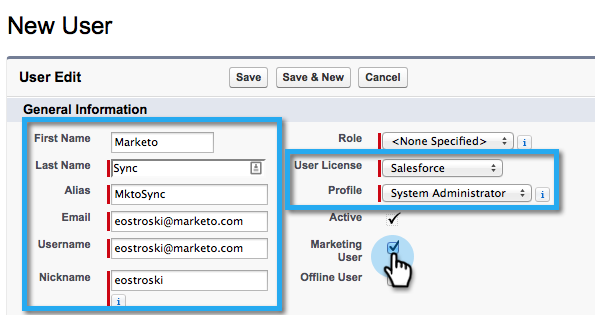

# Paso 2 de 3: Crear un usuario de [!DNL Salesforce] para Marketo (profesional) {#step-of-create-a-salesforce-user-for-marketo-professional}

>[!NOTE]
>
>Estos pasos debe completarlos un administrador de Salesforce.

>[!PREREQUISITES]
>
>[Paso 1 de 3: agregar campos de Marketo a Salesforce (profesional)](/help/marketo/product-docs/crm-sync/salesforce-sync/setup/professional-edition/step-1-of-3-add-marketo-fields-to-salesforce-professional.md){target="_blank"}

En este artículo, personalizará los permisos de campo con un diseño de página de [!DNL Salesforce] y creará un usuario de sincronización Marketo-[!DNL Salesforce].

## Definir diseños de página {#set-page-layouts}

[!DNL Salesforce] Professional establece la accesibilidad de nivel de campo con Diseños de página, a diferencia de los Perfiles de [!DNL Salesforce] Enterprise/Unlimited. Los siguientes pasos permitirán al usuario de sincronización de Marketo actualizar los campos personalizados.

1. Escriba &quot;[!UICONTROL diseños de página]&quot; en la barra de búsqueda de navegación sin presionar **[!UICONTROL Intro]** y haga clic en **[!UICONTROL Diseño de página]** en **[!UICONTROL Posibles clientes]**.

   

1. Haga clic en **[!UICONTROL Editar]** junto al diseño del posible cliente.

   

1. Haga clic y arrastre una nueva **[!UICONTROL sección]** al diseño de página.

   

1. Escriba &quot;Marketo&quot; para **[!UICONTROL Nombre de sección]** y haga clic en **[!UICONTROL Aceptar]**.

   

1. Haga clic y arrastre el campo **[!UICONTROL Fecha de adquisición]** a la sección **Marketo**.

   

1. Repita el paso anterior para los siguientes campos:

   * [!UICONTROL Programa de adquisición]
   * [!UICONTROL Id. de programa de adquisición]
   * [!UICONTROL Exclusión por correo electrónico]
   * [!UICONTROL Ciudad deducida]
   * [!UICONTROL Compañía deducida]
   * [!UICONTROL País deducido]
   * [!UICONTROL Área metropolitana deducida]
   * [!UICONTROL Código de área del teléfono deducido]
   * [!UICONTROL Código postal deducido]
   * [!UICONTROL Región de estado deducido]
   * [!UICONTROL Puntuación de posible cliente]
   * [!UICONTROL Referente original]
   * [!UICONTROL Motor de búsqueda original]
   * [!UICONTROL Frase de búsqueda original]
   * [!UICONTROL Información original de Source]
   * [!UICONTROL Tipo de Source original]

   >[!NOTE]
   >
   >Estos campos deben estar en el diseño de página para que Marketo pueda leerlos y escribirlos.

   >[!TIP]
   >
   >Cree dos columnas para los campos arrastrándolas hacia abajo hasta el lado derecho de la página. Puede mover campos de un lado al otro para equilibrar las longitudes de las columnas.

1. Haga clic en **[!UICONTROL Guardar]** cuando termine de agregar campos.

   

1. Repita todos los pasos anteriores para el **[!UICONTROL Diseño de página de contacto]** de Salesforce.

   

1. Recuerde hacer clic en **[!UICONTROL Guardar]** cuando haya terminado con el **[!UICONTROL Diseño de la página de contacto]**.

   

   >[!NOTE]
   >
   >Asegúrese de que el campo **[!UICONTROL Evento de todo el día]** se haya agregado al **[!UICONTROL Diseño de página de evento]**.

## Crear usuario de sincronización {#create-sync-user}

Marketo requiere credenciales para tener acceso a [!DNL Salesforce]. Esto se realiza mejor con un usuario dedicado creado con los pasos a continuación.

>[!NOTE]
>
>Si su organización no tiene licencias de Salesforce adicionales, puede utilizar un usuario de marketing existente con el perfil de administrador del sistema.

1. Escriba &quot;usuarios&quot; en la barra de búsqueda de navegación y haga clic en **[!UICONTROL Usuarios]** en **[!UICONTROL Administrar usuarios]**.

   

1. Haga clic en **[!UICONTROL Nuevo usuario]**.

   

1. Rellene los campos obligatorios, seleccione la **[!UICONTROL Licencia de usuario: Salesforce]**, establezca el **[!UICONTROL Perfil: Administrador del sistema]**, compruebe **[!UICONTROL Usuario de marketing]** y haga clic en **[!UICONTROL Guardar]**.

   

   >[!TIP]
   >
   >Asegúrese de que la dirección de correo electrónico que ha introducido sea válida. Deberá iniciar sesión como el usuario de sincronización para restablecer la contraseña.

¡Excelente! Ahora tiene una cuenta que Marketo puede usar para conectarse a [!DNL Salesforce]. Vamos a hacerlo...

>[!MORELIKETHIS]
>
>[Paso 3 de 3: conectar Marketo y Salesforce (profesional)](/help/marketo/product-docs/crm-sync/salesforce-sync/setup/professional-edition/step-3-of-3-connect-marketo-and-salesforce-professional.md){target="_blank"}
