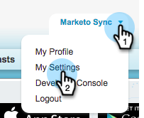

# Paso 3 de 3: Conectar Marketo y Salesforce (Professional) {#step-of-connect-marketo-and-salesforce-professional}

En este artículo, configurará Marketo para que se sincronice con la instancia de Salesforce configurada.

>[!PREREQUISITES]
>
>* [Paso 1 de 3: Agregar campos de Marketo a Salesforce (Professional)](/help/marketo/product-docs/crm-sync/salesforce-sync/setup/professional-edition/step-1-of-3-add-marketo-fields-to-salesforce-professional.md)
>* [Paso 2 de 3: Creación de un usuario de Salesforce para Marketo (Professional)](/help/marketo/product-docs/crm-sync/salesforce-sync/setup/professional-edition/step-2-of-3-create-a-salesforce-user-for-marketo-professional.md)

## Recuperar el token de seguridad del usuario de sincronización {#retrieve-sync-user-security-token}

>[!TIP]
>
>Si ya tiene el token de seguridad, proceda directamente a Sincronizar credenciales de usuario y felicitaciones para su preparación.

1. Inicie sesión en Salesforce con el usuario de sincronización de Marketo, haga clic en el nombre del usuario de sincronización y, a continuación, haga clic en **My Settings**.

   

1. En la barra de búsqueda de navegación, escriba &quot;restablecer&quot; y haga clic en **Restablecer mi token de seguridad**.

   

1. Haga clic en **Restablecer token de seguridad**.

   

   El token de seguridad se le enviará por correo electrónico.

## Establecer credenciales de usuario de sincronización {#set-sync-user-credentials}

1. En Marketo, vaya a **Admin**, seleccione **CRM** y haga clic en **Sincronizar con [Salesforce.com](https://Salesforce.com)**.

   

   >[!NOTE]
   >
   >Asegúrese de [ocultar todos los campos que no necesite](/help/marketo/product-docs/crm-sync/salesforce-sync/sfdc-sync-details/sfdc-sync-field-sync/hide-a-salesforce-field-from-the-marketo-sync.md) en Marketo del usuario de sincronización antes de hacer clic en **Sincronizar campos**. Una vez que haga clic en Sincronizar campos, todos los campos que el usuario pueda ver se crearán en Marketo de forma permanente y no se podrán eliminar.

1. Introduzca las credenciales del usuario de sincronización de Salesforce creadas en la parte 2 de la configuración de Salesforce ([Professional](/help/marketo/product-docs/crm-sync/salesforce-sync/setup/professional-edition/step-2-of-3-create-a-salesforce-user-for-marketo-professional.md), [Enterprise](/help/marketo/product-docs/crm-sync/salesforce-sync/setup/enterprise-unlimited-edition/step-2-of-3-create-a-salesforce-user-for-marketo-enterprise-unlimited.md) y haga clic en **Sincronizar campos**.

   

   >[!NOTE]
   >
   >Marque **Sandbox** si está sincronizando un Simulador para pruebas de Marketo con un Simulador para pruebas de Salesforce.

1. Lea la advertencia y haga clic en **Confirmar credenciales**.

   

   >[!CAUTION]
   >
   >Si desea ver los [mappings y personalizarlos](/help/marketo/product-docs/crm-sync/salesforce-sync/setup/optional-steps/edit-initial-field-mappings.md), esta es su única oportunidad para hacerlo. Una vez que haga clic en Iniciar sincronización de Salesforce, se habrá completado.

## Iniciar sincronización de Salesforce {#start-salesforce-sync}

1. Haga clic en **Iniciar sincronización de Salesforce** para iniciar la sincronización persistente de Marketo-Salesforce.

   

   >[!CAUTION]
   >
   >Marketo no desduplicará automáticamente con una sincronización de Salesforce o cuando introduzca posibles clientes manualmente.

1. Haga clic en **Iniciar sincronización**.

   

   >[!NOTE]
   >
   >El tiempo para completar la sincronización inicial varía según el tamaño y la complejidad de la base de datos.

## Verificar sincronización {#verify-sync}

Marketo proporciona mensajes de estado para la sincronización de Salesforce en el área de administración. Puede verificar que la sincronización funciona correctamente siguiendo estos pasos.

1. En Marketo, haga clic en **Admin** y, a continuación, en **Salesforce**.

   

1. El estado de sincronización es visible en la esquina superior derecha. Muestra uno de los tres mensajes siguientes: **Última sincronización**, **Sincronización en curso** o **Fallido**.

   

   

   

Vaya, acaba de terminar de configurar una de las funciones más poderosas de Marketo, ¡vaya!

>[!MORELIKETHIS]
>
>* [Instalación del paquete de perspectivas de ventas de Marketo en la AppExchange de Salesforce](/help/marketo/product-docs/marketo-sales-insight/msi-for-salesforce/installation/install-marketo-sales-insight-package-in-salesforce-appexchange.md)
>* [Configurar Marketo Sales Insight en Salesforce Professional Edition](/help/marketo/product-docs/marketo-sales-insight/msi-for-salesforce/configuration/configure-marketo-sales-insight-in-salesforce-professional-edition.md)

