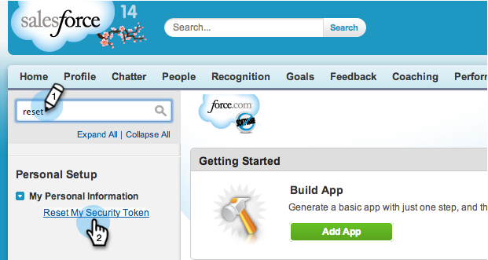

# Paso 3 de 3: Connect Marketing y Salesforce (Professional) {#step-of-connect-marketo-and-salesforce-professional}

En este artículo, configurará Marketing para que se sincronice con la instancia de Salesforce configurada.

>[!PREREQUISITES]
>
>* [Paso 1 de 3: Añadir campos de marketing a Salesforce (Professional)](step-1-of-3-add-marketo-fields-to-salesforce-professional.md)
>* [Paso 2 de 3: Creación de un usuario de Salesforce para Marketing (Professional)](step-2-of-3-create-a-salesforce-user-for-marketo-professional.md)

>

## Recuperar el autentificador de seguridad del usuario de sincronización {#retrieve-sync-user-security-token}

>[!TIP]
>
>Si ya tiene el distintivo de seguridad, vaya directamente a Definir credenciales de usuario de sincronización y felicitaciones para la preparación.

1. Inicie sesión en Salesforce con el usuario de sincronización de marketing, haga clic en el nombre del usuario de sincronización y, a continuación, haga clic en **Mi configuración**.

   

1. En la barra de búsqueda de Nav, escriba &quot;reset&quot; y haga clic en **Reset My Security Token**.

   

1. Haga clic en **Restablecer token de seguridad**.

   

   El token de seguridad se le enviará por correo electrónico.

## Definir credenciales de usuario de sincronización {#set-sync-user-credentials}

1. En Marketing, vaya a **Administración**, seleccione **CRM** y haga clic en **Sincronizar con [Salesforce.com](http://Salesforce.com)**

   

   >[!NOTE]
   >
   >**Recordatorio**
   >
   >
   >Asegúrese de [ocultar todos los campos que no necesita](../../../../../product-docs/crm-sync/salesforce-sync/sfdc-sync-details/sfdc-sync-field-sync/hide-a-salesforce-field-from-the-marketo-sync.md) en Marketing del usuario de sincronización antes de hacer clic en **Campos de sincronización**. Una vez que haga clic en Sincronizar campos, todos los campos que pueda ver el usuario se crearán en el Editor de forma permanente y no se podrán eliminar.

1. Introduzca las credenciales de usuario de sincronización de Salesforce creadas en la parte 2 de la configuración de Salesforce ([Professional](https://community.marketo.com/MarketoArticle?id=kA050000000LJ3QCAW), [Enterprise](https://community.marketo.com/MarketoArticle?id=kA050000000LIwKCAW)) y haga clic en **Campos de sincronización**.

   

   >[!NOTE]
   >
   >Marque **Simulador para pruebas** si está sincronizando un Simulador para pruebas de marketing con un Simulador para pruebas de Salesforce.

1. Lea la advertencia y haga clic en **Confirmar credenciales**.

   

   >[!CAUTION]
   >
   >Si desea ver las [asignaciones y personalizarlas](../../../../../product-docs/crm-sync/salesforce-sync/setup/optional-steps/edit-initial-field-mappings.md), esta es su única oportunidad de hacerlo. Una vez que haga clic en Inicio Salesforce Sync, ya estará listo.

## Inicio Salesforce Sync {#start-salesforce-sync}

1. Haga clic en **Inicio Salesforce Sync** para iniciar la sincronización persistente de Marketing-Salesforce.

   

   >[!CAUTION]
   >
   >Marketo no desduplicará automáticamente una sincronización de Salesforce o cuando introduzca leads manualmente.

1. Haga clic en **INICIO SYNC**.

   

   >[!NOTE]
   >
   >El tiempo para completar la sincronización inicial varía según el tamaño y la complejidad de la base de datos.

## Verificar la sincronización {#verify-sync}

Marketo proporciona mensajes de estado para la sincronización de Salesforce en el área Administración. Puede comprobar que la sincronización funciona correctamente siguiendo estos pasos.

1. En Marketing, haga clic en **Administración** y, a continuación, en **Salesforce**.

   

1. El estado de sincronización está visible en la esquina superior derecha. Mostrará uno de los tres mensajes: **Última sincronización**, **Sincronización en curso** o **Error**.

   

   

   

Vaya, acabas de configurar una de las características más poderosas de Marketo, ve!

>[!NOTE]
>
>**Artículos relacionados**
>
>* [Instalación del paquete de perspectiva de ventas de marketing en la AppExchange de Salesforce](../../../../../product-docs/marketo-sales-insight/msi-for-salesforce/installation/install-marketo-sales-insight-package-in-salesforce-appexchange.md)
>* [Configuración de la perspectiva de ventas de marketing en Salesforce Professional Edition](../../../../../product-docs/marketo-sales-insight/msi-for-salesforce/configuration/configure-marketo-sales-insight-in-salesforce-professional-edition.md)
>* [Pasos opcionales](http://docs.marketo.com/display/docs/optional+steps)

>

