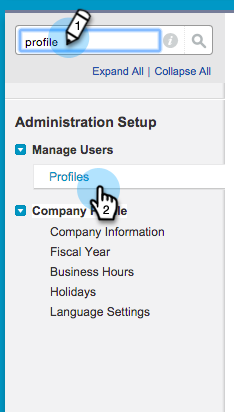

# Agregar un campo [!DNL Salesforce] existente a la sincronización de Marketo {#add-an-existing-salesforce-field-to-the-marketo-sync}

>[!NOTE]
>
>**Se requieren permisos de administración**

Normalmente, los nuevos campos personalizados de Salesforce se sincronizan automáticamente con Marketo Engage. Si no es así, es posible que los campos no sean visibles para el usuario de sincronización de Marketo. Así es como puedes arreglar esto.

1. Haz clic en tu nombre y selecciona **[!UICONTROL Configuración]**.

   

1. Escriba &quot;perfil&quot; en la barra de búsqueda izquierda y haga clic en **[!UICONTROL Perfiles]** en **[!UICONTROL Administrar usuarios]**.

   

1. Haga clic en el perfil del usuario de sincronización.

   

1. En la sección **[!UICONTROL Seguridad de nivel de campo]**, haga clic en **[!UICONTROL Ver]** junto al objeto que contiene el campo.

   

1. Haga clic en **[!UICONTROL Editar]**.

   

1. Marque la casilla de verificación **[!UICONTROL Visible]** del campo que desee agregar a la sincronización y haga clic en **[!UICONTROL Guardar]**.

   

   En el siguiente ciclo de sincronización, Marketo verá el campo e iniciará el proceso mágico.

   >[!NOTE]
   >
   > Si el campo ya tiene valores en [!DNL Salesforce], esos valores no se sincronizan con Marketo hasta la siguiente actualización del registro.
