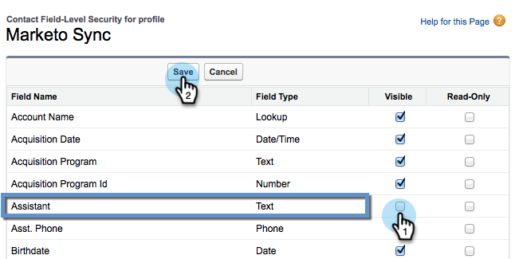

# Ocultar un campo de Salesforce de la sincronización de Marketo {#hide-a-salesforce-field-from-the-marketo-sync}

>[!NOTE]
>
>**Se requieren permisos de administrador**

No todos los campos de Salesforce son útiles para Marketing. Puede optimizar el rendimiento de la sincronización incluyendo solo los campos que necesite. Así puede ocultar un campo de Marketo.

1. Haga clic en el menú de su nombre y seleccione **Configuración**.

   

1. Introduzca **profiles** en la barra de búsqueda y haga clic en **Perfiles** en **Administrar usuarios**.

   

1. Haga clic en el perfil del usuario de sincronización.

   

1. En la sección **Field-Level Security**, haga clic en **View** junto al objeto que contiene el campo de destino.

   

1. Haga clic en **Editar**.

   

1. Desmarque la casilla **Visible** situada junto al campo que desee ocultar. Haga clic en **Guardar**.

   

   >[!NOTE]
   >
   >Si el campo que oculta en Salesforce ya se ha sincronizado con Marketo, también deberá ocultarlo en Marketo si no desea utilizarlo.

   ¡Eso es todo! Ya no verá este campo en Marketo una vez finalizada la siguiente sincronización.

   >[!MORELIKETHIS]
   >
   >[Ocultar y mostrar un campo](/help/marketo/product-docs/administration/field-management/hide-and-unhide-a-field.md)
