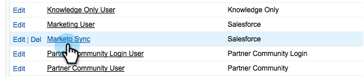

# Ocultar un campo de Salesforce de la sincronización de Marketo {#hide-a-salesforce-field-from-the-marketo-sync}

>[!NOTE]
>
>**Permisos de administración necesarios**

No todos los campos de Salesforce son útiles para Marketing. Puede optimizar el rendimiento de la sincronización incluyendo solo los campos que necesite. Así se puede ocultar un campo a un Marketo Engage.

1. Haga clic en el menú de nombre y seleccione **[!UICONTROL Configurar]**.

   

1. Introduzca &quot;perfiles&quot; en la barra de búsqueda y haga clic en **[!UICONTROL Perfiles]** bajo **[!UICONTROL Administrar usuarios]**.

   

1. Haga clic en el perfil del usuario de sincronización.

   

1. En el **[!UICONTROL Seguridad de nivel de campo]** , haga clic en **[!UICONTROL Ver]** después, el objeto que contiene el campo de destino.

   

1. Clic **[!UICONTROL Editar]**.

   

1. Desmarque la **[!UICONTROL Visible]** junto al campo que desee ocultar. Haga clic en **[!UICONTROL Guardar]**.

   

   >[!NOTE]
   >
   >Si el campo que oculta en Salesforce ya se ha sincronizado con Marketo, también debe ocultarlo en Marketo si no desea utilizarlo.

   ¡Eso es todo! Dejará de ver este campo en Marketo una vez finalizada la siguiente sincronización.

   >[!MORELIKETHIS]
   >
   >[Ocultar y mostrar un campo](/help/marketo/product-docs/administration/field-management/hide-and-unhide-a-field.md){target="_blank"}
