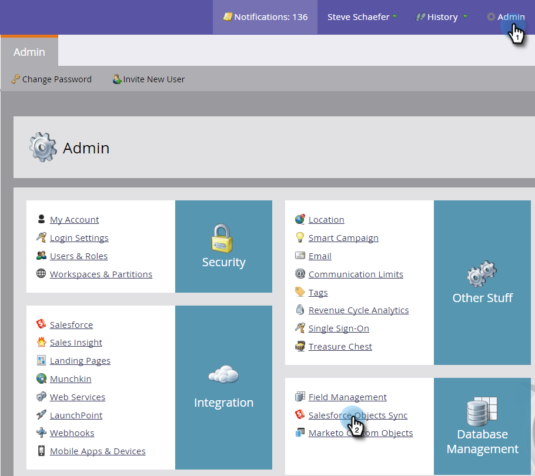
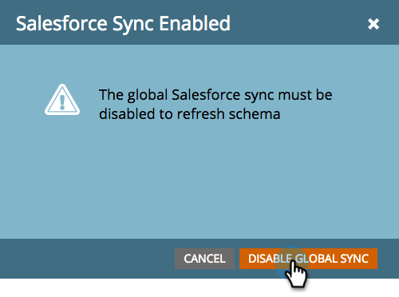
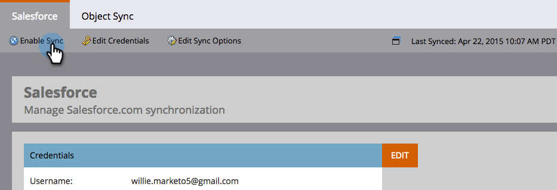
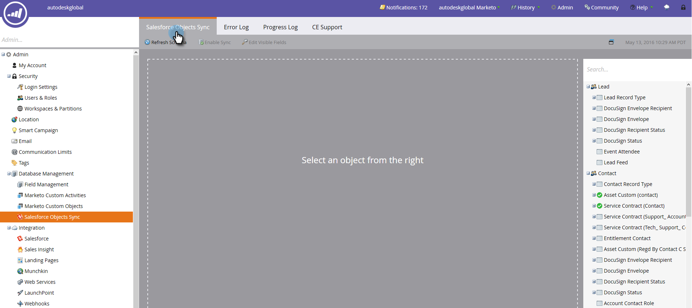

# Sincronización de SFDC: sincronización de objetos personalizada {#sfdc-sync-custom-object-sync}

Los objetos personalizados creados en su instancia de [!DNL Salesforce] también pueden formar parte de Marketo.  A continuación se muestra cómo configurarlo.

>[!NOTE]
>
>**Se requieren permisos de administrador**

>[!PREREQUISITES]
>
>Para usar un objeto personalizado, debe estar asociado a un objeto [lead](/help/marketo/product-docs/crm-sync/salesforce-sync/sfdc-sync-details/sfdc-sync-field-sync.md), [contact](/help/marketo/product-docs/crm-sync/salesforce-sync/sfdc-sync-details/sfdc-sync-contact-sync.md) o [account](/help/marketo/product-docs/crm-sync/salesforce-sync/sfdc-sync-details/sfdc-sync-account-sync.md) en [!DNL Salesforce].

>[!IMPORTANT]
>
>El usuario de sincronización de Marketo necesita acceso de lectura al objeto personalizado para enumerarlo y realizar una sincronización con él.

## Habilitar objeto personalizado  {#enable-custom-object}

1. Haga clic en **[!UICONTROL Admin]** y en el vínculo **[!UICONTROL Sincronización de objetos de Salesforce]**.

   .

1. Si este es su primer objeto personalizado, haga clic en **[!UICONTROL Sincronizar esquema]**.

   

1. Haga clic en **[!UICONTROL Deshabilitar sincronización global]**.

   

   >[!NOTE]
   >
   >Una sincronización inicial del esquema de objeto personalizado [!DNL Salesforce] puede tardar unos minutos.

   

1. Arrastre el objeto personalizado que desee sincronizar al lienzo.

   

   >[!NOTE]
   >
   >Los objetos personalizados deben tener nombres únicos. Marketo no admite dos objetos personalizados diferentes con el mismo nombre.

1. Haga clic en **[!UICONTROL Habilitar sincronización]**.

   

1. Vuelva a hacer clic en **[!UICONTROL Habilitar sincronización]**.

   

   >[!NOTE]
   >
   >Recuerde volver a habilitar la sincronización global.

1. Vuelva a la ficha **[!UICONTROL Salesforce]**.

   

1. Haga clic en **[!UICONTROL Habilitar sincronización]**.

   

1. Para ver todos los objetos personalizados de [!DNL Salesforce], haz clic en **[!UICONTROL Administrador]** y en el vínculo **[!UICONTROL Sincronización de objetos de Salesforce]** (igual que el paso 1 anterior).

   

   >[!NOTE]
   >
   >* Marketo solo admite entidades personalizadas vinculadas a entidades estándar de uno o dos niveles de profundidad.
   >
   >* El árbol de objetos personalizados puede mostrar el mismo objeto más de una vez, debido a sus conexiones directas con uno de los objetos principales (por ejemplo, posibles clientes, contactos o cuentas o conexiones indirectas a través de objetos intermediarios). En estos casos, elija el objeto más cercano al objeto principal y elija solo uno. Si elige el mismo objeto varias veces, puede que la sincronización de ese objeto personalizado se vea obstaculizada.

### ¿Qué sigue? {#whats-next}

[Añadir o quitar campos de objetos personalizados como restricciones de listas inteligentes o activador](/help/marketo/product-docs/crm-sync/salesforce-sync/setup/optional-steps/add-remove-custom-object-field-as-smart-list-trigger-constraints.md){target="_blank"}

Ahora puede utilizar los datos de este objeto personalizado en campañas inteligentes y listas inteligentes.
