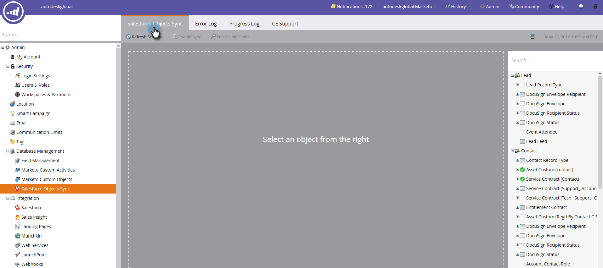

# Sincronización SFDC: sincronización de objetos personalizada {#sfdc-sync-custom-object-sync}

Los objetos personalizados creados en su instancia de Salesforce también pueden formar parte de Marketo Engage. A continuación se muestra cómo configurarlo.

>[!NOTE]
>
>**Permisos de administración necesarios**

>[!PREREQUISITES]
>
>Para utilizar un objeto personalizado, debe estar asociado a una [dirigir](/help/marketo/product-docs/crm-sync/salesforce-sync/sfdc-sync-details/sfdc-sync-field-sync.md){target="_blank"}, [contact](/help/marketo/product-docs/crm-sync/salesforce-sync/sfdc-sync-details/sfdc-sync-contact-sync.md){target="_blank"}, or [account](/help/marketo/product-docs/crm-sync/salesforce-sync/sfdc-sync-details/sfdc-sync-account-sync.md){target="_blank"} objeto en Salesforce.

>[!IMPORTANT]
>
>El usuario de sincronización de Marketo necesita acceso de lectura al objeto personalizado para enumerarlo y realizar una sincronización con él.

## Habilitar objeto personalizado  {#enable-custom-object}

1. Clic **[!UICONTROL Administrador]** y el **[!UICONTROL Sincronización de objetos de Salesforce]** vínculo.

   .

1. Si este es su primer objeto personalizado, haga clic en **[!UICONTROL Sincronizar esquema]**.

   

1. Clic **[!UICONTROL Deshabilitar sincronización global]**.

   

   >[!NOTE]
   >
   >Una sincronización inicial del esquema de objeto personalizado de Salesforce puede tardar unos minutos.

   

1. Arrastre el objeto personalizado que desee sincronizar al lienzo.

   

   >[!NOTE]
   >
   >Los objetos personalizados deben tener nombres únicos. Marketo no admite dos objetos personalizados diferentes con el mismo nombre.

1. Clic **[!UICONTROL Habilitar sincronización]**.

   

1. Clic **[!UICONTROL Habilitar sincronización]** otra vez.

   

   >[!NOTE]
   >
   >No olvide volver a activar la sincronización global.

1. Vuelva a la **Salesforce** pestaña.

   

1. Clic **[!UICONTROL Habilitar sincronización]**.

   

1. Para ver todos los objetos personalizados de Salesforce, haga clic en **[!UICONTROL Administrador]** y el **[!UICONTROL Sincronización de objetos de Salesforce]** vínculo (igual que el paso 1 anterior).

   

   >[!NOTE]
   >
   >Marketo solo admite entidades personalizadas vinculadas a entidades estándar de uno o dos niveles de profundidad.

### ¿Qué sigue? {#whats-next}

[Agregar o quitar campos de objetos personalizados como restricciones de listas inteligentes o Déclencheur](/help/marketo/product-docs/crm-sync/salesforce-sync/setup/optional-steps/add-remove-custom-object-field-as-smart-list-trigger-constraints.md){target="_blank"}

¡Excelente! Ahora puede utilizar los datos de este objeto personalizado en campañas inteligentes y listas inteligentes.
