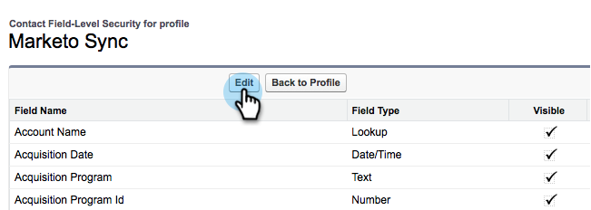

# Agregar un campo de Salesforce existente a la sincronización de Marketo {#add-an-existing-salesforce-field-to-the-marketo-sync}

>[!NOTE]
>
>**Se requieren permisos de administrador**

Normalmente, los nuevos campos personalizados de Salesforce se sincronizan automáticamente con Marketo. Si no es así, es posible que el usuario de Marketo Sync no pueda ver los campos. Así es como se puede arreglar esto.

1. Haga clic en su nombre y, a continuación, seleccione **Setup**.

   

1. Introduzca **profile** en la barra de búsqueda izquierda y haga clic en **Profiles** en **Administrar usuarios**.

   

1. Haga clic en el perfil del usuario de sincronización.

   

1. En la sección **Field-Level Security**, haga clic en **View** junto al objeto que contiene el campo.

   

1. Haga clic en **Editar**.

   

1. Marque la casilla **Visible** para el campo que desee agregar a la sincronización y haga clic en **Guardar**.

   

   ¡Dulce! En el siguiente ciclo de sincronización, Marketo verá el campo e iniciará la magia.

   >[!NOTE]
   >
   > Si el campo ya tiene valores en Salesforce, esos valores no se sincronizan con Marketo hasta la siguiente actualización del registro.
