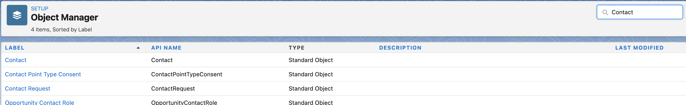

# Paso 1 de 3: Agregar campos de Marketo a [!DNL Veeva] CRM {#step-1-of-3-add-marketo-fields-to-veeva-crm}

>[!PREREQUISITES]
>
>La instancia de CRM [!DNL Veeva] debe tener acceso a las API de Salesforce para sincronizar datos entre Marketo Engage y CRM [!DNL Veeva].

Marketo Engage utiliza un conjunto de campos para capturar determinados tipos de información relacionada con el marketing. Si desea estos datos en [!DNL Veeva] CRM, siga las instrucciones a continuación.

`1.` Crear un campo personalizado en [!DNL Veeva] CRM en los objetos de contacto: Puntuación

`2.` Si lo desea, puede crear campos adicionales (consulte la tabla siguiente).

Todos estos campos personalizados son opcionales y no son necesarios para sincronizar Marketo Engage y [!DNL Veeva] CRM.

## Agregar campos de Marketo a [!DNL Veeva] CRM {#add-marketo-fields-to-veeva-crm}

Agregue un campo personalizado a los objetos de contacto y posible cliente de [!DNL Veeva] CRM enumerados anteriormente. Si desea agregar más, consulte la tabla de campos disponibles al final de esta sección.

Siga estos pasos para agregar el campo Score.

1. Inicie sesión en [!DNL Veeva] CRM y haga clic en **[!UICONTROL Configurar]**.

   

1. Haga clic en **[!UICONTROL Objetos y campos]** y seleccione **[!UICONTROL Administrador de objetos]**.

   

1. En la barra de búsqueda, busque &quot;Contacto&quot;.

   

1. Haga clic en el objeto **[!UICONTROL Contact]**.

1. Seleccione **[!UICONTROL Campos y relaciones]**.

1. Haga clic en **[!UICONTROL Nuevo]**.

   

1. Elija el tipo de campo adecuado (para Puntuación - número).

   

1. Haga clic en **[!UICONTROL Siguiente]**.

   

1. Escriba **[!UICONTROL Etiqueta de campo]**, **[!UICONTROL Longitud]** y **[!UICONTROL Nombre de campo]** para el campo, como se muestra en la tabla siguiente.

<table>
 <tbody>
  <tr>
   <th>Etiqueta del campo
   <th>Nombre del campo
   <th>Tipo de datos
   <th>Atributos de campo
  </tr>
  <tr>
   <td>Puntuación</td>
   <td>mkto71_Lead_Score</td>
   <td>Número</td>
   <td>Longitud 10 
Cifras decimales 0</td>
  </tr>
 </tbody>
</table>

>[!NOTE]
>
>[!DNL Veeva] CRM anexa __c a los nombres de campo cuando los utiliza para crear nombres de API.

>[!NOTE]
>
>Los campos de texto y número requieren una longitud, pero los campos de fecha y hora no. Una descripción es opcional.

1. Haga clic en **[!UICONTROL Siguiente]**.

   

1. Especifique la configuración de acceso y haga clic en **[!UICONTROL Siguiente]**.

1. Definir todos los roles en **[!UICONTROL Visible]** y **[!UICONTROL Solo lectura]**.

1. Desactive la casilla de verificación **[!UICONTROL Solo lectura]** para el perfil del usuario de sincronización:

* Si tiene un usuario con el perfil de un administrador del sistema como usuario de sincronización, desactive la casilla de verificación [!UICONTROL Solo lectura] para el perfil del administrador del sistema (como se muestra a continuación).
* Si creó un perfil personalizado para el usuario de sincronización, desactive la casilla de verificación [!UICONTROL Solo lectura] para ese perfil personalizado.

  

1. Elija los diseños de página que deben mostrar el campo.

1. Haga clic en **[!UICONTROL Guardar y nuevo]** para volver y crear los otros dos campos personalizados.

1. Haz clic en **[!UICONTROL Guardar]** cuando hayas terminado con los tres.

   

>[!NOTE]
>
>Al agregar el campo al objeto Contact, también se agregan al objeto Person Account.

OPCIONAL: utilice el procedimiento anterior para cualquier campo personalizado adicional de la tabla siguiente.

<table>
 <tbody>
  <tr>
   <th>Etiqueta del campo
   <th>Nombre del campo
   <th>Tipo de datos
   <th>Atributos de campo
  </tr>
  <tr>
   <td>Ciudad inferida</td>
   <td>mkto71_Inferred_City</td>
   <td>Texto</td>
   <td>Longitud 255</td>
  </tr>
  <tr>
   <td>Compañía inferida</td>
   <td>mkto71_Inferred_Company</td>
   <td>Texto</td>
   <td>Longitud 255</td>
  </tr>
  <tr>
   <td>País inferido</td>
   <td>mkto71_Inferred_Country</td>
   <td>Texto</td>
   <td>Longitud 255</td>
  </tr>
  <tr>
   <td>Área metropolitana inferida</td>
   <td>mkto71_Inferred_Metropolitan_Area</td>
   <td>Texto</td>
   <td>Longitud 255</td>
  </tr>
  <tr>
   <td>Código de área telefónico inferido</td>
   <td>mkto71_Inferred_Phone_Area_Code</td>
   <td>Texto</td>
   <td>Longitud 255</td>
  </tr>
  <tr>
   <td>Código postal inferido</td>
   <td>mkto71_Inferred_Postal_Code</td>
   <td>Texto</td>
   <td>Longitud 255</td>
  </tr>
  <tr>
   <td>Región del estado inferida</td>
   <td>mkto71_Inferred_State_Region</td>
   <td>Texto</td>
   <td>Longitud 255</td>
  </tr>
 </tbody>
</table>

>[!NOTE]
>
>Los valores de los campos asignados automáticamente por Marketo no estarán disponibles inmediatamente en [!DNL Veeva] CRM cuando se haya creado el nuevo campo. Marketo sincronizará los datos con [!DNL Veeva] CRM la próxima vez que se actualice el registro en cualquiera de los sistemas (es decir, una actualización de cualquiera de los campos sincronizados entre Marketo y [!DNL Veeva] CRM).
