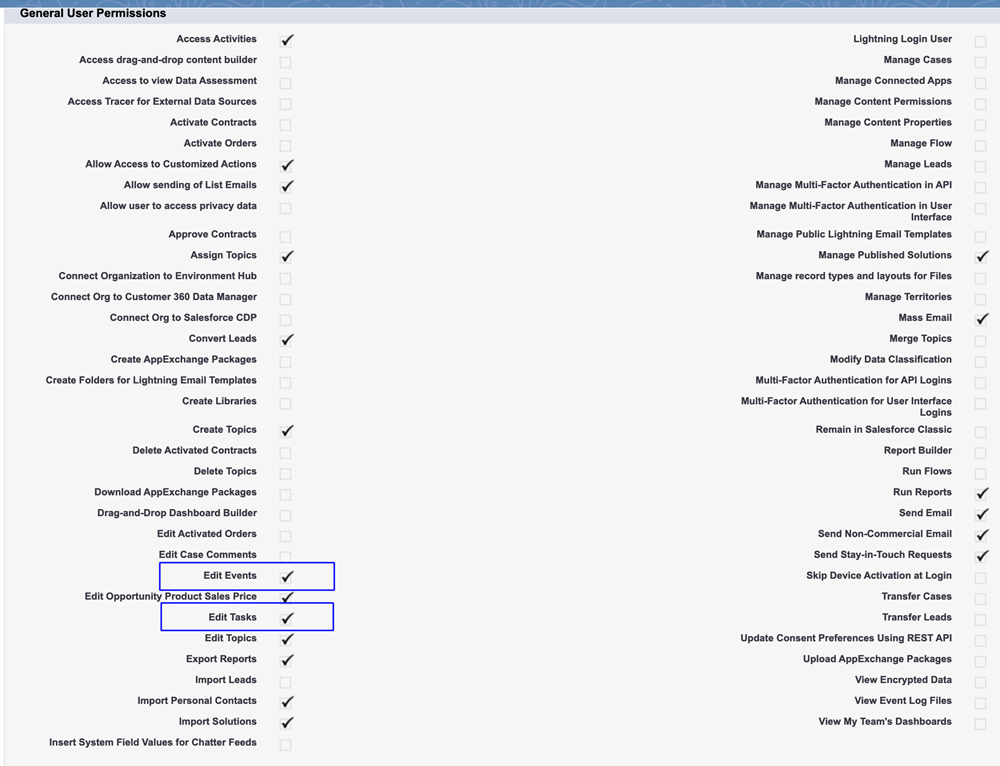
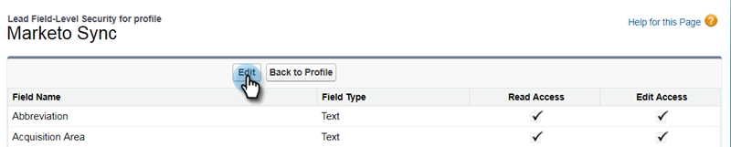

# Paso 2 de 3: Crear un usuario de Veeva CRM para un Marketo Engage {#step-2-of-3-create-a-veeva-crm-user-for-marketo-engage}

>[!NOTE]
>
>Los pasos de este artículo deben ser completados por un administrador de Veeva CRM.

>[!PREREQUISITES]
>
>[Paso 1 de 3: Agregar campos de Marketo a Salesforce (Professional)](/help/marketo/product-docs/crm-sync/veeva-crm-sync/setup/step-1-of-3-add-marketo-fields-to-veeva-crm.md){target=&quot;_blank&quot;}

En este artículo, personalizará los permisos de campo con un diseño de página de Veeva CRM y creará un usuario de sincronización de Marketo-Veeva CRM.

## Definir diseños de página {#set-page-layouts}

Estos pasos permitirán al usuario de sincronización de Marketo actualizar los campos personalizados.

1. Haga clic en los diseños de página Cuenta (cuenta de persona) en la barra de búsqueda de navegación sin pulsar Intro y haga clic en Diseño de página en Contactos.

   

1. Haga clic en **Diseños de página**.

   

1. Haga clic en **HCP - Profesional**.

   

1. Haga clic y arrastre un nuevo **Sección** en el diseño de página.

1. Introduzca &quot;Marketo&quot; para Nombre de sección y haga clic en **OK**.

   

1. Haga clic en y arrastre el campo Puntuación a la sección Marketo .

   

1. Repita el paso anterior para los campos siguientes:

   * Ciudad inferida
   * Compañía inferida
   * País inferido
   * Área metropolitana inferida
   * Código de área telefónico inferido
   * Código postal inferido
   * Región del estado inferida

   >[!NOTE]
   >
   >Estos campos deben estar en el diseño de página para que Marketo pueda leerlos o escribirlos.

   >[!TIP]
   >
   >Cree dos columnas para los campos arrastrándolas hasta el lado derecho de la página. Puede mover campos de un lado a otro para equilibrar la longitud de las columnas.

1. Cuando haya terminado con el diseño HCP-Professional, haga clic en **Guardar**.

   

>[!NOTE]
>
>Repita esto para otros diseños de página de cuenta.

## Crear un perfil {#create-a-profile}

1. Haga clic en **Configuración**.

   

1. Escriba &quot;perfiles&quot; en la barra de búsqueda de navegación y haga clic en el botón **Perfiles** vínculo.

   

1. Haga clic en **Nuevo**.

   

1. Seleccione Usuario estándar, asigne al perfil el nombre &quot;Marketo-Salesforce Sync&quot; y haga clic en **Guardar**.

   

## Definir permisos de perfil {#set-profile-permissions}

1. Haga clic en **Editar** para establecer los permisos de seguridad.

   

1. En la sección Permisos administrativos , asegúrese de que la opción API habilitada está seleccionada.

   

   >[!TIP]
   >
   >Asegúrese de marcar la casilla Contraseña nunca caduca .

1. En la sección Permisos generales de usuario , asegúrese de que la opción Editar eventos y Editar tareas están seleccionadas.

   

1. En la sección Permisos de objeto estándar , asegúrese de que los permisos de lectura, creación, edición y eliminación estén marcados para cuentas y contactos.

   

1. En la sección Permisos de objeto personalizados , asegúrese de que los permisos de lectura estén marcados para Llamada, Mensaje de clave de llamada y cualquier otro objeto personalizado deseado.

   

1. Cuando termine, haga clic en **Guardar** en la parte inferior de la página.

   

## Definir permisos de campo {#set-field-permissions}

1. Analice con sus especialistas en marketing para averiguar qué campos personalizados son necesarios para sincronizar.

>[!NOTE]
>
>Este paso evitará que los campos que no necesite se muestren en Marketo, lo que reducirá el desorden y acelerará la sincronización.

1. En la página de detalles del perfil, vaya a la sección Seguridad a nivel de campo . Haga clic en Ver para editar la accesibilidad para los objetos Contacto y Cuenta .

   

>[!TIP]
>
>Puede configurar otros objetos según las necesidades de su organización.

1. Para cada objeto, haga clic en **Editar**.

   

Busque los campos innecesarios, asegúrese de que Read Access y Edit Access son **un** activada. Haga clic en **Guardar** cuando haya terminado.

>[!NOTE]
>
>Editar solo la accesibilidad para los campos personalizados.

1. Cuando termine de desactivar todos los campos innecesarios, marque Acceso de lectura y Editar acceso para los siguientes campos de objeto. Haga clic en Guardar cuando termine.

<table>
 <tbody>
  <tr>
   <th>Objeto
   <th>Campos
  </tr>
  <tr>
   <td>Cuenta</td>
   <td>Campo Tipo</td>
  </tr>
  <tr>
   <td>Evento</td>
   <td>Todos los campos</td>
  </tr>
  <tr>
   <td>Tarea</td>
   <td>Todos los campos</td>
  </tr>
 </tbody>
</table>

## Crear usuario de sincronización {#create-sync-user}

Marketo requiere credenciales para acceder a Veeva CRM. Esto se puede hacer mejor con un usuario dedicado creado con los pasos a continuación.

>[!NOTE]
>
>Si su organización no tiene licencias de Veeva CRM adicionales, puede utilizar un usuario de marketing existente con el perfil de administrador del sistema.

1. Introduzca &quot;usuarios&quot; en la barra de búsqueda de navegación y haga clic en **Usuarios** en Administrar usuarios.

   

1. Haga clic en **Nuevo usuario**.

   

1. Rellene los campos obligatorios, seleccione la Licencia de usuario: Salesforce, establezca el Perfil: Marketo Sync User y haga clic en **Guardar**.

   

>[!TIP]
>
>Asegúrese de que la dirección de correo electrónico que ha introducido sea válida. Deberá iniciar sesión como usuario de sincronización para restablecer la contraseña.

¡Excelente! Ahora tiene una cuenta que el Marketo Engage puede utilizar para conectarse a Veeva CRM. Hagámoslo.

>[!MORELIKETHIS]
>
>[Paso 3 de 3: Conectar Marketo y Veva CRM](/help/marketo/product-docs/crm-sync/veeva-crm-sync/setup/step-3-of-3-connect-marketo-engage-and-veeva-crm.md){target=&quot;_blank&quot;}
