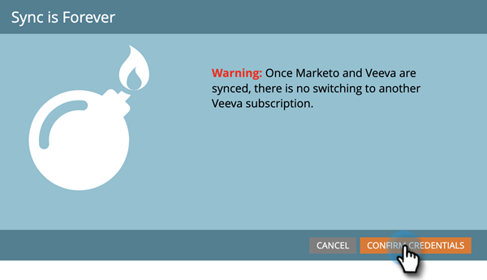

# Paso 3 de 3: Conectar Marketo Engage y Veeva CRM {#step-3-of-3-connect-marketo-engage-and-veeva-crm}

En este artículo, configurará Marketo Engage para que se sincronice con la instancia de Veeva CRM que ha configurado. **Verá Salesforce en algunas de las ventanas emergentes**, ya que Veeva CRM está construido en la plataforma Salesforce.

>[!PREREQUISITES]
>
>* [Paso 1 de 3: Agregar campos de Marketo a Veeva](/help/marketo/product-docs/crm-sync/veeva-crm-sync/setup/step-1-of-3-add-marketo-fields-to-veeva-crm.md){target="_blank"}
>* [Paso 2 de 3: Crear un usuario Veeva para Marketo](/help/marketo/product-docs/crm-sync/veeva-crm-sync/setup/step-2-of-3-create-a-veeva-crm-user-for-marketo-engage.md){target="_blank"}

>[!IMPORTANT]
>
>Solo se puede conectar una instancia de Marketo a una instancia de Veeva CRM a la vez.

## Conectarse a Veeva CRM mediante OAuth {#connect-to-veeva-crm-using-oauth}

1. En Marketo, Haga Clic En **[!UICONTROL Administrador]**. Seleccione **[!UICONTROL CRM]** y haga clic en **[!UICONTROL Sincronizar con Veeva]**.

   

   >[!NOTE]
   >
   >Asegúrese de [ocultar todos los campos que no necesite](/help/marketo/product-docs/crm-sync/salesforce-sync/sfdc-sync-details/hide-a-salesforce-field-from-the-marketo-sync.md){target="_blank"} en Marketo del usuario de sincronización antes de hacer clic en Sincronizar campos. Una vez que haga clic en Sincronizar campos, todos los campos que el usuario pueda ver se crearán en Marketo de forma permanente y no se podrán eliminar.

1. Haga clic en **[!UICONTROL Iniciar sesión con Veeva]**.

   

   >[!NOTE]
   >
   >Marque Zona protegida si va a sincronizar una Zona protegida de Marketo con una de Veeva CRM.

1. Haga clic en **[!UICONTROL Confirmar credenciales]**.

   

1. Se mostrará una ventana emergente con la página de inicio de sesión de Salesforce. Escriba sus credenciales de &quot;Usuario de sincronización de Marketo&quot; y haga clic en **[!UICONTROL Iniciar sesión]**.

   

1. Escribe el código de verificación que recibiste por correo electrónico (enviado por Salesforce) y haz clic en **[!UICONTROL Verificar]**.

   

1. Una vez verificada correctamente, aparecerá la página de acceso que solicita el acceso. Haga clic en **[!UICONTROL Permitir]**.

   

1. En unos minutos, aparecerá una ventana emergente en Marketo Engage. Haga clic en **[!UICONTROL Confirmar credenciales]**.

   

## Iniciar sincronización con Veeva {#start-veeva-sync}

1. Haga clic en **[!UICONTROL Iniciar sincronización de Veeva]** para iniciar la sincronización persistente entre Marketo y Veeva CRM.

   

   >[!CAUTION]
   >
   >Marketo no desduplicará automáticamente una sincronización de Veeva CRM o cuando introduzca manualmente posibles clientes.

1. Haga clic en **[!UICONTROL Iniciar sincronización]**.

   

>[!NOTE]
>
>El tiempo para completar la sincronización inicial varía según el tamaño y la complejidad de la base de datos.

## Verificar sincronización {#verify-sync}

Marketo proporciona mensajes de estado para la sincronización de Veeva CRM en el área de Administración. Puede comprobar que la sincronización funciona correctamente siguiendo estos pasos.

1. En Marketo, haz clic en **[!UICONTROL Admin]** y luego en **[!UICONTROL Veeva]**.

   

1. El estado de sincronización es visible en la esquina superior derecha. Mostrará uno de los tres mensajes: Última sincronización, Sincronización en curso o Error.

>[!MORELIKETHIS]
>
>[Configurar objetos personalizados](/help/marketo/product-docs/crm-sync/veeva-crm-sync/sync-details/custom-object-sync.md){target="_blank"}
