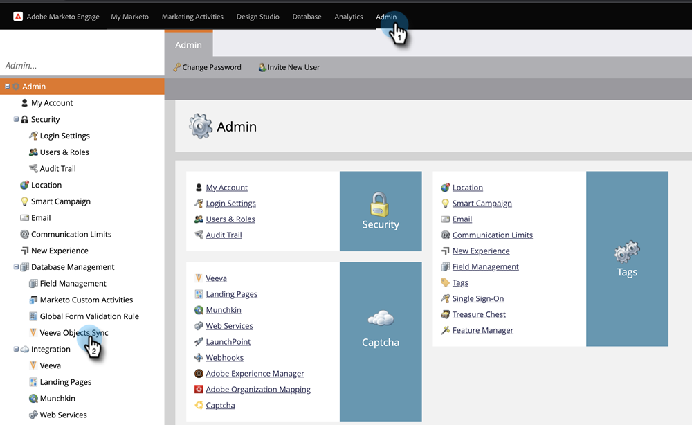

# Agregar o quitar un campo de objeto personalizado como restricciones de lista/Déclencheur inteligente {#add-remove-custom-object-field-as-smart-list-trigger-constraints}

El Marketo Engage proporciona control específico sobre la sincronización de objetos personalizados de Veva. Esto le permite seleccionar los campos disponibles como restricciones en filtros de objeto personalizados y utilizarlos como déclencheur en campañas inteligentes.

>[!NOTE]
>
>**Se requieren permisos de administrador**

1. Haga clic en **Administrador**, luego **Sincronización de objetos de veeva**.

   

1. Seleccione el objeto que desea modificar.

   

1. Haga clic en **Editar campos visibles**.

   

   >[!TIP]
   >
   >Si el botón Editar campos visibles está atenuado, el objeto se está utilizando en una lista inteligente o campaña inteligente. Elimine todas las asociaciones para continuar.

1. Si la sincronización global está habilitada, haga clic en **Deshabilitar sincronización global**.

   

1. Marque las casillas situadas junto a las restricciones de filtro/déclencheur que desee y haga clic en **Guardar**.

   

   >[!NOTE]
   >
   >Todos los campos están seleccionados de forma predeterminada para que sean restricciones en los filtros.

1. Haga clic en la ficha Campos para confirmar los cambios.

   

>[!IMPORTANT]
>
>No olvide volver a habilitar la sincronización global.

Ahora sus listas inteligentes y campañas inteligentes tienen aún más poder.

>[!MORELIKETHIS]
>
>[Habilitar/deshabilitar la sincronización de objetos personalizados](/help/marketo/product-docs/crm-sync/veeva-crm-sync/sync-details/enable-disable-custom-object-sync.md){target=&quot;_blank&quot;}
