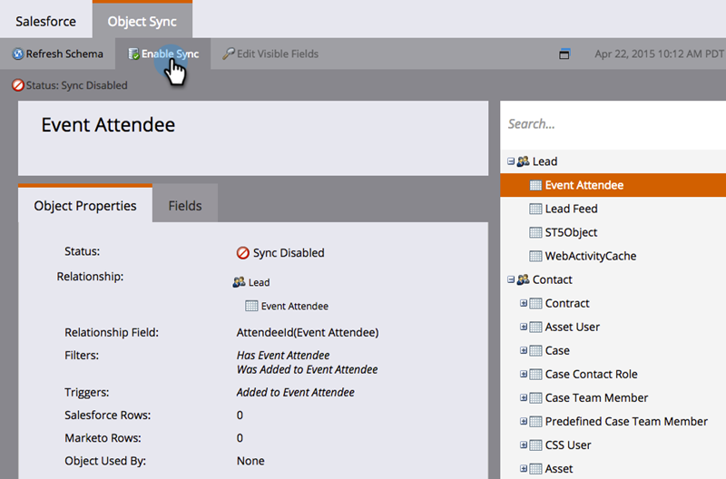

# Sincronización de objeto personalizado {#custom-object-sync}

Los objetos personalizados creados en su instancia de CRM [!DNL Veeva] también pueden formar parte de Marketo Engage. A continuación se muestra cómo configurarlo.

>[!NOTE]
>
>**Se requieren permisos de administración**

>[!PREREQUISITES]
>
>Para usar un objeto personalizado, debe estar asociado a un contacto o a un objeto de cuenta en [!DNL Veeva] CRM.

## Habilitar objeto personalizado {#enable-custom-object}

1. En Marketo, haz clic en **[!UICONTROL Administrador]** y luego en **[!UICONTROL Sincronizar objetos de Veeva]**.

   

1. Si este es su primer objeto personalizado, haga clic en **[!UICONTROL Sincronizar esquema]**.

   

1. Haga clic en **[!UICONTROL Deshabilitar sincronización global]**.

   

   >[!NOTE]
   >
   >La sincronización inicial del esquema de objeto personalizado [!DNL Veeva] puede tardar unos minutos.

1. Arrastre el objeto personalizado que desee sincronizar al lienzo.

   

   >[!NOTE]
   >
   >Los objetos personalizados deben tener nombres únicos. Marketo no admite dos objetos personalizados diferentes con el mismo nombre.

1. Haga clic en **[!UICONTROL Habilitar sincronización]**.

   

1. Vuelva a hacer clic en **[!UICONTROL Habilitar sincronización]**.

   

1. Vuelva a la ficha **[!UICONTROL Veeva]**.

   

1. Haga clic en **[!UICONTROL Habilitar sincronización]**.

   

1. Para ver todos los objetos personalizados de [!DNL Veeva], haz clic en **[!UICONTROL Administrador]** y **[!UICONTROL Sincronizar objetos de Veeva]**.

   

   >[!NOTE]
   >
   >Marketo solo admite entidades personalizadas vinculadas a entidades estándar de uno a dos niveles de profundidad.

¡Excelente! Ahora puede utilizar datos de este objeto personalizado en campañas inteligentes y listas inteligentes.

>[!MORELIKETHIS]
>
>* [Sincronizando mensajes de clave de llamada y llamada](/help/marketo/product-docs/crm-sync/veeva-crm-sync/sync-details/syncing-call-and-call-key-messages.md){target="_blank"}
>* [Agregar o quitar campo de objeto personalizado como restricciones de lista inteligente/Déclencheur](/help/marketo/product-docs/crm-sync/veeva-crm-sync/sync-details/add-remove-custom-object-field-as-smart-list-trigger-constraints.md){target="_blank"}
