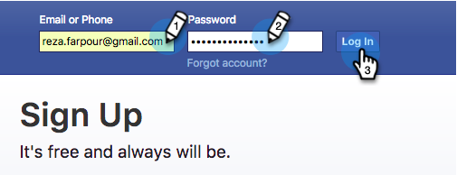

# Añadir Audiencias personalizadas de Facebook como un servicio de LaunchPoint {#add-facebook-custom-audiences-as-a-launchpoint-service}

>[!NOTE]
>
>**Se requieren permisos de administración**

Con esta integración, puede enviar datos de audiencia desde listas estáticas e inteligentes de Marketing a Facebook para que se utilicen como Audiencias personalizadas en Campañas de publicidad de Facebook. Así es como configurarlo.

1. Vaya a Administrador de mercadotecnia ****.

   

1. Vaya a **LaunchPoint**, haga clic en **Nuevo** y seleccione **Nuevo servicio**.

   

1. Escriba un **Nombre para mostrar** para el servicio y seleccione el servicio **Audiencias personalizadas de Facebook** en la lista desplegable **Servicio**.

   

1. Abra una nueva ficha en el mismo explorador y vaya a [facebook.com](https://www.facebook.com/). Inicie sesión en Facebook con la cuenta que desee utilizar para la integración.

   >[!CAUTION]
   >
   >Para que Marketing pueda enviar audiencias a través de varias cuentas del Administrador de publicidad, el usuario de Facebook que autorice en los pasos siguientes debe tener acceso a *todas* estas cuentas.

   

1. Una vez que haya iniciado sesión en Facebook, vuelva a Marketo. Haga clic en **Autorizar**.

   

   >[!NOTE]
   >
   >_debe_ utilizar una cuenta de Facebook Business Manager para que funcione la integración de Audiencias personalizadas. Para obtener más información sobre cómo configurar una cuenta de Business Manager, consulte [Ayuda de Facebook](https://www.facebook.com/business/help/1710077379203657).

1. Si se le solicita, haga clic en **Aceptar** para aceptar la instalación de la aplicación de Marketing to en Facebook.

   

1. ¡Ya estás autorizado! Seleccione un modo coincidente y haga clic en **Crear**.

   >[!NOTE]
   >
   >**La coincidencia básica solo** utiliza direcciones de correo electrónico. **La** coincidencia avanzada utiliza siete campos adicionales, lo que aumenta la tasa de coincidencia, para obtener más conversión. Sin embargo, si la política de privacidad de su compañía no permite compartir campos adicionales o si los datos no los incluyen, seleccione Coincidencia básica.

   

   ¡bueno trabajo! Ahora puede pasar a cualquier lista estática o inteligente de Marketing y enviar datos de audiencia a Facebook.

   >[!CAUTION]
   >
   >Oh, antes de ir, asegúrese de [aceptar los términos de Audiencias personalizadas de Facebook](https://www.facebook.com/ads/manage/customaudiences/tos.php) en su cuenta de Facebook. Sin esto, las actualizaciones de audiencia fallarán.

>[!MORELIKETHIS]
>
>* [Crear una Audiencia personalizada en Facebook](/help/marketo/product-docs/demand-generation/facebook/create-a-custom-audience-in-facebook.md)
   >
   >
* [Configurar publicidades de posibles clientes de Facebook](/help/marketo/product-docs/demand-generation/facebook/set-up-facebook-lead-ads.md)

