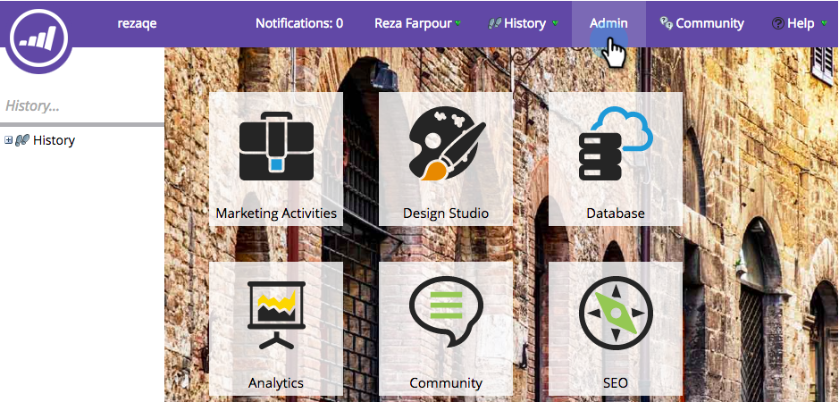
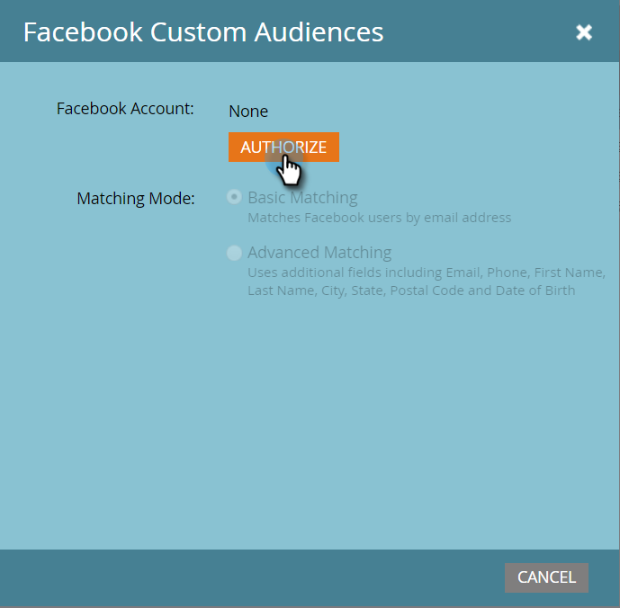

# Agregar [!DNL Facebook] audiencias personalizadas como servicio de [!DNL LaunchPoint] {#add-facebook-custom-audiences-as-a-launchpoint-service}

>[!NOTE]
>
>**Se requieren permisos de administrador**

Con esta integración, puede enviar datos de audiencia desde listas estáticas e inteligentes de Marketo a [!DNL Facebook] para que se utilicen como audiencias personalizadas en [!DNL Facebook] campañas de publicidad. Siga estos pasos para configurarlo.

1. Vaya a Marketo **[!UICONTROL Admin]**.

   

1. Vaya a **[!UICONTROL LaunchPoint]**, haga clic en **[!UICONTROL Nuevo]** y seleccione **[!UICONTROL Nuevo servicio]**.

   

1. Escriba un **[!UICONTROL Nombre para mostrar]** para su servicio y seleccione el servicio **[!UICONTROL Audiencias personalizadas de Facebook]** de la lista desplegable **[!UICONTROL Servicio]**.

   

1. Abra una ficha nueva en el mismo explorador y vaya a [facebook.com](https://www.facebook.com/). Inicie sesión en [!DNL Facebook] con la cuenta que desee usar para la integración.

   >[!CAUTION]
   >
   >Para que Marketo envíe audiencias a través de varias cuentas de Ad Manager, el usuario [!DNL Facebook] que autorizó en los siguientes pasos necesita tener acceso a *todas* estas cuentas.

   

1. Una vez que haya iniciado sesión en [!DNL Facebook], vuelva a Marketo. Haga clic en **[!UICONTROL Autorizar]**.

   

   >[!NOTE]
   >
   >Usted *debe* usar una cuenta de [!DNL Facebook] Business Manager para que funcione su integración de audiencias personalizadas. Para aprender a configurar una cuenta de Business Manager, consulte [[!DNL Facebook] Ayuda](https://www.facebook.com/business/help/1710077379203657).

1. Si se le solicita, haga clic en **[!UICONTROL Aceptar]** para aceptar la instalación de la aplicación Marketo en [!DNL Facebook].

   

1. ¡Ya está autorizado! Seleccione un modo que coincida y haga clic en **[!UICONTROL Crear]**.

   >[!NOTE]
   >
   >**[!UICONTROL Coincidencia básica]** solo usa direcciones de correo electrónico. **[!UICONTROL Coincidencia avanzada]** usa siete campos adicionales, lo que aumenta la tasa de coincidencia, para obtener más conversión. Sin embargo, si la directiva de privacidad de la compañía no permite compartir campos adicionales o si los datos no los incluyen, seleccione [!UICONTROL Coincidencia básica].

   

   Ahora puede ir a cualquier lista estática o inteligente en Marketo y enviar datos de audiencia a [!DNL Facebook].

   >[!CAUTION]
   >
   >Antes de usar la integración, [Acepte los términos de audiencias personalizadas de  [!DNL Facebook]](https://www.facebook.com/ads/manage/customaudiences/tos.php) en su cuenta de [!DNL Facebook]. Sin hacerlo, las actualizaciones de audiencia fallarán.

>[!MORELIKETHIS]
>
>* [Crear una audiencia personalizada en [!DNL Facebook]](/help/marketo/product-docs/demand-generation/facebook/create-a-custom-audience-in-facebook.md)
>
>* [Configurar [!DNL Facebook] Anuncios Posibles Clientes](/help/marketo/product-docs/demand-generation/facebook/set-up-facebook-lead-ads.md)
