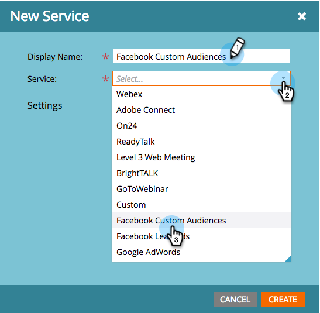

# Añadir audiencias personalizadas de Facebook como servicio de LaunchPoint {#add-facebook-custom-audiences-as-a-launchpoint-service}

>[!NOTE]
>
>**Permisos de administración necesarios**

Con esta integración, puede enviar datos de audiencia de listas estáticas e inteligentes de Marketo a Facebook para utilizarlos como audiencias personalizadas en campañas de publicidad de Facebook. A continuación se muestra cómo configurarlo.

1. Ir a Marketo **Administrador**.

   

1. Ir a **LaunchPoint**, haga clic en **Nuevo** y seleccione **Nuevo servicio**.

   

1. Introduzca una **Nombre para mostrar** para el servicio y seleccione la **Audiencias personalizadas de facebook** servicio desde el **Servicio** menú desplegable.

   

1. Abra una pestaña nueva en el mismo explorador y vaya a [facebook.com](https://www.facebook.com/). Inicie sesión en Facebook con la cuenta que desee utilizar para la integración.

   >[!CAUTION]
   >
   >Para que Marketo envíe audiencias a través de varias cuentas de Ad Manager, el usuario de Facebook que autorice en los siguientes pasos debe tener acceso a *todo* de estas cuentas.

   

1. Una vez que haya iniciado sesión en Facebook, vuelva a Marketo. Clic **Autorizar**.

   

   >[!NOTE]
   >
   >Usted _debe_ use una cuenta de Facebook Business Manager para que funcione la integración de Audiencias personalizadas. Para aprender a configurar una cuenta de Business Manager, consulte [Ayuda de facebook](https://www.facebook.com/business/help/1710077379203657).

1. Si se le solicita, haga clic en **OK** para aceptar la instalación de la aplicación de Marketo en Facebook.

   

1. ¡Ya está autorizado! Seleccione un modo coincidente y haga clic en **Crear**.

   >[!NOTE]
   >
   >**Coincidencia básica** solo utiliza direcciones de correo electrónico. **Coincidencia avanzada** utiliza siete campos adicionales, lo que aumenta la tasa de coincidencia, para obtener más conversión. Sin embargo, si la política de privacidad de su empresa no permite compartir campos adicionales o si los datos no los incluyen, seleccione Coincidencia básica.

   

   ¡bueno trabajo! Ahora puede pasar a cualquier lista estática o inteligente en Marketo y enviar datos de audiencia a Facebook.

   >[!CAUTION]
   >
   >Antes de que te vayas, asegúrate de [Acepte los términos de audiencias personalizadas de Facebook](https://www.facebook.com/ads/manage/customaudiences/tos.php) en su cuenta de Facebook. Sin hacerlo, las actualizaciones de audiencia fallarán.

>[!MORELIKETHIS]
>
>* [Crear una audiencia personalizada en Facebook](/help/marketo/product-docs/demand-generation/facebook/create-a-custom-audience-in-facebook.md)
>
>* [Configurar anuncios de posibles clientes de Facebook](/help/marketo/product-docs/demand-generation/facebook/set-up-facebook-lead-ads.md)
