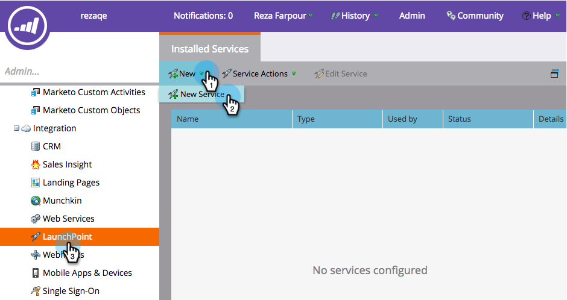

# Añadir audiencias personalizadas de Facebook como servicio de LaunchPoint {#add-facebook-custom-audiences-as-a-launchpoint-service}

>[!NOTE]
>
>**Se requieren permisos de administración**

Con esta integración, puede enviar datos de audiencia de listas estáticas e inteligentes de Marketo Engage a Facebook para utilizarlos como audiencias personalizadas en campañas de publicidad de Facebook. A continuación se muestra cómo configurarlo.

1. Vaya a Marketo **[!UICONTROL Admin]**.

   

1. Vaya a **[!UICONTROL LaunchPoint]**, haga clic en **[!UICONTROL Nuevo]** y seleccione **[!UICONTROL Nuevo servicio]**.

   

1. Escriba un **[!UICONTROL Nombre para mostrar]** para su servicio y seleccione el servicio **[!UICONTROL Audiencias personalizadas de Facebook]** de la lista desplegable **[!UICONTROL Servicio]**.

   

1. Abra una ficha nueva en el mismo explorador y vaya a [facebook.com](https://www.facebook.com/){target="_blank"}. Inicie sesión en Facebook con la cuenta que desee utilizar para la integración.

   >[!CAUTION]
   >
   >Para que Marketo envíe audiencias a través de varias cuentas de Ad Manager, el usuario de Facebook que usted autorice en los siguientes pasos debe tener acceso a *todas* estas cuentas.

   

1. Una vez que haya iniciado sesión en Facebook, vuelva a Marketo. Haga clic en **[!UICONTROL Autorizar]**.

   

   >[!NOTE]
   >
   >Usted _debe_ usar una cuenta de Facebook Business Manager para que funcione su integración de audiencias personalizadas. Para obtener información sobre cómo configurar una cuenta de Business Manager, consulte la [Ayuda de Facebook](https://www.facebook.com/business/help/1710077379203657){target="_blank"}.

1. Si se le solicita, haga clic en **[!UICONTROL Aceptar]** para aceptar la instalación de la aplicación Marketo en Facebook.

   

1. ¡Ya está autorizado! Seleccione un modo que coincida y haga clic en **[!UICONTROL Crear]**.

   >[!NOTE]
   >
   >**Coincidencia básica** solo usa direcciones de correo electrónico. **Coincidencia avanzada** usa siete campos adicionales, lo que aumenta la tasa de coincidencia, para obtener más conversión. Sin embargo, si la política de privacidad de su empresa no permite compartir campos adicionales o si los datos no los incluyen, seleccione Coincidencia básica.

   

   ¡Buen trabajo! Ahora puede pasar a cualquier lista estática o inteligente en Marketo y enviar datos de audiencia a Facebook.

   >[!CAUTION]
   >
   >Antes de irte, [acepta los términos de audiencias personalizadas de Facebook](https://www.facebook.com/ads/manage/customaudiences/tos.php){target="_blank"} en tu cuenta de Facebook. Sin hacerlo, las actualizaciones de audiencia fallarán.

>[!MORELIKETHIS]
>
>* [Crear una audiencia personalizada en Facebook](/help/marketo/product-docs/demand-generation/facebook/create-a-custom-audience-in-facebook.md){target="_blank"}
>
>* [Configurar anuncios de clientes potenciales de Facebook](/help/marketo/product-docs/demand-generation/facebook/set-up-facebook-lead-ads.md){target="_blank"}
